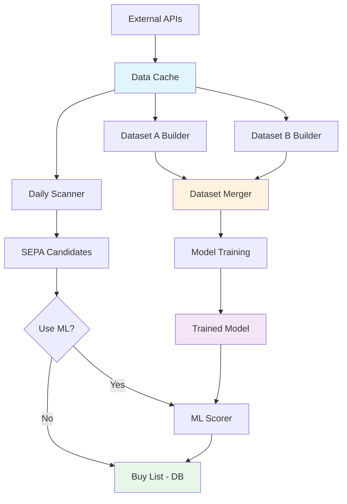

# QSS Workflow Chart - Script Reference Guide

## 📋 Table of Contents

- [Data Collection & Initialization](#data-collection--initialization)
- [Feature Engineering](#feature-engineering)
- [Daily Operations](#daily-operations)
- [Model Training Pipeline](#model-training-pipeline)
- [Analysis & Inspection](#analysis--inspection)
- [Utilities](#utilities)

---

## 🗄️ Data Collection & Initialization

### Initialize Price History
**Script**: `initialise_price_data.py`
```bash
python initialise_price_data.py
```
**Purpose**: Download and cache historical price data (2010-present)
- Fetches S&P 500 universe (~500 tickers) OR FMP screener (~1730 tickers)
- Downloads OHLCV data from FMP/yfinance
- Saves to `data/price/*.parquet` cache

**When to use**: First-time setup or after adding new tickers

---

### Initialize Fundamental Data
**Script**: `init_fundamentals.py`
```bash
python init_fundamentals.py
```
**Purpose**: Download and cache quarterly fundamental data
- Fetches income statement and balance sheet data
- Uses FMP batch API for efficient downloading
- Saves to `data/fundamentals/*.parquet` cache

**When to use**: First-time setup or quarterly updates

---

### Update Existing Fundamentals
**Script**: `build_fundamentals.py`
```bash
python build_fundamentals.py [--force] [--tickers AAPL MSFT ...]
```
**Purpose**: Update or rebuild fundamental data cache
- `--force`: Force re-download even if cache exists
- `--tickers`: Update specific tickers only
- Uses FMP quarterly endpoints (rate-limited: 300/min)

**When to use**: Monthly/quarterly updates or when adding new tickers

---

## 🧬 Feature Engineering

### Build Dataset A (Features)
**Script**: `build_dataset_a.py`
```bash
python build_dataset_a.py [--output data/ml/dataset_a.parquet]
```
**Purpose**: Generate daily technical + fundamental feature store
- **Input**: Price cache (`data/price/*.parquet`) + Fundamentals (`data/fundamentals/*.parquet`)
- **Processing**:
  - Technical indicators: SMA, ATR, RS, VCP metrics
  - Alpha factors: WorldQuant alphas (1, 6, 9, 12, 41, 101)
  - Fundamental ratios: P/E, P/B, Growth metrics
- **Output**: `data/ml/dataset_a.parquet` (~16 lightweight + 6 alpha + 15 fundamental features)

**When to use**: After updating price/fundamental data, before model training

**Features Generated**:
- **Lightweight** (16): SMA_50/150/200, ATR, nATR, VCP_Ratio, Consolidation_Width, RS, Vol_Ratio, Dry_Up_Volume, 52w high/low
- **Alpha Factors** (6): alpha001, alpha006, alpha009, alpha012, alpha041, alpha101
- **Fundamentals** (15): PE, PB, PS ratios, Revenue/EPS/NetIncome growth, margins, ROE, debt ratios

---

### Build Dataset B (Labels)
**Script**: `build_dataset_b.py`
```bash
python build_dataset_b.py \
    --start 2021-01-01 \
    --end 2024-12-31 \
    --label-rule "t.return_pct >= 15.0" \
    [--output data/ml/dataset_b.parquet]
```
**Purpose**: Simulate historical SEPA trades to generate labels
- **Input**: Dataset A features + SEPA strategy
- **Processing**: Event-driven simulation with position tracking
- **Output**: `data/ml/dataset_b.parquet` (1 row = 1 historical trade)

**Arguments**:
- `--start/--end`: Simulation date range
- `--label-rule`: Python lambda for success definition (default: `return_pct >= 15.0`)
- `--output`: Output path

**Trade Metrics Captured**:
- `return_pct`, `days_held`, `exit_reason`, `label`
- `max_drawdown_pct`, `max_favorable_excursion_pct`
- `r_multiple`, `sharpe_ratio`, `initial_risk_pct`

**When to use**: Before model training or when changing labeling criteria

---

### Merge Datasets A + B
**Script**: `merge_datasets.py`
```bash
python merge_datasets.py \
    --dataset-a data/ml/dataset_a.parquet \
    --dataset-b data/ml/dataset_b.parquet \
    --output data/ml/training_dataset_final.parquet
```
**Purpose**: Join features (A) with labels (B) for ML training
- **Logic**: Point-in-time snapshot join on `(ticker, entry_date)`
- **Output**: `data/ml/training_dataset_final.parquet` (features + labels)

**When to use**: After building both Dataset A and Dataset B

---

### Prepare Final Training Dataset
**Script**: `prepare_training_dataset.py`
```bash
python prepare_training_dataset.py \
    --dataset data/ml/training_dataset_final.parquet \
    --output data/ml/training_dataset_prepared.parquet
```
**Purpose**: Feature selection and temporal validation
- Removes 100% missing features
- Applies correlation filter (0.95 threshold)
- Creates temporal folds with purge gap
- Exports ready-to-train dataset

**When to use**: Final step before model training (optional, `train_sepa_model.py` does this internally)

---

## 🚀 Daily Operations

### Daily Scanner (SEPA Only)
**Script**: `main_scanner.py`
```bash
python main_scanner.py
```
**Purpose**: Daily SEPA signal scanner (no ML)
- Scans S&P 500 for SEPA setups
- Updates `buy_list` table in SQLite
- Displays actionable buy signals with entry/stop/target prices

**Output**:
- Console: Buy signals + watchlist summary
- Database: `database/qss_db.sqlite` (buy_list, buy_list_activity)

**When to use**: Every trading day before market open

---

### Daily Scanner (ML-Enhanced)
**Script**: `optimized_scanner.py`
```bash
# SEPA-only scan (baseline)
python optimized_scanner.py --date today

# ML-enhanced scan (ranked by probability)
python optimized_scanner.py --date today --use-ml \
    --model models/model_fold_2.json \
    --threshold 0.6
```
**Purpose**: Production scanner with ML signal ranking
- **Without `--use-ml`**: Standard SEPA scan
- **With `--use-ml`**: Scores SEPA candidates with ML model
  - Filters by `--threshold` (default: 0.6)
  - Ranks by ML probability (0.0-1.0)

**Arguments**:
- `--date`: Scan date (default: today)
- `--use-ml`: Enable ML scoring
- `--model`: Path to trained model (default: `models/model_fold_2.json`)
- `--threshold`: Min probability to include (default: 0.6)
- `--top-n`: Max signals to return (optional)
- `--export-csv`: Export to CSV (optional)

**Output**:
- Console: Ranked buy signals with ML scores
- Database: `buy_list` table with `ml_probability`, `ml_rank`
- CSV: Optional export to `buy_list_<date>.csv`
- Predictions: Logged to `data/predictions_log.parquet`

**When to use**: Daily scanning with ML filtering (production mode)

---

### Rebuild ML Scores
**Script**: `rebuild_ml_scores.py`
```bash
python rebuild_ml_scores.py --model models/model_fold_2.json
```
**Purpose**: Recalculate ML scores for existing buy list
- Re-scores all active buy signals in database
- Updates `ml_probability` and `ml_rank` columns

**When to use**: After retraining model or to refresh scores

---

## 🤖 Model Training Pipeline

### Step 1: Build Dataset A
```bash
python build_dataset_a.py --output data/ml/dataset_a.parquet
```

### Step 2: Build Dataset B
```bash
python build_dataset_b.py \
    --start 2021-01-01 \
    --end 2024-12-31 \
    --label-rule "t.return_pct >= 15.0" \
    --output data/ml/dataset_b.parquet
```

### Step 3: Merge Datasets
```bash
python merge_datasets.py \
    --dataset-a data/ml/dataset_a.parquet \
    --dataset-b data/ml/dataset_b.parquet \
    --output data/ml/training_dataset_final.parquet
```

### Step 4: Train Model
```bash
# Install ML dependencies first
pip install -r requirements_ml.txt

# Quick training (5-10 min, no optimization)
python train_sepa_model.py --dataset data/ml/training_dataset_final.parquet

# Full training with hyperparameter optimization (30-60 min)
python train_sepa_model.py \
    --dataset data/ml/training_dataset_final.parquet \
    --optimize \
    --n-trials 50
```

**Purpose**: Train XGBoost model for SEPA signal ranking
- **Input**: `training_dataset_final.parquet` (features + labels)
- **Processing**:
  - Temporal splitting (2 folds with 60-day purge gap)
  - Feature selection (correlation filter + SHAP)
  - XGBoost training (scale_pos_weight=9)
  - Bayesian optimization with Optuna (if `--optimize`)
- **Output**:
  - `models/model_fold_1.json`, `models/model_fold_2.json`
  - `models/model_metadata_fold_*.json`
  - `evaluation/roc_curve_fold_*.png`
  - `evaluation/pr_curve_fold_*.png`
  - `evaluation/feature_importance_fold_*.png`
  - `evaluation/evaluation_report.json`
  - `training.log`

**Arguments**:
- `--dataset`: Training dataset path
- `--optimize`: Enable Optuna hyperparameter tuning
- `--n-trials`: Optuna trials (default: 50)
- `--purge-gap`: Days between train/test (default: 60)
- `--correlation`: Correlation threshold for feature selection (default: 0.95)
- `--precision-k`: Top-k% for evaluation metric (default: 0.20)

**When to use**: After updating Dataset A/B or quarterly retraining

---

### View Model Specifications
**Script**: Use Python directly
```python
import json

# Load model metadata
with open('models/model_metadata_fold_2.json') as f:
    meta = json.load(f)

print(f"Model Version: {meta['model_version']}")
print(f"Features: {len(meta['feature_names'])}")
print(f"Hyperparameters: {meta['hyperparameters']}")
print(f"Training Stats: {meta.get('training_stats', {})}")

# Load evaluation report
with open('evaluation/evaluation_report.json') as f:
    eval_report = json.load(f)

fold2 = eval_report['fold_2']
print(f"\nPrecision@Top-20%: {fold2['precision_at_k']['p@20']:.2%}")
print(f"ROC-AUC: {fold2['classification_metrics']['roc_auc']:.3f}")
print(f"Win Rate (Top 20%): {fold2['trading_simulation']['top_20']['win_rate']:.2%}")
```

---

## 🔍 Analysis & Inspection

### Inspect Dataset B
**Script**: `inspect_dataset_b.py`
```bash
python inspect_dataset_b.py --dataset data/ml/dataset_b.parquet
```
**Purpose**: Analyze trade simulation results
- Summary statistics (win rate, avg return, etc.)
- Distribution plots (returns, days held)
- Entry date timeline
- Exit reason breakdown

**Output**: Console statistics + optional charts

---

### Inspect Merged Dataset
**Script**: `inspect_merged.py`
```bash
python inspect_merged.py --dataset data/ml/training_dataset_final.parquet
```
**Purpose**: Validate merged dataset quality
- Missing value analysis
- Feature correlation heatmap
- Label distribution
- Sample rows

**Output**: Console statistics + optional visualizations

---

### View Current Buy List
**Script**: `view_buy_list_db.py`
```bash
python view_buy_list_db.py
```
**Purpose**: Display active buy signals from database
- Shows ticker, signal date, prices, ATR, RS
- Includes ML scores (if available)
- Status (active/removed)

**Output**: Formatted table in console

---

### Show Buy List Summary
**Script**: `show_buy_list.py`
```bash
python show_buy_list.py
```
**Purpose**: Quick summary of current buy list
- Active signals count
- Top 10 by ML probability
- Recent additions

---

### View Fundamentals
**Script**: `view_fundamentals.py`
```bash
python view_fundamentals.py --ticker AAPL [--output excel]
```
**Purpose**: Inspect fundamental data for a ticker
- Displays quarterly data (income statement + balance sheet)
- Shows calculated ratios and growth metrics
- Optional Excel export

**Arguments**:
- `--ticker`: Stock symbol
- `--output`: Export format (console/excel)

---

## 🛠️ Utilities

### Clear Buy List
**Script**: `clear_buy_list.py`
```bash
python clear_buy_list.py [--confirm]
```
**Purpose**: Clear all buy signals from database
- Removes all signals from `buy_list` table
- Logs action in `buy_list_activity`

**Arguments**:
- `--confirm`: Skip confirmation prompt

**When to use**: Testing or manual reset

---

### Initialize Dataset B (Empty)
**Script**: `initialise_dataset_b.py`
```bash
python initialise_dataset_b.py
```
**Purpose**: Create empty Dataset B template
- Sets up schema for `build_dataset_b.py`

**When to use**: First-time setup (rarely needed)

---

### Backtest Strategy
**Script**: `main_backtest.py`
```bash
# Quick test with 50 stocks
python main_backtest.py --subset 50

# Full backtest (all S&P 500)
python main_backtest.py

# Skip HTML report
python main_backtest.py --no-report
```
**Purpose**: Validate SEPA strategy performance
- Event-driven backtesting
- Portfolio simulation with position limits
- Performance metrics (Sharpe, win rate, max drawdown)

**Output**:
- `trades_log.csv`: Trade history
- `performance_report.html`: Interactive report
- `performance_charts.png`: Equity curve
- Console: Summary statistics

**When to use**: Strategy validation or parameter tuning

---

## 📊 Quick Reference Workflows

### ⚡ Complete Initialization (First Time)
```bash
# 1. Install dependencies
pip install -r requirements.txt
pip install -r requirements_ml.txt

# 2. Download data
python initialise_price_data.py
python init_fundamentals.py

# 3. Test scanner
python main_scanner.py
```

---

### 📈 Daily Workflow (Production)
```bash
# Run ML-enhanced scanner
python optimized_scanner.py --date today --use-ml \
    --model models/model_fold_2.json \
    --threshold 0.6

# View results
python view_buy_list_db.py
```

---

### 🔄 Monthly Data Updates
```bash
# Update price data (automatic in scanner)
python optimized_scanner.py --date today

# Update fundamentals (quarterly earnings)
python build_fundamentals.py

# Rebuild Dataset A
python build_dataset_a.py --output data/ml/dataset_a.parquet
```

---

### 🤖 Quarterly Model Retraining
```bash
# 1. Rebuild Dataset B with latest data
python build_dataset_b.py \
    --start 2021-01-01 \
    --end 2024-12-31 \
    --output data/ml/dataset_b.parquet

# 2. Merge datasets
python merge_datasets.py \
    --dataset-a data/ml/dataset_a.parquet \
    --dataset-b data/ml/dataset_b.parquet \
    --output data/ml/training_dataset_final.parquet

# 3. Train new model
python train_sepa_model.py \
    --dataset data/ml/training_dataset_final.parquet \
    --optimize \
    --n-trials 50

# 4. Review evaluation
cat evaluation/evaluation_report.json
```

---

## 🗂️ Data Flow Diagram



---

## 📁 Key Directories

| Directory | Purpose | Contents |
|-----------|---------|----------|
| `data/price/` | Price cache | `*.parquet` (OHLCV by ticker) |
| `data/fundamentals/` | Fundamental cache | `*.parquet` (quarterly data) |
| `data/ml/` | ML datasets | `dataset_a.parquet`, `dataset_b.parquet`, `training_dataset_final.parquet` |
| `database/` | SQLite databases | `qss_db.sqlite` (buy list, signals) |
| `models/` | Trained models | `model_fold_*.json`, metadata |
| `evaluation/` | Model evaluation | Plots, reports, metrics |
| `src/` | Core modules | Python classes and engines |

---

## 📞 Need Help?

- **Quick Start**: `QUICKSTART.md`
- **Architecture**: `docs/ARCHITECTURE.md`
- **Training Guide**: `README_TRAINING.md`
- **Dataset Guides**: `docs/DATASET_A_GUIDE.md`, `docs/DATASET_B_GUIDE.md`

---

**Last Updated**: 2025-12-01  
**System**: Quantamental SEPA System (QSS)  
**Version**: Sprint 1 Complete + ML Integration
