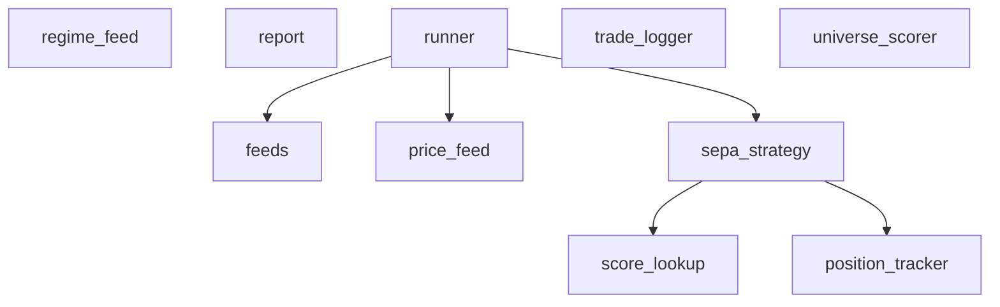

# Module: backtest

## 1. Overview

**Location:** `C:\Users\Hang\PycharmProjects\quantamental\src\backtest`
**Files:** 10

## 2. Visual Architecture



## 3. Data Schemas

### SEPAPosition (dataclass)
*Defined in: `position_tracker`*

| Field | Type |
|-------|------|
| `ticker` | `str` |
| `entry_date` | `datetime` |
| `entry_price` | `float` |
| `entry_atr` | `float` |
| `initial_size` | `int` |
| `score` | `float` |
| `regime` | `int` |
| `initial_stop` | `float` |
| `target1` | `float` |
| `target2` | `float` |
| `tranche1_sold` | `bool` |
| `tranche2_sold` | `bool` |
| `remaining_shares` | `int` |
| `tranche1_pending` | `bool` |
| `tranche2_pending` | `bool` |
| `exit_pending` | `bool` |
| `current_stop` | `float` |
| `exit_date` | `Optional[datetime]` |
| `exit_price` | `Optional[float]` |
| `exit_reason` | `Optional[str]` |
| `max_progression` | `int` |

### DailySnapshot (dataclass)
*Defined in: `sepa_strategy`*

| Field | Type |
|-------|------|
| `date` | `datetime` |
| `portfolio_value` | `float` |
| `cash` | `float` |
| `position_value` | `float` |
| `position_count` | `int` |
| `regime` | `int` |

### SignalRejection (dataclass)
*Defined in: `sepa_strategy`*

| Field | Type |
|-------|------|
| `date` | `datetime` |
| `ticker` | `str` |
| `score` | `float` |
| `reason` | `str` |

### TradeLog (dataclass)
*Defined in: `trade_logger`*

| Field | Type |
|-------|------|
| `ticker` | `str` |
| `entry_date` | `datetime` |
| `entry_price` | `float` |
| `entry_score` | `float` |
| `entry_regime` | `int` |
| `entry_atr` | `float` |
| `initial_size` | `int` |
| `initial_stop` | `float` |
| `target1` | `float` |
| `target2` | `float` |
| `exit_date` | `Optional[datetime]` |
| `exit_price` | `Optional[float]` |
| `exit_reason` | `Optional[str]` |
| `final_size` | `int` |
| `pnl_dollars` | `float` |
| `pnl_percent` | `float` |
| `holding_days` | `int` |
| `tranche1_date` | `Optional[datetime]` |
| `tranche1_price` | `Optional[float]` |
| `tranche2_date` | `Optional[datetime]` |
| `tranche2_price` | `Optional[float]` |

## 4. Implementation Rules

| Constant | Value | File |
|----------|-------|------|
| `BACKTEST_DATA_DIR` | `config.DATA_DIR / 'backtest'` | `price_feed` |
| `PRICE_OUTPUT_DIR` | `BACKTEST_DATA_DIR / 'prices'` | `price_feed` |
| `BACKTEST_DATA_DIR` | `config.DATA_DIR / 'backtest'` | `regime_feed` |
| `BACKTEST_DATA_DIR` | `config.DATA_DIR / 'backtest'` | `runner` |
| `BACKTEST_DATA_DIR` | `config.DATA_DIR / 'backtest'` | `universe_scorer` |
| `D2_PATH` | `config.DATA_DIR / 'ml' / 'd2.parquet'` | `universe_scorer` |
| `X` | `df[self._m01_features].copy()` | `universe_scorer` |

## 5. Public Interface

### `feeds`

**class SEPAStockFeed**
**class M03RegimeFeed**
- `load_stock_feed(ticker: str, prices_dir: str) -> SEPAStockFeed`
- `load_regime_feed(regime_path: str) -> M03RegimeFeed`

### `position_tracker`

**class PositionTracker**
  - `register_entry_intent(order_ref: int, intent: dict)`
  - `confirm_entry(order_ref: int, executed_price: float, executed_size: int) -> Optional[SEPAPosition]`
  - `record_partial_exit(ticker: str, shares_sold: int, exit_price: float, exit_reason: str, exit_date: Optional[datetime]) -> bool`
  - `is_in_cooldown(ticker: str, current_date: datetime, cooldown_days: int) -> bool`
  - `get_position(ticker: str) -> Optional[SEPAPosition]`
  - `has_position(ticker: str) -> bool`
  - `get_open_count() -> int`
  - `get_all_open() -> List[SEPAPosition]`
  - `get_all_closed() -> List[SEPAPosition]`
  - `update_stops(ticker: str, current_atr: float, current_high: float) -> Optional[float]`
  - `check_stops(ticker: str, current_low: float) -> bool`
  - `check_targets(ticker: str, current_high: float) -> Optional[str]`
  - `get_stats() -> Dict`

### `price_feed`

- `calculate_atr(df: pd.DataFrame, period: int) -> pd.Series`
- `get_qualifying_tickers(scores_path: Path, min_score: float, min_percentile: float) -> Set[str]`
- `prepare_price_feeds(start_date: str, end_date: str, scores_path: Optional[Path], output_dir: Optional[Path], min_score: float, min_percentile: float, atr_period: int) -> List[str]`
- `list_prepared_tickers(output_dir: Optional[Path]) -> List[str]`

### `regime_feed`

- `prepare_regime_feed(start_date: str, end_date: str, output_path: Optional[Path], trading_days_only: bool) -> pd.DataFrame`

### `report`

- `calculate_rolling_sharpe(equity_curve: pd.DataFrame, window_months: int, risk_free_rate: float) -> pd.Series`
- `generate_report(metrics: Dict[str, Any], trade_df: Optional[pd.DataFrame], equity_curve: Optional[pd.DataFrame], output_path: Optional[str], start_date: str, end_date: str, initial_cash: float, strategy_params: Optional[Dict[str, Any]]) -> str`
- `generate_monthly_returns(equity_curve: pd.Series) -> pd.DataFrame`

### `runner`

**class SEPABacktestRunner**
  - `setup(max_tickers: Optional[int], specific_tickers: List[str])`
  - `run() -> Dict[str, Any]`
  - `get_equity_curve_dataframe() -> Optional[pd.DataFrame]`
  - `get_trade_dataframe() -> Optional[pd.DataFrame]`
  - `save_report(metrics: Dict[str, Any], output_dir: Optional[Path]) -> str`
  - `print_results(metrics: Optional[Dict])`
  - `plot(save_path: Optional[str])`
- `run_backtest(start_date: str, end_date: str, initial_cash: float, max_tickers: Optional[int]) -> Dict[str, Any]`

### `score_lookup`

**class ScoreLookup**
  - `get_candidates(date: datetime, min_score: float, min_percentile: float, rank_by: Literal['trailing', 'daily']) -> List[Tuple[str, float, float]]`
  - `get_score(date: datetime, ticker: str) -> Optional[Tuple[float, float, float]]`
  - `get_available_dates() -> List[datetime]`
  - `get_date_range() -> Tuple[datetime, datetime]`
  - `get_stats() -> Dict`

### `sepa_strategy`

**class SEPAHybridV1**
  - `notify_order(order)`
  - `next()`
  - `stop()`
  - `get_exposure_stats() -> Dict`
  - `get_signal_rejection_stats() -> Dict`
  - `get_equity_curve() -> List[tuple]`

### `trade_logger`

**class TradeLogger**
  - `log_entry(ticker: str, entry_date: datetime, entry_price: float, entry_score: float, entry_regime: int, entry_atr: float, initial_size: int, initial_stop: float, target1: float, target2: float)`
  - `log_partial_exit(ticker: str, exit_date: datetime, exit_price: float, shares_sold: int, exit_reason: str)`
  - `get_open_trades() -> List[TradeLog]`
  - `get_closed_trades() -> List[TradeLog]`
  - `to_dataframe() -> pd.DataFrame`
  - `save(path: str)`
  - `load(path: str)`
  - `get_stats() -> Dict[str, Any]`
  - `get_exit_breakdown() -> Dict[str, int]`
  - `get_regime_breakdown() -> Dict[int, Dict[str, float]]`

### `universe_scorer`

**class UniverseScorer**
  - `load_model()`
  - `score_universe(start_date: str, end_date: str, output_path: Optional[Path]) -> pd.DataFrame`
- `score_universe(start_date: str, end_date: str, output_path: Optional[Path]) -> pd.DataFrame`


## 7. Strategy Configuration Guide

Adjust these parameters in `sepa_strategy.py` to tune strategy selectivity.

### Critical Parameters

| Parameter | Type | Range | Description |
|-----------|------|-------|-------------|
| `min_score` | `float` | `0.0` - `100.0` | Absolute floor for M01 score. Scores below this are rejected immediately. |
| `min_percentile` | `float` | `0.0` - `1.0` | Minimum **daily rank percentile**. `0.9` means only the top 10% of stocks that day are eligible. |

> [!WARNING]
> `min_percentile` must be between **0.0 and 1.0**. Setting it to an integer like `10` will filter out ALL stocks (since rank `0.9` < `10`).

### Configuration Presets

#### 1. "Top N Competition" (Recommended)
Let the regime filter exposure, and simply pick the best available stocks to fill the slots.
```python
('min_score', 30.0),       # Weak floor, just to filter noise
('min_percentile', 0.0),  # No hard gate - best candidates win
```

#### 2. Balanced Quality
Ensure stocks have decent absolute quality and are in the top tier relative to peers.
```python
('min_score', 50.0),       # Must be "neutral" or better
('min_percentile', 0.80), # Top 20% of daily ranks
```

#### 3. "Sniper" Mode (Strict)
Only take the absolute highest conviction setups. High win rate, lower frequency.
```python
('min_score', 70.0),       # Strong Bull conviction
('min_percentile', 0.90), # Top 10% elite
```

## 8. Maintenance Log

**Last Updated:** 2026-02-04
