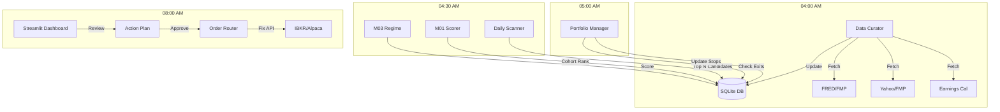

### 📄 File: `docs/system_architecture_v2.md`

# SEPA Hybrid Production Architecture

**Version:** 2.0
**Status:** Blueprint
**Core Principle:** "State-Aware, Database-Centric Execution"

---

## 1. Executive Summary

This document defines the production architecture for the SEPA Hybrid V1 strategy. It transitions the logic from a Backtrader simulation to a modular, database-driven live trading system.

**Key Changes from V1 (Backtest):**

1. **Persistence:** All state (stops, targets, tranches) is stored in a SQLite/Postgres database, not in RAM.
2. **Decoupling:** Scanning (Entry) is separated from Portfolio Management (Exit).
3. **Human-in-the-Loop:** The system generates a "Daily Action Plan" for trader approval before execution.

---

## 2. System High-Level Design

The system follows a linear **Cron-Driven Pipeline** that executes daily before market open.

---

## 3. Database Schema (The "Brain")

We leverage your existing `buy_list` but add tables to handle the **Shadow Tracker** (Portfolio State).

### 3.1 Existing Tables

* **`buy_list`**: Daily candidates generated by `daily_scanner.py`.
* **`market_data`**: OHLCV cache (Parquet-backed, metadata in DB).

### 3.2 New Tables (The Shadow Tracker)

**Table: `active_trades**` (State of Open Positions)
*Tracks the logical state of every position, independent of the broker.*

| Column | Type | Description |
| --- | --- | --- |
| `trade_id` | `UUID` | Unique identifier. |
| `ticker` | `TEXT` | Symbol. |
| `entry_date` | `DATE` | Date of entry. |
| `entry_price` | `REAL` | Cost basis. |
| `current_qty` | `INT` | Shares currently held. |
| `sl_price` | `REAL` | **Current Hard Stop level.** |
| `tp1_level` | `REAL` | Price target for Tranche 1. |
| `tp2_level` | `REAL` | Price target for Tranche 2. |
| `tranche_state` | `INT` | `0`=Full, `1`=T1 Sold, `2`=T2 Sold. |
| `highest_close` | `REAL` | High water mark (for trailing logic). |

**Table: `trade_journal**` (Forensic Log)
*Detailed audit trail of every decision.*

| Column | Type | Description |
| --- | --- | --- |
| `timestamp` | `DATETIME` | When the event occurred. |
| `ticker` | `TEXT` | Related symbol. |
| `event_type` | `TEXT` | `ENTRY`, `EXIT_STOP`, `EXIT_T1`, `REGIME_LIQ`. |
| `price` | `REAL` | Execution price. |
| `regime` | `INT` | M03 state at moment of event. |
| `notes` | `TEXT` | Auto-generated reason (e.g. "Hit T1 at 145.20"). |

---

## 4. Component Architecture

### 4.1 Data Curator (Ingestion)

* **Module:** `data_curator.py` (Existing)
* **Upgrade Required:**
* **Earnings Filter:** Update `src/fundamental_engine.py` to flag tickers reporting earnings in `T+3` days.
* **M03 Sync:** Ensure `src/macro_engine.py` runs *before* the scanner to provide the daily `allow_longs` gate.

### 4.2 Daily Scanner (Entry Engine)

* **Module:** `daily_scanner.py` (Existing)
* **Upgrade Required:**
* **Cohort Normalization:** Replace the current scoring logic with the `10-Day Cohort` method validated in backtesting.
* **Top N Logic:** Update the `save_to_db` function to enforce the "Competition" (Rank by Score  Select Top N) rather than just dumping everything.
* **Earnings Blackout:** Hard filter: `if earnings_date <= today + 3: skip`.

### 4.3 Portfolio Manager (Exit Engine) -- **NEW**

* **Module:** `src/strategy/portfolio_manager.py`
* **Responsibility:** The "Shadow Tracker." It runs daily at 05:00 AM.
* **Logic:**
1. Load `active_trades` from DB.
2. Load yesterday's OHLCV.
3. **Check Stops:** `if Low < sl_price`: Mark for `SELL_STOP`.
4. **Check Targets:** `if High > tp1_level` AND `tranche_state == 0`: Mark for `SELL_T1`.
5. **Update Trailing:** If `tranche_state > 0`, calculate new SL based on SMA/ATR logic. Update `sl_price` in DB.
6. **Regime Check:** If `M03.regime == 0`: Mark **ALL** for `LIQUIDATE`.

### 4.4 Dashboard (The Cockpit)

* **Module:** `dashboard.py` (Existing)
* **Upgrade Required:**
* **"Portfolio" Page:** Visualize `active_trades`. Show current PnL, distance to Stop, and distance to Target.
* **"Action Plan" Widget:** A table showing today's generated orders (Buys from Scanner + Sells from Portfolio Manager).
* **"Execute" Button:** Trigger the `OrderRouter` to send approved orders to the broker.

---

## 5. Implementation Roadmap

### Phase 1: The "Shadow" (No Execution)

* **Goal:** Run the system in "Paper Mode" keeping state in the DB.
* **Tasks:**
1. Create `active_trades` table.
2. Build `PortfolioManager` class to simulate exits based on price data.
3. Update `daily_scanner` with Cohort Normalization.
4. Run for 1 week. Verify `trade_journal` matches your manual analysis.

### Phase 2: The "Link" (Dashboard Integration)

* **Goal:** Visualize the machine's brain.
* **Tasks:**
1. Add Portfolio Page to Streamlit.
2. Visualize "Stop Loss" levels on the price charts in the dashboard.
3. Add the "Earnings Warning" badge to the Buy List.

### Phase 3: The "Hand" (Execution)

* **Goal:** Connect to Broker.
* **Tasks:**
1. Build `src/execution/alpaca_router.py` (or IBKR).
2. Implement `send_orders(action_plan)` function.
3. Add "Emergency Kill Switch" (Cancel all orders).

---

## 6. Daily Schedule (Cron)

| Time (ET) | Process | Description |
| --- | --- | --- |
| **04:00** | `python data_curator.py --update-all` | Fetch Prices, Macro, Earnings. |
| **04:30** | `python daily_scanner.py --date today` | Run M01/M02, Gen Buy List. |
| **05:00** | `python portfolio_manager.py --update` | Process Exits, Update Stops. |
| **08:00** | **Trader Review** | Trader checks Dashboard, approves plan. |
| **09:30** | **Market Open** | Execution (if automated) or Manual Entry. |
| **16:05** | `python data_curator.py --update-prices` | Snapshot closing data. |

---

## 7. Next Immediate Step

**Build the `PortfolioManager` logic.**
Since `daily_scanner` handles entries, we effectively have "Half a System." We need the logic that monitors existing positions and tells you when to sell.

Do you want me to generate the **Python specification for the `PortfolioManager` class**?