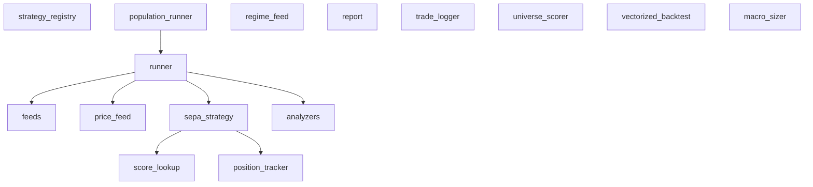

# Module: backtest

## 1. Overview

**Location:** `C:\Users\Hang\PycharmProjects\quantamental\src\backtest`
**Files:** 13

## 2. Visual Architecture

> **CLIs over these engines** (`scripts/`): `run_backtest.py` (single run),
> `run_strategy_array.py` (S-series), `run_strategy_confirm.py` (parallel grids),
> `run_oos_gate.py` (fixed-config OOS gate), `run_strategy_wfo.py` (vec re-optimize
> search), `run_model_arena.py`, `check_backtest_parity.py`. The array/confirm CLIs
> are thin wrappers over `population_runner`; both read configs from `strategy_registry`.

## 3. Data Schemas

### SEPAPosition (dataclass)
*Defined in: `position_tracker`*

| Field | Type |
|-------|------|
| `ticker` | `str` |
| `entry_date` | `datetime` |
| `entry_price` | `float` |
| `entry_atr` | `float` |
| `initial_size` | `int` |
| `score` | `float` |
| `regime` | `int` |
| `initial_stop` | `float` |
| `target1` | `float` |
| `target2` | `float` |
| `tranche1_sold` | `bool` |
| `tranche2_sold` | `bool` |
| `remaining_shares` | `int` |
| `tranche1_pending` | `bool` |
| `tranche2_pending` | `bool` |
| `exit_pending` | `bool` |
| `current_stop` | `float` |
| `exit_date` | `Optional[datetime]` |
| `exit_price` | `Optional[float]` |
| `exit_reason` | `Optional[str]` |
| `max_progression` | `int` |

### DailySnapshot (dataclass)
*Defined in: `sepa_strategy`*

| Field | Type |
|-------|------|
| `date` | `datetime` |
| `portfolio_value` | `float` |
| `cash` | `float` |
| `position_value` | `float` |
| `position_count` | `int` |
| `regime` | `int` |

### SignalRejection (dataclass)
*Defined in: `sepa_strategy`*

| Field | Type |
|-------|------|
| `date` | `datetime` |
| `ticker` | `str` |
| `score` | `float` |
| `reason` | `str` |

### TradeLog (dataclass)
*Defined in: `trade_logger`*

| Field | Type |
|-------|------|
| `ticker` | `str` |
| `entry_date` | `datetime` |
| `entry_price` | `float` |
| `entry_score` | `float` |
| `entry_regime` | `int` |
| `entry_atr` | `float` |
| `initial_size` | `int` |
| `initial_stop` | `float` |
| `target1` | `float` |
| `target2` | `float` |
| `exit_date` | `Optional[datetime]` |
| `exit_price` | `Optional[float]` |
| `exit_reason` | `Optional[str]` |
| `final_size` | `int` |
| `pnl_dollars` | `float` |
| `pnl_percent` | `float` |
| `holding_days` | `int` |
| `tranche1_date` | `Optional[datetime]` |
| `tranche1_price` | `Optional[float]` |
| `tranche2_date` | `Optional[datetime]` |
| `tranche2_price` | `Optional[float]` |

## 4. Implementation Rules

| Constant | Value | File |
|----------|-------|------|
| `BACKTEST_DATA_DIR` | `config.DATA_DIR / 'backtest'` | `price_feed` |
| `PRICE_OUTPUT_DIR` | `BACKTEST_DATA_DIR / 'prices'` | `price_feed` |
| `BACKTEST_DATA_DIR` | `config.DATA_DIR / 'backtest'` | `regime_feed` |
| `BACKTEST_DATA_DIR` | `config.DATA_DIR / 'backtest'` | `runner` |
| `BACKTEST_DATA_DIR` | `config.DATA_DIR / 'backtest'` | `universe_scorer` |
| `D2_PATH` | `config.DATA_DIR / 'ml' / 'd2.parquet'` | `universe_scorer` |
| `X` | `df[self._m01_features].copy()` | `universe_scorer` |

## 5. Public Interface

### `strategy_registry`

Named, versioned strategy configs (a dict of kwargs behind a stable name + a
human-readable fingerprint) — the single source of truth for the champion, the
S-series, and experiment arms. Not a class hierarchy: configs are
`SEPAHybridV1` kwargs passed straight through the runner.

**class StrategyDef** — `(name, signal, strategy_kwargs, description, status, fingerprint)`; `status ∈ {champion, candidate, baseline, retired}`. `fingerprint` auto-derives if blank.
- `parse_fingerprint(fp: str) -> Dict[str, Any]` — `E1.d0_X1.sl15_Xt.t1_10_X3.sma50_S0.top5` → kwargs.
- `to_fingerprint(kwargs: Dict[str, Any]) -> str` — canonical label (round-trips with parse).
- `get(name: str) -> StrategyDef`
- `by_status(status: str) -> List[StrategyDef]`
- `STRATEGIES: Dict[str, StrategyDef]` — the registry. Current champion = `champion` / `E1.d0_X1.sl15_Xt.t1_10_X3.sma50_S0.top5`.

**Fingerprint scheme** (`<Entry>_<Stop>_<TP>_<Selection>`): `E1.d0` immediate entry / `E2.dN` delayed · `X1.slNN` whole-% stop · `Xt.t1_NN` tranche T1 target · `X3.smaNN` decoupled SMA trend exit · `S0.topN` top-N by score · `skipK` selection_skip_top. Only components a config sets appear.

### `population_runner`

Shared "run one arm end-to-end, fan out across arms" path. Both
`run_strategy_array.py` and `run_strategy_confirm.py` are thin CLIs over it. Every
prod run persists the **full artifact set** (trades + rejections + equity +
metrics + config). BackTrader is serial *within* an arm (temporal fidelity),
parallel *across* arms (ProcessPoolExecutor; DuckDB reads are read-only).

**class Job** — `(id, description, strategy_kwargs, signal, model, scores_df, score_loader)`; pass `score_loader` (a picklable partial) instead of `scores_df` for parallel workers.
- `run_arm(job, start, end, initial_cash, out_dir, db_path) -> Dict` — one arm, persists `<id>/{trades,rejections,equity}.parquet + {metrics,config}.json`, returns summary row.
- `run_population(jobs, start, end, initial_cash, out_dir, db_path, workers=3) -> List[Dict]` — serial if `workers<=1`, else fan out.

### `feeds`

**class SEPAStockFeed**
**class M03RegimeFeed**
- `load_stock_feed(ticker: str, prices_dir: str) -> SEPAStockFeed`
- `load_regime_feed(regime_path: str) -> M03RegimeFeed`

### `position_tracker`

**class PositionTracker**
  - `register_entry_intent(order_ref: int, intent: dict)`
  - `confirm_entry(order_ref: int, executed_price: float, executed_size: int) -> Optional[SEPAPosition]`
  - `record_partial_exit(ticker: str, shares_sold: int, exit_price: float, exit_reason: str, exit_date: Optional[datetime]) -> bool`
  - `is_in_cooldown(ticker: str, current_date: datetime, cooldown_days: int) -> bool`
  - `get_position(ticker: str) -> Optional[SEPAPosition]`
  - `has_position(ticker: str) -> bool`
  - `get_open_count() -> int`
  - `get_all_open() -> List[SEPAPosition]`
  - `get_all_closed() -> List[SEPAPosition]`
  - `update_stops(ticker: str, current_atr: float, current_high: float) -> Optional[float]`
  - `check_stops(ticker: str, current_low: float) -> bool`
  - `check_targets(ticker: str, current_high: float) -> Optional[str]`
  - `get_stats() -> Dict`

### `price_feed`

- `calculate_atr(df: pd.DataFrame, period: int) -> pd.Series`
- `get_qualifying_tickers(scores_path: Path, min_score: float, min_percentile: float) -> Set[str]`
- `prepare_price_feeds(start_date: str, end_date: str, scores_path: Optional[Path], output_dir: Optional[Path], min_score: float, min_percentile: float, atr_period: int) -> List[str]`
- `list_prepared_tickers(output_dir: Optional[Path]) -> List[str]`

### `regime_feed`

- `prepare_regime_feed(start_date: str, end_date: str, output_path: Optional[Path], trading_days_only: bool) -> pd.DataFrame`

### `report`

- `calculate_rolling_sharpe(equity_curve: pd.DataFrame, window_months: int, risk_free_rate: float) -> pd.Series`
- `generate_report(metrics: Dict[str, Any], trade_df: Optional[pd.DataFrame], equity_curve: Optional[pd.DataFrame], output_path: Optional[str], start_date: str, end_date: str, initial_cash: float, strategy_params: Optional[Dict[str, Any]]) -> str`
- `generate_monthly_returns(equity_curve: pd.Series) -> pd.DataFrame`

### `runner`

**class SEPABacktestRunner**
  - `setup(scores_df: pd.DataFrame, max_tickers: Optional[int], specific_tickers: List[str], strategy_kwargs: Optional[Dict[str, Any]])` — `strategy_kwargs` passes straight through to `SEPAHybridV1` (the kwargs-passthrough the registry relies on; no subclassing).
  - `run() -> Dict[str, Any]`
  - `get_equity_curve_dataframe() -> Optional[pd.DataFrame]`
  - `get_trade_dataframe() -> Optional[pd.DataFrame]`
  - `save_report(metrics: Dict[str, Any], output_dir: Optional[Path]) -> str`
  - `print_results(metrics: Optional[Dict])`
  - `plot(save_path: Optional[str])`
- `run_backtest(start_date: str, end_date: str, initial_cash: float, max_tickers: Optional[int]) -> Dict[str, Any]`

### `score_lookup`

**class ScoreLookup**
  - `get_candidates(date: datetime, min_score: float, min_percentile: float, rank_by: Literal['trailing', 'daily']) -> List[Tuple[str, float, float]]`
  - `get_score(date: datetime, ticker: str) -> Optional[Tuple[float, float, float]]`
  - `get_available_dates() -> List[datetime]`
  - `get_date_range() -> Tuple[datetime, datetime]`
  - `get_stats() -> Dict`

### `sepa_strategy`

**class SEPAHybridV1**
  - `notify_order(order)`
  - `next()`
  - `stop()`
  - `get_exposure_stats() -> Dict`
  - `get_signal_rejection_stats() -> Dict`
  - `get_equity_curve() -> List[tuple]`

### `trade_logger`

**class TradeLogger**
  - `log_entry(ticker: str, entry_date: datetime, entry_price: float, entry_score: float, entry_regime: int, entry_atr: float, initial_size: int, initial_stop: float, target1: float, target2: float)`
  - `log_partial_exit(ticker: str, exit_date: datetime, exit_price: float, shares_sold: int, exit_reason: str)`
  - `get_open_trades() -> List[TradeLog]`
  - `get_closed_trades() -> List[TradeLog]`
  - `to_dataframe() -> pd.DataFrame`
  - `save(path: str)`
  - `load(path: str)`
  - `get_stats() -> Dict[str, Any]`
  - `get_exit_breakdown() -> Dict[str, int]`
  - `get_regime_breakdown() -> Dict[int, Dict[str, float]]`

### `universe_scorer`

**class UniverseScorer**
  - `load_model()`
  - `score_from_t3(start_date: str, end_date: str, db_path: Optional[Path], ranking_lookback_days: int) -> pd.DataFrame` — canonical scoring path (scores SEPA candidates daily from `t3_sepa_features`); returns the `ScoreLookup` contract.

## 7. Strategy Configuration Guide

Don't hand-write kwargs. Configs are named in `strategy_registry.STRATEGIES` and
passed to the runner via `strategy_kwargs` — reference a registry name, or add a
new `StrategyDef`. The knobs below are the ones the registry sets.

### Entry / selection (the live model)

| Parameter | Type | Description |
|-----------|------|-------------|
| `entry_mode` | `'top_n' \| 'percentile'` | Slot-fill mode. Live configs use `top_n`. |
| `entry_top_n` | `int` | N slots to fill (champion = 5). |
| `rank_by` | `'prob_elite' \| 'trailing' \| 'daily'` | Ranking metric. Champion ranks by `prob_elite`. |
| `min_prob_elite` | `float` | Entry gate on P(elite) (champion = 0.15). |
| `min_score` | `float` | Absolute M01 floor; `0` when `prob_elite` is the gate. |
| `selection_skip_top` | `int` | Drop the K highest-ranked names before slot-fill (A3 tail-pollution cap; proto-specific DD lever, no-op on binary). |
| `regime_max_pos` | `dict` | Per-M03-regime slot cap; regime 0 (strong bear) = 0 → hard-liquidate. |

### Exits (where the edge lives)

| Parameter | Type | Description |
|-----------|------|-------------|
| `max_stop_pct` | `float` | Whole-position % stop. **Champion = 0.15** (15%). |
| `atr_stop_mult` | `float` | ATR stop multiplier. **Inert** on the champion — `initial_stop = max(price−mult·ATR, price·(1−pct))` and the 10–15% floor always wins. A *small* `max_stop_pct` is a tight CAP, not a floor (the G7 pure-ATR trap). |
| `min_target1_pct` | `float` | Tranche-1 profit-take. **Champion = 0.10** (early +10% pop). |
| `sma_exit_period` | `int` | Trend-exit SMA (champion = 50). |
| `sma_exit_independent` | `bool` | `True` = decoupled SMA (close<SMA ⇒ out), beats tranche-gated. Champion = `True`. |

> The champion (`E1.d0_X1.sl15_Xt.t1_10_X3.sma50_S0.top5`) is a **stop×TP
> interaction**: the wide 15% stop lets winners breathe; the early +10% T1 banks
> the first pop before the wide stop gives it back. `sl15` and `tpTight` each
> *alone* underperform the old seed — together they win (IS 1.10, OOS-gated 1.47).

## 8. Productionisation workflow (registry → gate → promote)

The 2026-07-05 backtest productionisation
(`docs/architecture/backtest_productionisation_plan.md`) folded the ad-hoc
strategy-exploration harness into the prod suite behind clean seams. **Phases 1–3
+ the G7 fix are shipped; Phase 4 is planned (below).**

**Shipped:**
1. **Registry (`strategy_registry`)** — every config is a named, fingerprinted
   `StrategyDef`. Champions/experiments are referenceable, diffable,
   regression-tested. `run_strategy_array` (S-series) and `run_strategy_confirm`
   (grids) both source configs here; `_base_kwargs` is single-sourced.
2. **Fixed-config OOS gate (`scripts/run_oos_gate.py --strategy <name>`)** — the
   promotion gate. Rolls train/test folds, runs the *locked* registry config on
   each unseen BackTrader window, stitches OOS → `data/selection_sweep/wfo_gate/<name>.json`.
   NOT `run_strategy_wfo.py` (that *re-optimizes* on the vectorized engine which
   lacks tranche TP — a **search**, complementary; don't merge them). Re-gating
   the champion reproduces **agg OOS Sharpe 1.47 / +245% / −28%** exactly.
3. **Shared population runner (`population_runner`)** — the parallel
   run-arm-and-persist path, with the **rejection audit** (`rejections.parquet`:
   why a qualified candidate did NOT enter — `no_slots`/`skip_top`/`cooldown`/…)
   persisted for all prod runs. Array/confirm are thin CLIs over it.
4. **G7 fix** — the `G_x4` pure-ATR arms mis-expressed the stop (small
   `max_stop_pct` = tight cap, not floor → −69%); fixed to a wide 0.30 net so ATR
   dominates.

**Guards:** `tests/test_strategy_registry.py` (kwargs validity + fingerprint
round-trip), `tests/test_oos_gate.py` (prod gate reproduces recorded Sharpe),
`tests/test_population_runner.py` (artifact set + rejection persistence + fan-out).

### Phase 4 — wire the champion live (PLANNED)

**Purpose:** the champion is currently a *validated backtest config*, not a
*tradeable* one. Phase 4 closes the last gap — from "gated on 3 historical folds"
to "running forward on unseen data." Nothing here is new science; it's promotion
plumbing + a forward-quarter probation.

| Step | What | Why |
|---|---|---|
| **4a — live config** | Promote the champion into the live `SEPAFlatV1` defaults (`max_stop_pct=0.15, min_target1_pct=0.10, sma_exit_independent=True, entry_top_n=5`); **drop the inert `atr_stop_mult`**. Or a registry-driven live selector reading `strategy_registry.get("champion")`. | Makes the champion the actual strategy the pipeline trades, not a kwargs dict in a script. |
| **4b — nightly shadow** | Add the champion to the nightly pipeline **shadow** (paper, no capital); log fills vs backtest. | The OOS gate is 3 historical folds and 2024 was flat — a live forward quarter on unseen 2026-H2 data is the *real* out-of-sample (Path forward Tier A.1). Treat the live slot as paper/small-size probation, not a full allocation. |
| **4c — parity guards (G6)** | Extend `check_backtest_parity.py` / `test_backtest_smoke.py` to cover the new primitives (`selection_skip_top`, `regime_gate`, `max_concurrent_positions`). | These knobs have no prod call-site yet → untested against the parity/scoring guards. |

> **Deferred deliberately** — Phase 4 touches the running Prefect nightly on the
> `sh019` infra box, so it's a separate, supervised change. It also depends on
> the friction / liquidity-floor re-run (Tier A.2) to confirm the edge survives
> realistic costs *before* any real capital — the microcap +861% is a ranking
> signal, not a P&L promise.

## 9. Maintenance Log

- **2026-07-05** — Backtest productionisation (Phases 1–3 + G7): added
  `strategy_registry` + `population_runner`, `scripts/run_oos_gate.py`; array/confirm
  refactored to thin CLIs over the shared runner. Fixed stale §5 (`runner.setup`
  signature, `universe_scorer.score_from_t3`) and §7 (removed non-existent
  `min_percentile` guide). Phase 4 (live wiring) documented as planned.
- **2026-02-04** — Auto-generated passport.
