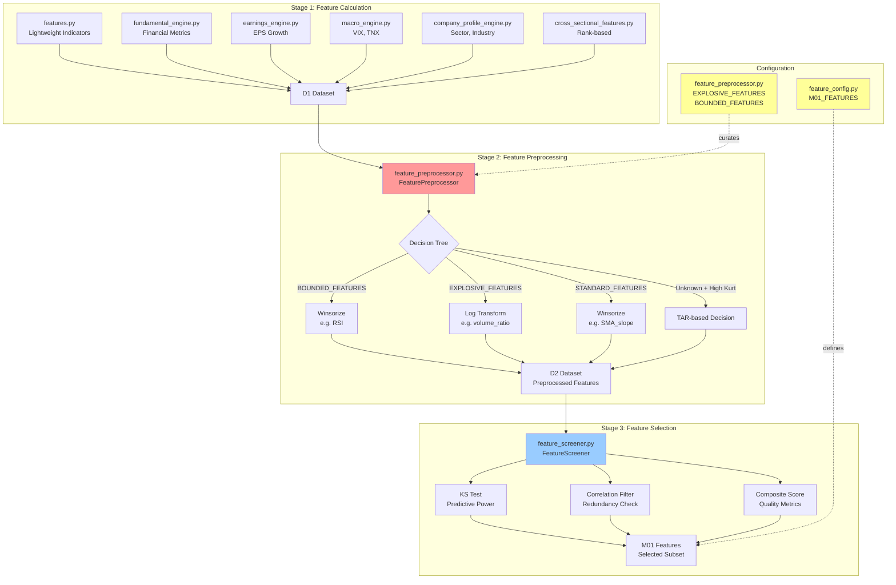
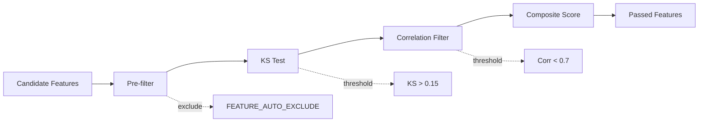

# Feature Pipeline Passport

**Last Updated:** 2026-02-09
**Status:** ✅ Production Ready (Preprocessing Bug Fixed)

---

## 1. Overview

The Feature Pipeline is a 3-stage system for creating, preprocessing, and selecting features for ML models:

1. **Feature Calculation** - Compute raw features from market data, fundamentals, and macro
2. **Feature Preprocessing** - Transform features to handle extreme distributions
3. **Feature Selection** - Screen and validate features for model training

**Architecture Philosophy:**
- **Separation of Concerns**: Calculation → Transformation → Selection are independent stages
- **Manual Curation > Heuristics**: Domain knowledge overrides statistical rules
- **Validation at Every Step**: Fail fast with clear errors rather than silent bugs

---

## 2. Visual Architecture



---

## 3. Stage 1: Feature Calculation

### 3.1 Lightweight Indicators (features.py)

**Purpose:** Fast technical indicators computed in real-time

**Location:** [src/features.py](../../src/features.py)

**Key Functions:**
| Function | Output | Description |
|----------|--------|-------------|
| `compute_momentum_features()` | price_mom_5, price_mom_21, etc. | Rolling returns over multiple windows |
| `compute_volume_features()` | volume_ratio, volume_surge | Abnormal volume detection |
| `compute_volatility_features()` | atr, atr_pct, volatility_contraction | Price dispersion metrics |
| `compute_price_position()` | price_vs_sma50, RS_line | Relative position indicators |
| `compute_alpha_factors()` | alpha009, alpha034, etc. | WorldQuant-style alphas |

**Data Source:** D0 (daily OHLCV bars)

**Performance:** ~50ms for 100 tickers (vectorized pandas)

**Characteristics:**
- ✅ Stateless (no external dependencies)
- ✅ Vectorized (pandas operations)
- ✅ Real-time capable (< 100ms)

---

### 3.2 Fundamental Engine (fundamental_engine.py)

**Purpose:** Quarterly financial metrics from income statement, balance sheet, cash flow

**Location:** [src/fundamental_engine.py](../../src/fundamental_engine.py)

**Key Metrics:**
| Category | Examples | Update Frequency |
|----------|----------|------------------|
| Growth | revenue_growth_yoy, eps_growth_yoy | Quarterly |
| Profitability | roe, roa, operating_margin | Quarterly |
| Financial Health | debt_to_equity, current_ratio | Quarterly |
| Valuation | pe_ratio, price_to_book | Daily (price changes) |

**Data Source:** `data/fundamental/` (Polygon API)

**Lag:** 45-90 days (earnings reports + filing)

**Handling Missing Data:**
- Forward-fill up to 120 days
- Flag stale data with `_days_since_update` columns

---

### 3.3 Earnings Engine (earnings_engine.py)

**Purpose:** EPS surprise and earnings quality metrics

**Location:** [src/earnings_engine.py](../../src/earnings_engine.py)

**Key Features:**
| Feature | Formula | Interpretation |
|---------|---------|----------------|
| `eps_surprise_pct` | (Actual - Est) / Est | Earnings beat/miss |
| `revenue_surprise_pct` | (Actual - Est) / Est | Revenue beat/miss |
| `earnings_consistency` | Std(EPS_surprise) over 4Q | Predictability |
| `days_since_earnings` | Days from last report | Staleness indicator |

**Data Source:** `data/earnings/` (Polygon API)

**Critical Timing:** Use `days_since_earnings` to avoid look-ahead bias

---

### 3.4 Macro Engine (macro_engine.py)

**Purpose:** Market-wide regime indicators

**Location:** [src/macro_engine.py](../../src/macro_engine.py)

**Key Indicators:**
| Symbol | Name | Signal |
|--------|------|--------|
| ^VIX | Volatility Index | Fear gauge (>25 = high vol regime) |
| ^TNX | 10Y Treasury Yield | Risk-free rate, discount rate |
| SPY | S&P 500 ETF | Market direction proxy |

**Update:** Daily close

**Usage:** Added as features to D1, merged on `date` (broadcast to all tickers)

---

### 3.5 Company Profile Engine (company_profile_engine.py)

**Purpose:** Static company metadata (sector, industry, market cap)

**Location:** [src/company_profile_engine.py](../../src/company_profile_engine.py)

**Key Fields:**
- `sector` (e.g., "Technology", "Healthcare")
- `industry` (e.g., "Software", "Biotechnology")
- `market_cap_category` (Small/Mid/Large cap)

**Encoding:** Categorical features (handled natively by XGBoost)

**Update:** Quarterly or on major corporate events

---

### 3.6 Cross-Sectional Features (cross_sectional_features.py)

**Purpose:** Rank-based features computed across universe on each date

**Location:** [src/cross_sectional_features.py](../../src/cross_sectional_features.py)

**Key Features:**
| Feature | Formula | Use Case |
|---------|---------|----------|
| `rs_rank` | Percentile rank of RS_line | Relative strength vs peers |
| `volume_rank` | Percentile rank of volume_ratio | Abnormal volume detector |
| `momentum_rank` | Percentile rank of price_mom_21 | Cross-sectional momentum |

**Computation:** Daily (requires full universe snapshot)

**Critical:** Must use `.groupby('date').rank()` to avoid look-ahead bias

---

## 4. Stage 2: Feature Preprocessing

### 4.1 FeaturePreprocessor Class

**Location:** [src/feature_preprocessor.py](../../src/feature_preprocessor.py)

**Purpose:** Transform features to handle extreme distributions and outliers

**Core Design Principle:**
> **Manual Curation > Statistical Heuristics**
> Curated feature lists (`EXPLOSIVE_FEATURES`, `BOUNDED_FEATURES`) ALWAYS override kurtosis-based heuristics

---

### 4.2 Transform Decision Tree

**Updated:** 2026-02-09 (Bug Fix - Moved kurtosis check to unknown features only)

```python
def fit(df, features, target):
    for feature in features:
        kurt = kurtosis(feature)

        # Priority 1: BOUNDED_FEATURES (bypass kurtosis)
        if feature in BOUNDED_FEATURES:
            → winsorize(1st, 99th percentile)

        # Priority 2: EXPLOSIVE_FEATURES (bypass kurtosis)
        elif feature in EXPLOSIVE_FEATURES:
            → log_transform()

        # Priority 3: STANDARD_FEATURES (bypass kurtosis)
        elif feature in STANDARD_FEATURES:
            → winsorize(1st, 99th percentile)

        # Priority 4: Unknown features (apply heuristics)
        else:
            if abs(kurt) <= 10.0:
                → skip (normal distribution)
            else:
                tar = compute_tail_alpha_ratio(feature, target)
                if tar > 1.0:
                    → log_transform()  # Tail has alpha
                else:
                    → winsorize(1st, 99th percentile)
```

---

### 4.3 Curated Feature Lists

**EXPLOSIVE_FEATURES** (Always Log-Transformed)
```python
EXPLOSIVE_FEATURES = [
    'volume_ratio',           # Volume spikes (1x to 100x range)
    'volume_surge',           # Abnormal volume (0 to 50+ stdev)
    'breakout_momentum',      # Breakout strength (sparse, fat tail)
    'alpha009',               # Volatility-weighted momentum
    'alpha034',               # Mean reversion strength
    'price_momentum_curve',   # Acceleration metric
    # ... (20 total)
]
```

**BOUNDED_FEATURES** (Always Winsorized)
```python
BOUNDED_FEATURES = [
    'RSI_5',      # RSI ∈ [0, 100]
    'RSI_14',     # RSI ∈ [0, 100]
    'RSI_21',     # RSI ∈ [0, 100]
    # ... (9 total)
]
```

**STANDARD_FEATURES** (Always Winsorized)
```python
STANDARD_FEATURES = [
    'SMA_50_Slope',              # Trend slope
    'SMA_200_Slope',             # Long-term trend
    'volatility_contraction',    # Vol compression
    # ... (34 total)
]
```

---

### 4.4 Transform Methods

#### Log Transform
```python
def log_transform(x):
    """
    Compress right tail while preserving order.
    Handles negative values by shifting to positive range first.
    """
    if x.min() < 0:
        shift = abs(x.min()) + 1
        return np.log(x + shift)
    else:
        return np.log(x + 1)  # Add 1 to handle zeros
```

**Use Cases:**
- Exponential distributions (volume_ratio: 0.1x to 100x)
- Power-law distributions (breakout events: 95% near zero, 5% large)
- Count data with outliers

#### Winsorization
```python
def winsorize(x, lower_pct=1, upper_pct=99):
    """
    Clip extreme values to percentile bounds.
    Preserves distribution shape, removes outliers.
    """
    lower = np.percentile(x, lower_pct)
    upper = np.percentile(x, upper_pct)
    return np.clip(x, lower, upper)
```

**Use Cases:**
- Bounded metrics (RSI ∈ [0, 100])
- Normal-ish distributions with outliers
- Features where extremes are likely errors

---

### 4.5 Tail-Alpha Ratio (TAR)

**Purpose:** Detect if feature's tail contains predictive signal

**Formula:**
```python
TAR = mean(target | feature > 95th percentile) / mean(target | feature ∈ [40th, 60th])
```

**Interpretation:**
- TAR > 1.2: Tail has strong positive signal → Log transform
- TAR < 0.8: Tail has strong negative signal → Log transform
- TAR ≈ 1.0: Tail has no signal → Winsorize

**Threshold:** 1.0 (anything != 1.0 suggests non-linearity)

---

### 4.6 Validation

**Added:** 2026-02-09 to prevent preprocessing bugs

```python
def _validate_manual_curation(self):
    """
    Validates that curated features have expected transforms.
    Raises ValueError if manual curation was not respected.
    """
    for feature in EXPLOSIVE_FEATURES:
        if feature in requested_features:
            assert config[feature]['transform'] == 'log'

    for feature in BOUNDED_FEATURES:
        if feature in requested_features:
            assert config[feature]['transform'] == 'winsorize'

    # ... etc
```

**Output Example:**
```
[OK] Validated 20 explosive, 2 bounded, 12 standard features
```

---

### 4.7 Output: Preprocessing Config

**Location:** `models/preprocessing_config.json`

**Structure:**
```json
{
    "version": "1.0",
    "created_at": "2026-02-09T12:30:00",
    "kurtosis_threshold": 10.0,
    "tail_alpha_threshold": 1.0,
    "requested_features": ["volume_ratio", "RSI_14", ...],
    "features": {
        "volume_ratio": {
            "transform": "log",
            "category": "explosive",
            "original_kurtosis": 45.2
        },
        "RSI_14": {
            "transform": "winsorize",
            "category": "bounded",
            "lower_bound": 15.3,
            "upper_bound": 84.7,
            "original_kurtosis": 2.1
        }
    }
}
```

**Usage:**
- Saved during training
- Loaded during inference to ensure identical transforms
- Versioned (check `created_at` for staleness)

---

## 5. Stage 3: Feature Selection

### 5.1 FeatureScreener Class

**Location:** [src/evaluation/feature_screener.py](../../src/evaluation/feature_screener.py)

**Purpose:** Identify features with predictive power and filter redundant ones

---

### 5.2 Screening Pipeline



---

### 5.3 KS Test (Kolmogorov-Smirnov)

**Purpose:** Measure distributional difference between high-return and low-return groups

**Formula:**
```python
high_group = feature[target > 75th percentile]
low_group = feature[target < 25th percentile]
ks_statistic, p_value = scipy.stats.ks_2samp(high_group, low_group)
```

**Interpretation:**
- KS = 0.0: Feature has no predictive power (identical distributions)
- KS = 0.15: Weak signal (minimum threshold)
- KS = 0.30: Moderate signal
- KS = 0.50+: Strong signal

**Threshold:** 0.15 (lower = more features pass, higher = stricter)

---

### 5.4 Correlation Filter

**Purpose:** Remove redundant features to reduce multicollinearity

**Method:**
```python
corr_matrix = df[features].corr()
for feat_a, feat_b in high_correlation_pairs:
    if corr(feat_a, feat_b) > 0.7:
        # Keep the one with higher KS score
        if ks[feat_a] > ks[feat_b]:
            remove(feat_b)
        else:
            remove(feat_a)
```

**Threshold:** 0.7 (Pearson correlation)

**Rationale:** Features with r > 0.7 provide redundant information

---

### 5.5 Composite Score (4-Pillar)

**Formula:**
```python
composite_score = (
    ks_score * 0.40 +
    monotonicity_score * 0.25 +
    stability_score * 0.20 +
    (1 - correlation_penalty) * 0.15
)
```

**Pillars:**
1. **KS Score** (40%): Distributional separation power
2. **Monotonicity** (25%): Consistent relationship with target (Spearman ρ)
3. **Stability** (20%): Consistent across time folds (IC variance)
4. **Low Correlation** (15%): Independence from other features

**Output:** Features ranked by composite score

---

### 5.6 Auto-Exclusion List

**Location:** [src/feature_config.py](../../src/feature_config.py) - `FEATURE_AUTO_EXCLUDE`

**Purpose:** Blacklist features known to be problematic

```python
FEATURE_AUTO_EXCLUDE = [
    'ticker',              # Identifier, not feature
    'date',                # Time index
    'entry_date',          # Duplicate of date
    'return_pct',          # Target leakage
    'mfe_pct',             # Target leakage
    'weak_days',           # Computed post-trade
    # ... (20 total)
]
```

**Rationale:**
- Prevent target leakage (features computed from future data)
- Remove identifiers (not predictive)
- Exclude post-trade metrics (not available at entry)

---

### 5.7 Output: EDA Report

**Location:** `models/eda_report.md`

**Structure:**
```markdown
# Feature Screening Results

## Summary
- Total Candidates: 235
- Passed KS Test: 87
- Passed Correlation Filter: 64
- Final Selected: 64

## Top Features by KS Score
| Feature | KS Score | Category |
|---------|----------|----------|
| volume_ratio | 0.342 | explosive |
| breakout_momentum | 0.318 | explosive |
| eps_surprise_pct | 0.289 | fundamental |

## Failed Features
| Feature | Reason |
|---------|--------|
| SMA_10 | KS too low (0.08) |
| close_to_open | High correlation with price_mom_1 (0.89) |
```

---

## 6. Feature Configuration

### 6.1 M01_FEATURES (Final Model Input)

**Location:** [src/feature_config.py](../../src/feature_config.py)

**Purpose:** Explicitly define which features M01 uses (after preprocessing)

**Structure:**
```python
M01_FEATURES = [
    # Log-transformed features (prefix added by preprocessor)
    'log_volume_ratio',
    'log_breakout_momentum',
    'log_alpha009',

    # Winsorized features (no prefix, in-place transform)
    'RSI_14',
    'price_vs_sma50',

    # Categorical features (native XGBoost support)
    'sector',
    'market_cap_category',

    # ... (141 total features after preprocessing)
]
```

**Naming Convention:**
- Log-transformed: `log_<original_name>`
- Winsorized: `<original_name>` (no change)
- Categorical: `<original_name>` (no preprocessing)

---

## 7. Critical Bug Fix (2026-02-09)

### 7.1 Problem
Kurtosis check was executing BEFORE checking `EXPLOSIVE_FEATURES` list, causing manually curated features with kurtosis < 10.0 to be silently skipped.

**Affected Features:**
- `breakout_momentum` (kurtosis=8.30) → Missing `log_breakout_momentum`
- `alpha009` (kurtosis=6.96) → Missing `log_alpha009`

### 7.2 Root Cause
```python
# BEFORE (buggy)
if abs(kurt) <= 10.0:
    continue  # ❌ Skips before checking EXPLOSIVE_FEATURES

if feature in EXPLOSIVE_FEATURES:
    # ← Never reached if kurtosis low
```

### 7.3 Fix
Moved kurtosis check to `else` branch (unknown features only):

```python
# AFTER (fixed)
if feature in EXPLOSIVE_FEATURES:
    → log_transform()  # ✅ Always executes

else:
    if abs(kurt) <= 10.0:
        continue  # Now only skips unknown features
```

### 7.4 Validation
Added `_validate_manual_curation()` function to ensure curated features are fitted correctly.

**Output:**
```
[OK] Validated 20 explosive, 2 bounded, 12 standard features
```

**Documentation:** [docs/BUG_FIX_COMPLETE.md](../BUG_FIX_COMPLETE.md)

---

## 8. Implementation Rules

### 8.1 Feature Calculation Rules
1. **Statefulness:** Features in `features.py` MUST be stateless (no external dependencies)
2. **Vectorization:** Use pandas vectorized operations (no iterrows)
3. **Real-time Constraint:** Lightweight features MUST compute in < 100ms for 100 tickers
4. **Lag Handling:** Fundamental features MUST forward-fill with staleness warnings

### 8.2 Preprocessing Rules
1. **Manual Curation Priority:** Curated lists ALWAYS override heuristics
2. **Validation Required:** `_validate_manual_curation()` MUST pass after fit
3. **Config Versioning:** Always check `created_at` timestamp for staleness
4. **Transform Consistency:** Use same config for train and inference

### 8.3 Feature Selection Rules
1. **Auto-Exclusion First:** Always filter `FEATURE_AUTO_EXCLUDE` before screening
2. **Temporal Validation:** Run KS test within each time fold (no look-ahead)
3. **Correlation Tie-Breaking:** Keep feature with higher KS score
4. **Report Generation:** Always generate `eda_report.md` for audit trail

---

## 9. Maintenance Log

| Date | Change | Author | Impact |
|------|--------|--------|--------|
| 2026-02-09 | Fixed preprocessing decision tree bug | Claude | CRITICAL - Unblocked M01 training |
| 2026-02-09 | Added `_validate_manual_curation()` | Claude | Prevents future preprocessing bugs |
| 2026-02-09 | Created feature pipeline passport | Claude | Documentation |

---

## 10. Future Enhancements

### 10.1 ARCSINH Transform (Proposed)
For bipolar distributions like `net_income_growth_yoy`:
- Current: Winsorized (treats +500% and -50% equally)
- Better: `arcsinh()` transform (symmetric handling of both tails)

**Implementation:**
```python
ARCSINH_FEATURES = ['net_income_growth_yoy', 'eps_growth_yoy']

def arcsinh_transform(x):
    return np.arcsinh(x)  # Inverse hyperbolic sine
```

### 10.2 Feature Registry (Proposed)
Create explicit mapping of all features:
- Source: Which engine computes it
- Transform: Expected preprocessing
- Category: Fundamental, technical, macro, etc.
- Validated: Unit test coverage

---

**End of Feature Pipeline Passport**
