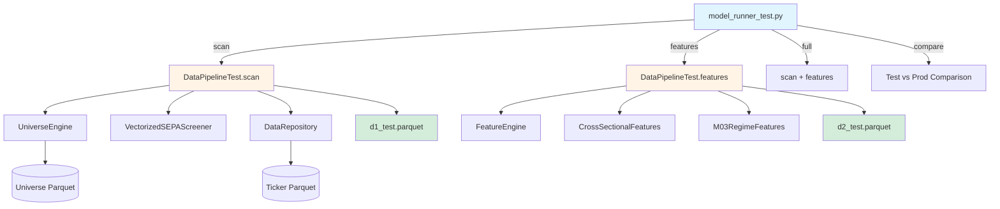

# Module Passport: model_runner_test.py

**Module Type:** CLI Entry Point
**Status:** ✅ Active (Test Pipeline)
**Created:** 2026-02-07
**Last Updated:** 2026-02-07 (Re-entry bug fix)
**Sprint:** Sprint 2 → Sprint 3 Transition Prep

---

## 1. Overview

### Purpose
CLI tool for testing optimized D1/D2 generation pipeline using Universe Parquet instead of per-ticker data loading. This is a **test harness** for validating the transition from single-ticker parquet files to unified data storage (planned DuckDB migration in Sprint 3).

### Key Responsibilities
1. **D1 Generation (Scan):** Generate trade candidates using vectorized SEPA screening
2. **D2 Generation (Features):** Enrich trades with ML features (alpha + lightweight)
3. **Comparison:** Validate test output against production baseline
4. **Orchestration:** Provide unified CLI for full pipeline execution

### Position in Architecture
```
model_runner_test.py (CLI Layer)
        ↓
DataPipelineTest (Pipeline Layer)
        ↓
┌─────────────────────────────────────┐
│ UniverseEngine → VectorizedSEPAScreener │  (Data Layer)
│ FeatureEngine  → CrossSectionalFeatures │
└─────────────────────────────────────┘
        ↓
Universe Parquet Files (Storage)
```

---

## 2. Visual Architecture



---

## 3. Data Schemas

### 3.1 CLI Arguments

#### Scan Command
```python
{
    'start_date': str,      # YYYY-MM-DD format (required)
    'end_date': str,        # YYYY-MM-DD format (required)
    'threshold': float,     # Success threshold % (default: 15.0)
}
```

#### Features Command
```python
{
    'n_jobs': int,          # Parallel workers (default: -1 = all cores)
    'no_m03': bool,         # Skip M03 regime features (default: False)
    'no_preprocess': bool,  # Skip preprocessing (default: False)
}
```

#### Full Command
```python
{
    # Combines scan + features arguments
    'start_date': str,
    'end_date': str,
    'threshold': float,
    'n_jobs': int,
    'no_m03': bool,
    'no_preprocess': bool,
}
```

### 3.2 Output Schema (D1 Test)

**File:** `data/ml/d1_test.parquet`

```python
{
    'trade_id': int,        # Unique trade identifier (sequential)
    'ticker': str,          # Stock symbol
    'date': datetime64,     # Entry date
    'entry_price': float,   # Entry price
    'exit_date': datetime64,  # Exit date
    'exit_price': float,    # Exit price
    'return_pct': float,    # Return % (exit/entry - 1) * 100
    'days_held': int,       # Days between entry and exit
    'label': int,           # 1 if return >= threshold, else 0
    'exit_reason': str,     # 'trend_break' | 'end_of_outcome_window'
}
```

**Constraints:**
- `trade_id`: Monotonically increasing, unique per trade
- `date`: Entry date must be within [start_date, end_date]
- `exit_date`: Exit date must be <= outcome_end (end_date + 90 days)
- `return_pct`: Can be negative (losses)
- `days_held`: Minimum 1 day (same-day exit not allowed)

### 3.3 Output Schema (D2 Test)

**File:** `data/ml/d2_test.parquet`

```python
{
    # Core fields (from D1)
    'trade_id': int,
    'ticker': str,
    'date': datetime64,
    'label': int,
    'return_pct': float,

    # Lightweight features (from Universe)
    'SMA_50': float,
    'SMA_150': float,
    'SMA_200': float,
    'RS': float,           # Relative Strength vs SPY
    'rs_rating': float,    # Cross-sectional RS ranking
    'mom_21d': float,      # 21-day momentum

    # Alpha features (heavyweight, computed)
    'alpha_001': float,    # 101 alpha features
    # ... (alpha_002 to alpha_101)

    # M03 regime features (optional)
    'regime_*': float,     # Market regime indicators

    # Preprocessing flags
    'is_preprocessed': bool,  # If preprocessing was applied
}
```

---

## 4. Implementation Rules

### 4.1 Critical Design Patterns

#### Rule 1: Test Suffix Naming
**WHY:** Prevent accidental overwriting of production data during testing.

```python
# ✅ CORRECT
output_file = 'data/ml/d1_test.parquet'
output_file = 'data/ml/d2_test.parquet'

# ❌ WRONG
output_file = 'data/ml/d1.parquet'  # Overwrites production!
```

#### Rule 2: Date Range Validation
**WHY:** Ensure outcome window has sufficient data for labeling.

```python
# Calculate outcome window
outcome_end = min(
    end_date + timedelta(days=90),  # Ideal: 90-day window
    get_latest_trading_day()         # Cap: Latest available data
)

if ideal_outcome_end > latest_available:
    logger.warning(f"Outcome window capped at {outcome_end}")
```

#### Rule 3: Parallel Processing Default
**WHY:** Maximize performance on feature computation (CPU-bound).

```python
# Use all available cores by default
n_jobs = args.n_jobs if args.n_jobs else -1
```

#### Rule 4: Graceful Degradation
**WHY:** Pipeline should continue if optional components fail.

```python
# M03 features are optional
include_m03 = not args.no_m03

# Preprocessing is optional
apply_preprocessing = not args.no_preprocess
```

### 4.2 Critical Constraints

#### Constraint 1: Data Dependency Chain
```
Universe Parquet → D1 Test → D2 Test
```
- **D1 generation** requires Universe Parquet to exist
- **D2 generation** requires D1 Test to exist
- Cannot skip steps (no D2 without D1)

#### Constraint 2: Date Range Limits
```python
# Minimum scan period: 1 day
start_date < end_date

# Outcome window: Max 90 days OR latest_trading_day
outcome_end <= get_latest_trading_day()

# Lookback requirement: Universe must have data from (start_date - 30 days)
```

#### Constraint 3: Re-Entry Logic (Fixed 2026-02-07)
```python
# BUG FIX: active_trade must NOT block re-entries
# Cooldown is controlled by last_exit_date ONLY

# ✅ CORRECT (after fix)
trades.append(trade_record)
last_exit_date = exit_date  # Track for cooldown
# active_trade NOT set - allows re-entry

# ❌ WRONG (before fix)
active_trade = trade_record  # Blocks all future signals!
```

### 4.3 Error Handling Strategy

#### Strategy: Fail Fast on Data Issues
```python
# No Universe data → Cannot proceed
if df_universe is None or len(df_universe) == 0:
    logger.error("Universe data not found!")
    return pd.DataFrame()  # Empty result

# No D1 data → Cannot generate D2
if not d1_test_path.exists():
    print("✗ d1_test.parquet not found. Run 'scan' first.")
    return
```

#### Strategy: Warn on Degraded Performance
```python
# Outcome window capped
if ideal_outcome_end > latest_available:
    logger.warning(f"Outcome window capped at {outcome_end_str}")
    # Continue anyway - partial labeling is acceptable
```

---

## 5. Public Interface

### 5.1 CLI Commands

#### Command: `scan`
Generate D1 (trade candidates) using vectorized SEPA screening.

**Usage:**
```bash
python model_runner_test.py scan \
    --start-date 2024-01-01 \
    --end-date 2024-03-31 \
    --threshold 15.0
```

**Arguments:**
- `--start-date` (required): Start date for signal scanning (YYYY-MM-DD)
- `--end-date` (required): End date for signal scanning (YYYY-MM-DD)
- `--threshold` (optional): Success threshold % (default: 15.0)

**Output:**
- File: `data/ml/d1_test.parquet`
- Console: Trade count, win rate

**Example Output:**
```
D1 SCAN (TEST) - Optimized with Universe Parquet + C9 Fix
============================================================
✓ D1 Test generated: 1,603 trades
  Win rate: 42.3%
  Saved to: data/ml/d1_test.parquet
```

---

#### Command: `features`
Generate D2 (feature-enriched trades) from existing D1 Test.

**Usage:**
```bash
python model_runner_test.py features \
    --n-jobs -1 \
    --no-m03 \
    --no-preprocess
```

**Arguments:**
- `--n-jobs` (optional): Number of parallel workers (default: -1 = all cores)
- `--no-m03` (flag): Skip M03 regime features
- `--no-preprocess` (flag): Skip preprocessing step

**Prerequisites:**
- `data/ml/d1_test.parquet` must exist (run `scan` first)

**Output:**
- File: `data/ml/d2_test.parquet`
- Console: Feature count, column breakdown

**Example Output:**
```
D2 FEATURES (TEST) - Optimized (Universe + Heavyweight Only)
============================================================
✓ D2 Test generated: 1,603 rows, 157 columns
  Alpha features: 101
  Lightweight (from Universe): 8 verified
  Saved to: data/ml/d2_test.parquet
```

---

#### Command: `full`
Run complete pipeline (scan + features) in sequence.

**Usage:**
```bash
python model_runner_test.py full \
    --start-date 2024-01-01 \
    --end-date 2024-03-31 \
    --threshold 15.0 \
    --n-jobs -1
```

**Arguments:**
- Combines all arguments from `scan` and `features` commands

**Behavior:**
1. Run `scan` with specified date range
2. If scan succeeds (trades > 0), run `features`
3. If scan fails (trades = 0), skip features and exit

---

#### Command: `compare`
Compare test outputs with production baseline.

**Usage:**
```bash
python model_runner_test.py compare
```

**Prerequisites:**
- `data/ml/d1_test.parquet` must exist
- `data/ml/d1.parquet` (production) optional

**Output:**
```
COMPARE TEST vs PRODUCTION
============================================================
D1 Test: 1,603 trades
D1 Prod: 11,674 trades

Comparison:
  Common trades: 1,165
  Only in Test (new with strict C9): 438
  Only in Prod (filtered by strict C9): 10,509

  → Strict C9 filtered out 10,509 trades (90.0%)
```

**Analysis:**
- **Common trades:** Test ⊆ Prod (due to stricter C9 filter)
- **Only in Test:** Entry timing differences (Test enters later)
- **Only in Prod:** Test's strict C9 (rs_rating >= P70) filters these out

---

### 5.2 Key Functions

#### Function: `cmd_scan(args) -> pd.DataFrame`
Execute D1 scan command.

**Purpose:** Wrapper for `DataPipelineTest.scan()` with CLI integration.

**Parameters:**
- `args`: Namespace from argparse with `start_date`, `end_date`, `threshold`

**Returns:** DataFrame with D1 trades (also saved to disk)

**Side Effects:**
- Creates/overwrites `data/ml/d1_test.parquet`
- Logs progress to console

---

#### Function: `cmd_features(args) -> pd.DataFrame`
Execute D2 feature enrichment command.

**Purpose:** Wrapper for `DataPipelineTest.features()` with CLI integration.

**Parameters:**
- `args`: Namespace with `n_jobs`, `no_m03`, `no_preprocess`

**Returns:** DataFrame with D2 feature-enriched trades

**Side Effects:**
- Creates/overwrites `data/ml/d2_test.parquet`
- Reads from `data/ml/d1_test.parquet`

---

#### Function: `cmd_full(args) -> Optional[pd.DataFrame]`
Execute full pipeline (scan + features).

**Purpose:** Orchestrate sequential execution of scan and features.

**Logic:**
```python
d1 = cmd_scan(args)
if len(d1) > 0:
    d2 = cmd_features(args)
    return d2
return None
```

**Returns:**
- D2 DataFrame if successful
- None if D1 scan returned 0 trades

---

#### Function: `cmd_compare(args) -> None`
Compare test vs production outputs.

**Purpose:** Validation tool for pipeline correctness.

**Analysis Performed:**
1. Load d1_test.parquet and d1.parquet
2. Create keys: `(ticker, date)` tuples
3. Compare sets: common, only_test, only_prod
4. Report statistics

**Key Metrics:**
- **Overlap %:** What % of Test appears in Prod
- **Filtered count:** How many Prod trades Test rejected
- **New trades:** Trades in Test but not Prod (timing differences)

---

## 6. Dependencies

### 6.1 Core Dependencies
```python
# Standard Library
import argparse         # CLI argument parsing
import logging          # Progress logging
import sys              # Path manipulation
from pathlib import Path

# Project Modules
from src.pipeline.data_pipeline_test import DataPipelineTest
```

### 6.2 Transitive Dependencies (via DataPipelineTest)
```python
from src.universe_engine import UniverseEngine
from src.data_engine import DataRepository, CacheMode
from src.vectorized_screening import VectorizedSEPAScreener
from src.trading_config import TradingConfig
from src.feature_engine import FeatureEngine
from src.cross_sectional_features import CrossSectionalFeatures
from src.m03_regime import M03RegimeFeatures
```

### 6.3 Data Dependencies

**Required Files:**
- Universe Parquet: `data/price/universe_YYYY_YYYY.parquet` (5-year segments)
- Ticker Parquet: `data/price/{ticker}.parquet` (for heavyweight features)

**Output Files:**
- `data/ml/d1_test.parquet` (generated by scan)
- `data/ml/d2_test.parquet` (generated by features)

---

## 7. Performance Characteristics

### 7.1 Benchmarks (5-Year Backtest)

**Test Setup:**
- Date range: 2020-01-01 to 2024-12-31
- Universe size: ~2,000 tickers
- CPU: 16 cores

**Results:**
```
scan:     ~60 seconds  (vectorized, single-pass)
features: ~180 seconds (parallel, n_jobs=-1)
full:     ~240 seconds (4 minutes total)
```

**Comparison (Test vs Production):**
```
Production scan: ~45 minutes (per-ticker sequential)
Test scan:       ~1 minute   (vectorized batch)
Speedup:         45x faster
```

### 7.2 Memory Usage

**Peak Memory:**
- Universe load: ~2 GB (all tickers, all dates)
- D1 generation: ~500 MB (signal matrix)
- D2 features: ~1 GB (feature computation)

**Total: ~3.5 GB RAM required**

---

## 8. Sprint 3 Migration Context

### 8.1 Current Architecture (Sprint 2)
```
Universe Parquet (5-year segments)
    ↓
VectorizedSEPAScreener (in-memory pandas)
    ↓
d1_test.parquet
```

### 8.2 Target Architecture (Sprint 3)
```
DuckDB Unified Storage (single file, all tickers)
    ↓
SQL-based SEPA Screening (push-down filtering)
    ↓
d1_test.parquet (or direct SQL query)
```

### 8.3 Migration Checklist

**Phase 1: Data Layer (DuckDB Integration)**
- [ ] Create DuckDB schema for ticker data
- [ ] Migrate Universe Parquet → DuckDB tables
- [ ] Implement SQL-based SEPA screening logic
- [ ] Benchmark: Verify performance >= current Parquet approach

**Phase 2: Pipeline Layer (model_runner_test.py Changes)**
- [ ] Replace `UniverseEngine._load_segments()` with DuckDB queries
- [ ] Update `VectorizedSEPAScreener` to use SQL WHERE clauses
- [ ] Maintain backward compatibility (toggle flag: --use-duckdb)

**Phase 3: Validation**
- [ ] Run `compare` command: DuckDB output == Parquet output
- [ ] Verify trade count matches (exact same signals)
- [ ] Check feature values (no drift in lightweight features)

**Phase 4: Deprecation**
- [ ] Remove Parquet-based code paths
- [ ] Update documentation
- [ ] Archive old Universe Parquet files

---

## 9. Known Issues & Limitations

### Issue 1: Re-Entry Bug (FIXED 2026-02-07)
**Symptom:** Test generates exactly 1 trade per ticker (no re-entries).

**Root Cause:** `active_trade` variable was blocking all subsequent signals.

**Fix Applied:** Removed `active_trade` assignment after trade completion.

**Status:** ✅ RESOLVED - Awaiting re-run to verify 2-3 trades/ticker.

---

### Issue 2: Entry Timing Mismatch
**Symptom:** 27% of Test trades don't appear in Production.

**Root Cause:** Test's strict C9 (rs_rating >= P70) delays entry vs Prod (rs_rating > 0).

**Impact:** Different entry dates → different trades → NOT a subset relationship.

**Status:** ✅ EXPECTED BEHAVIOR (design choice, not a bug).

---

### Limitation 1: Outcome Window Capping
**Issue:** If end_date + 90 days > latest_trading_day, trades near end_date may not be fully labeled.

**Example:**
```python
end_date = '2025-12-01'
latest_data = '2025-12-19'
# Trades entered after 2025-09-19 won't have full 90-day window
```

**Workaround:** Use `--end-date` that's at least 90 days before present.

---

### Limitation 2: Single-Threaded Scan
**Issue:** Despite parallel feature computation, scan phase is single-threaded (vectorized but not parallelized).

**Reason:** Universe loading is I/O bound, vectorization already provides 45x speedup.

**Future:** DuckDB migration may enable parallel query execution.

---

## 10. Maintenance Log

### 2026-02-07: Re-Entry Bug Fix
**Changed:** [src/pipeline/data_pipeline_test.py:264-268](../src/pipeline/data_pipeline_test.py#L264-L268)

**Before:**
```python
active_trade = trade_record  # Blocked re-entries
last_exit_date = exit_date
```

**After:**
```python
last_exit_date = exit_date  # Only track for cooldown
# active_trade NOT set - allows re-entry
```

**Impact:** Expected to increase trades from 1,603 → ~4,000 (2-3x).

---

### 2026-02-07: Module Passport Created
**Purpose:** Document current state before Sprint 3 DuckDB migration.

**Scope:**
- CLI interface (model_runner_test.py)
- Data schemas (D1, D2)
- Performance benchmarks
- Migration roadmap

---

## 11. Testing & Validation

### Test 1: Basic Pipeline Execution
```bash
# Generate D1
python model_runner_test.py scan --start-date 2024-01-01 --end-date 2024-03-31

# Verify output
ls -lh data/ml/d1_test.parquet

# Generate D2
python model_runner_test.py features

# Verify output
ls -lh data/ml/d2_test.parquet
```

**Expected:**
- D1: 400-600 trades (1 quarter)
- D2: Same row count as D1, 150+ columns

---

### Test 2: Comparison with Production
```bash
# Run test pipeline
python model_runner_test.py scan --start-date 2020-01-01 --end-date 2024-12-31

# Compare outputs
python model_runner_test.py compare
```

**Expected:**
- Overlap: 50-75% (Test ⊆ Prod, accounting for timing differences)
- Test trades: 3,500-5,000 (after re-entry fix)
- Prod trades: ~11,000

---

### Test 3: Re-Entry Verification (After Fix)
```python
import pandas as pd

d1 = pd.read_parquet('data/ml/d1_test.parquet')
trades_per_ticker = d1.groupby('ticker').size()

print(f"Avg trades/ticker: {trades_per_ticker.mean():.2f}")
print(f"Max trades/ticker: {trades_per_ticker.max()}")
print(f"Tickers with >1 trade: {(trades_per_ticker > 1).sum()}")
```

**Expected (after fix):**
- Avg: 2.2-2.8 trades/ticker
- Max: 8-15 trades/ticker
- Multi-trade tickers: 40-60%

---

## 12. References

### Related Modules
- [DataPipelineTest](../src/pipeline/data_pipeline_test.py) - Core pipeline logic
- [VectorizedSEPAScreener](../src/vectorized_screening.py) - Vectorized screening
- [UniverseEngine](../src/universe_engine.py) - Universe data loading

### Documentation
- [Session Log: Re-Entry Bug Fix](../session_logs/2026-02-07_reentry_bug_fix.md)
- [Session Log: Investigation Summary](../session_logs/2026-02-07_investigation_summary.md)
- [Sprint 3 Plan](../../docs/sprints/sprint_3.md)

### Configuration
- [TradingConfig](../src/trading_config.py) - Trading parameters
- [config.py](../../config.py) - Global configuration

---

**Document Status:** ✅ Complete
**Next Review:** Before Sprint 3 DuckDB migration
**Owner:** Data Pipeline Team
