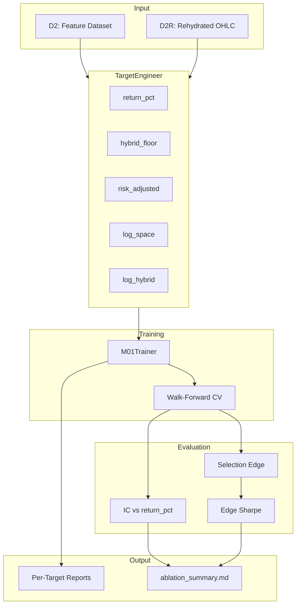

# Module Passport: run_m01_ablation_study

> **Purpose:** Compare M01 target definitions to find the optimal training target for ranking quality.

**Location:** `scripts/run_m01_ablation_study.py`
**Type:** CLI Script
**Last Updated:** 2026-02-09

---

## 1. Overview

The ablation study script trains M01 models with 5 different target definitions and compares their effectiveness at ranking trades by actual return. The goal is to determine which target transformation produces the best Information Coefficient (IC) and Selection Edge when evaluated against realized `return_pct`.

### Key Insight
Training on a transformed target (e.g., log-space MFE) may produce better rankings than training directly on `return_pct`, even though evaluation is always against `return_pct`.

---

## 2. Visual Architecture



---

## 3. Target Definitions

### M01_A: `return_pct` (Baseline)

| Property | Value |
|----------|-------|
| **Formula** | `y = realized_return_pct` |
| **Description** | Uses actual realized return as target |
| **Pros** | Simple, no data leakage, direct optimization |
| **Cons** | Ignores unrealized potential (MFE) |

### M01_B: `hybrid_floor` (Capped Loser Penalty)

| Property | Value |
|----------|-------|
| **Formula** | `if survivor: y = MFE else: y = max(-10%, -2*nATR)` |
| **Parameters** | `max_penalty=-10%`, `stop_multiplier=2.0` |
| **Description** | Survivors get MFE credit, losers get capped penalty |
| **Pros** | Keeps all trades, limits outlier impact |
| **Cons** | Artificial cap may lose severity information |

### M01_C: `risk_adjusted` (MFE / ATR)

| Property | Value |
|----------|-------|
| **Formula** | `y = MFE / (nATR + 0.01)` |
| **Description** | Normalizes by entry volatility |
| **Pros** | Prevents "volatility detector" trap |
| **Cons** | May underweight good high-vol setups |

### M01_D: `log_space` (Tail Smoothing)

| Property | Value |
|----------|-------|
| **Formula** | `y = sign(MFE) * log(1 + |MFE|)` |
| **Description** | Log-compresses extreme returns |
| **Pros** | Prevents outliers from dominating gradients |
| **Cons** | Uses MFE only, no loser penalty |

### M01_E: `log_hybrid` (The Golden Target)

| Property | Value |
|----------|-------|
| **Formula** | `y = sign(x) * log(1 + |x|)` |
| **x for winners** | `MFE` |
| **x for losers** | `realized_loss_at_stop` |
| **Stop Triggers** | 1. Close < Entry * 0.90 (structural) |
|                   | 2. Close < SMA_50 - 1.0*ATR (technical) |
| **Description** | Log compression + realistic stop-loss accountability |
| **Pros** | Best of both worlds |
| **Cons** | Requires D2R with SMA_50, ATR columns |

---

## 4. Key Metrics

| Metric | Formula | Interpretation |
|--------|---------|----------------|
| **IC** | `spearmanr(y_pred, return_pct)` | Ranking quality (-1 to +1) |
| **Selection Edge** | `mean(top_decile) - mean(all)` | Alpha from top picks |
| **Edge Sharpe** | `mean(edge) / std(edge)` | Consistency across folds |

**Winner Selection:** Highest Edge Sharpe (prioritizes consistency over raw edge)

---

## 5. Public Interface

### Functions

```python
def load_data(start_date: str, end_date: str) -> Tuple[pd.DataFrame, pd.DataFrame]:
    """
    Load D2 and D2R datasets using DataPipeline.

    Returns:
        (d2, d2r) - d2r may be None if not available
    """

def run_ablation_study(
    start_date: str,
    end_date: str,
    skip_training: bool = False
) -> Optional[pd.DataFrame]:
    """
    Run ablation study comparing 5 target definitions.

    Returns:
        DataFrame with columns: model, target_type, avg_ic, avg_edge, edge_sharpe, avg_rmse
    """

def _save_summary_report(
    comparison_df: pd.DataFrame,
    winner: pd.Series,
    output_path: Path,
    start_date: str,
    end_date: str
) -> None:
    """Save markdown summary report."""
```

### CLI Arguments

| Argument | Default | Description |
|----------|---------|-------------|
| `--start` | `2020-01-01` | Training start date |
| `--end` | `2023-12-31` | Training end date |
| `--skip-training` | `False` | Skip training, show target stats only |

---

## 6. Output Structure

```
models/ablation_study/
├── ablation_summary.md              # Winner + comparison table
├── return_pct/
│   ├── model_report_return_pct_YYMMDD.md
│   ├── feature_importance.csv
│   └── preprocessing_config.json
├── hybrid_floor/
│   └── ...
├── risk_adjusted/
│   └── ...
├── log_space/
│   └── ...
└── log_hybrid/
    └── ...
```

---

## 7. Dependencies

### Internal

| Module | Usage |
|--------|-------|
| `src.pipeline.DataPipeline` | Load D2, D2R datasets |
| `src.pipeline.M01Trainer` | Train models, generate reports |
| `src.evaluation.TargetEngineer` | Calculate target transformations |
| `src.evaluation.M01Evaluator` | Evaluation metrics |
| `src.evaluation.analyze_deciles` | Decile analysis for edge calculation |

### External

| Package | Usage |
|---------|-------|
| `scipy.stats.spearmanr` | IC calculation |
| `pandas` | Data manipulation |
| `numpy` | Numerical operations |

---

## 8. Usage Examples

```bash
# Full ablation study (2020-2023)
python scripts/run_m01_ablation_study.py

# Custom date range
python scripts/run_m01_ablation_study.py --start 2018-01-01 --end 2024-12-31

# Preview targets without training
python scripts/run_m01_ablation_study.py --skip-training
```

---

## 9. Implementation Rules

1. **Consistent Data Loading**: Uses `DataPipeline.load_d2()` - same as M01 training workflow
2. **Fair Comparison**: All models evaluated against `return_pct`, not their training target
3. **D2R Requirement**: If D2R unavailable, only `return_pct` baseline runs
4. **Walk-Forward CV**: Uses 3-year train / 1-year test windows (requires 4+ years of data)

---

## 10. Maintenance Log

| Date | Change | Author |
|------|--------|--------|
| 2026-02-09 | Updated data loading to use DataPipeline | Claude |
| 2026-02-09 | Added ablation_summary.md output | Claude |
| 2026-02-09 | Comprehensive docstring with formulas | Claude |
