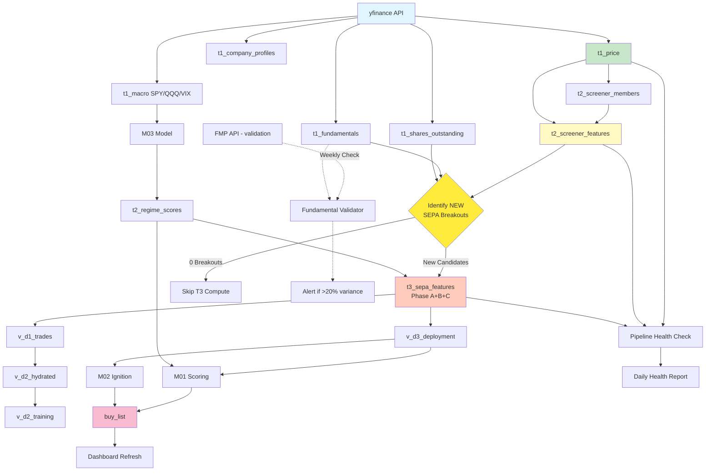
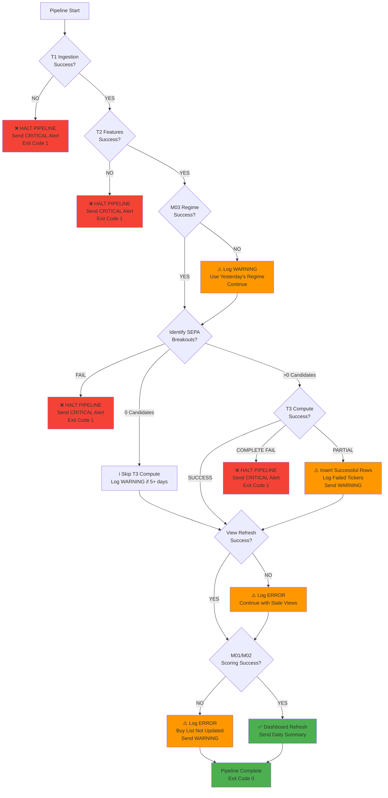

# DuckDB V2 Pipeline DAG

## Overview
This document defines the **dependency graph** and **execution order** for the daily data pipeline, including failure modes and recovery strategies.

---

## Full Dependency Graph



---

## Daily Execution Order

### Phase 1: Tier 1 Ingestion (Parallel)
**Duration:** ~1-2 minutes (rate-limited by yfinance API)

```python
# scripts/run_daily_pipeline.py - Phase 1
with ThreadPoolExecutor(max_workers=5) as executor:
    futures = {
        executor.submit(ingest_t1_price, date): 't1_price',
        executor.submit(ingest_t1_fundamentals, date): 't1_fundamentals',
        executor.submit(ingest_t1_shares, date): 't1_shares_outstanding',
        executor.submit(ingest_t1_macro, date): 't1_macro',
        executor.submit(ingest_t1_company_profiles, date): 't1_company_profiles',
    }

    for future in concurrent.futures.as_completed(futures):
        table_name = futures[future]
        try:
            rows_inserted = future.result()
            logger.info(f"✅ {table_name}: {rows_inserted} rows")
        except Exception as e:
            logger.error(f"❌ {table_name} failed: {e}")
            send_alert(f"CRITICAL: {table_name} ingestion failed")
            sys.exit(1)  # HALT PIPELINE
```

**Dependencies:**
- None (fully parallel, independent API calls)

**Failure Mode:**
- **If ANY T1 ingestion fails:** HALT entire pipeline, send CRITICAL alert, exit with code 1
- **Reason:** T2/T3 depend on fresh T1 data. Proceeding with stale data would corrupt downstream features.

**Idempotency:**
- Each ingestion checks: `SELECT MAX(date) FROM table_name`
- If `date` already exists, skip insert (log warning)

---

### Phase 2: Screener Membership Update
**Duration:** ~5 seconds

```python
# Step 2: Update t2_screener_members
update_t2_screener_members(date)
```

**SQL Logic:**
```sql
INSERT INTO t2_screener_members (ticker, date, meets_price, meets_volume, in_screener)
SELECT
    ticker,
    DATE '{date}' as date,
    close >= 15 as meets_price,
    volume >= 100000 as meets_volume,
    (close >= 15 AND volume >= 100000) as in_screener
FROM t1_price
WHERE date = '{date}'
ON CONFLICT (ticker, date) DO NOTHING;
```

**Dependencies:**
- `t1_price` (must have data for `date`)

**Failure Mode:**
- **If fails:** Log error, attempt to continue (T2 features can use yesterday's membership)
- **Alert condition:** If 0 rows inserted and universe_size = 0 (indicates data issue)

---

### Phase 3: Tier 2 Feature Computation (Eager, Full Universe)
**Duration:** ~15-30 seconds (60M+ rows with window functions)

```python
# Step 3: Compute T2 lightweight features
FeaturePipeline(db_path).compute_t2(start_date=date, warmup_days=365)
```

**SQL Logic:**
```sql
-- Simplified example (actual has 30 features)
CREATE OR REPLACE TABLE t2_screener_features AS
WITH price_with_windows AS (
    SELECT
        ticker, date, close,
        AVG(close) OVER (PARTITION BY ticker ORDER BY date ROWS BETWEEN 49 PRECEDING AND CURRENT ROW) as sma_50,
        MAX(high) OVER (PARTITION BY ticker ORDER BY date ROWS BETWEEN 251 PRECEDING AND CURRENT ROW) as high_52w,
        -- ... 28 more features
    FROM t1_price
    WHERE date >= '{date}' - INTERVAL '365 days'
)
SELECT * FROM price_with_windows WHERE date = '{date}';
```

**Dependencies:**
- `t1_price` (must have 365 days of history for rolling windows)
- `t2_screener_members` (for filtering, but not blocking)

**Failure Mode:**
- **If fails:** HALT pipeline (T3 depends on T2), send CRITICAL alert
- **Performance degradation:** If >5 minutes, alert WARNING (investigate indexes)

**Optimization:**
- Index on `(ticker, date)` in `t1_price`
- `PRAGMA threads=8` for parallel window functions

---

### Phase 4: M03 Regime Score Computation
**Duration:** ~2-5 seconds

```python
# Step 4: Compute M03 regime scores
RegimePipeline(db_path).compute_m03(date)
```

**Logic:**
```python
# Read latest macro data
macro_df = con.execute(f"""
    SELECT * FROM t1_macro
    WHERE date >= '{date}' - INTERVAL '90 days'
    ORDER BY date
""").fetchdf()

# Run M03 model (XGBoost or rules-based)
regime_scores = m03_model.predict(macro_df)

# Insert into t2_regime_scores
con.execute(f"""
    INSERT INTO t2_regime_scores (date, m03_score, m03_pillar_trend, m03_pillar_liq, m03_pillar_risk, model_version)
    VALUES (?, ?, ?, ?, ?, 'v1.0')
    ON CONFLICT (date) DO UPDATE SET
        m03_score = EXCLUDED.m03_score,
        m03_pillar_trend = EXCLUDED.m03_pillar_trend,
        ...
""", regime_scores)
```

**Dependencies:**
- `t1_macro` (must have 90 days of history for M03 lookback)

**Failure Mode:**
- **If fails:** Log WARNING, use yesterday's regime score (not critical for daily operation)
- **If 7 consecutive failures:** Send CRITICAL alert (M03 model broken)

---

### Phase 5: Identify New SEPA Breakouts
**Duration:** ~3-5 seconds

```python
# Step 5: Query T2 for NEW SEPA candidates
new_breakouts = identify_new_sepa_breakouts(date)
```

**SQL Logic:**
```sql
WITH sepa_candidates_today AS (
    SELECT
        t2.ticker,
        t2.date
    FROM t2_screener_features t2
    WHERE t2.date = '{date}'
      -- SEPA Criteria (C1-C11)
      AND t2.close > t2.sma_50
      AND t2.sma_50 > t2.sma_150
      AND t2.sma_150 > t2.sma_200
      AND t2.sma_200 > LAG(t2.sma_200, 20) OVER (PARTITION BY t2.ticker ORDER BY t2.date)
      AND t2.close >= 0.70 * t2.high_52w  -- Within 30% of 52W high
      AND t2.rs_rating >= 70
      -- ... (full SEPA logic)
),
already_in_t3 AS (
    SELECT DISTINCT ticker
    FROM t3_sepa_features
    WHERE date = '{date}'
      AND feature_version = 'v3.0'
)
SELECT sc.ticker, sc.date
FROM sepa_candidates_today sc
LEFT JOIN already_in_t3 t3 ON sc.ticker = t3.ticker
WHERE t3.ticker IS NULL;  -- NEW breakouts only
```

**Dependencies:**
- `t2_screener_features` (must be fresh for `date`)
- `t3_sepa_features` (to exclude already-processed tickers)

**Failure Mode:**
- **If fails:** HALT pipeline, send CRITICAL alert (cannot proceed to T3)

**Alert Conditions:**
- **0 breakouts for 5 consecutive days:** Send WARNING (possible market regime change or SEPA logic bug)
- **>500 breakouts in single day:** Send WARNING (possible data corruption or screener bug)

---

### Phase 6: Tier 3 Lazy Compute (Heavy Features)
**Duration:** ~5-15 seconds (depends on breakout count, avg ~50/day)

```python
# Step 6: Compute T3 ONLY for new breakouts
if not new_breakouts.empty:
    logger.info(f"🔥 {len(new_breakouts)} new SEPA breakouts on {date}")
    FeaturePipeline(db_path).compute_t3_for_candidates(
        new_breakouts,
        feature_version='v3.0'
    )
else:
    logger.warning(f"⚠️  0 new SEPA breakouts on {date}")
```

**Logic:**
```python
# Phase A: 79 SQL features (SMAs, RS, ATR, returns, etc.)
# Phase B: 16 Python alphas (WQ101 factors via groupby().apply())
# Phase C: 7 cross-sectional ranks

features_df = compute_heavy_features(new_breakouts, date)

# Join M03 regime scores
features_df = features_df.merge(
    con.execute(f"SELECT * FROM t2_regime_scores WHERE date = '{date}'").fetchdf(),
    on='date',
    how='left'
)

# Join fundamentals (point-in-time snapshot)
features_df = features_df.merge(
    con.execute(f"""
        SELECT ticker, pe_ratio, ps_ratio, pb_ratio
        FROM t1_fundamentals
        WHERE (ticker, date) IN (
            SELECT ticker, MAX(date)
            FROM t1_fundamentals
            WHERE date <= '{date}'
            GROUP BY ticker
        )
    """).fetchdf(),
    on='ticker',
    how='left'
)

# Set feature version
features_df['feature_version'] = 'v3.0'
features_df['ingested_at'] = datetime.now()

# Insert (skip duplicates)
con.execute("""
    INSERT OR IGNORE INTO t3_sepa_features
    SELECT * FROM features_df
""")
```

**Dependencies:**
- `t2_screener_features` (for Phase A SQL features)
- `t2_regime_scores` (for M03 features)
- `t1_fundamentals` (for point-in-time P/E, P/S)
- `t1_shares_outstanding` (for market cap calculations)

**Failure Mode:**
- **If fails partially:** Log failed tickers, insert successful rows, send WARNING
- **If fails completely:** HALT pipeline, send CRITICAL alert
- **If >10 minutes:** Send WARNING (performance issue, investigate Phase B bottleneck)

**Optimization:**
- Phase B (Python alphas) is bottleneck (~3s per 50 tickers)
- Consider: multiprocessing, numba JIT, or pre-compute alphas in T2 (trade-off: T2 becomes heavier)

---

### Phase 7: View Refresh
**Duration:** ~1 second (views are virtual, just DDL updates)

```python
# Step 7: Refresh views
ViewManager(db_path).create_all()
```

**Views Created:**
1. `v_d1_trades` (gap-based trade ID generation)
2. `v_d2_hydrated` (stop-loss forward walk)
3. `v_d2_training` (entry features + outcomes)
4. `v_d3_deployment` (last 252 days for scoring)

**Dependencies:**
- `t3_sepa_features` (must have fresh data)

**Failure Mode:**
- **If fails:** Log ERROR, attempt to continue (views may be stale but scoring can proceed)
- **If fails 3 consecutive days:** Send CRITICAL alert (view DDL broken)

---

### Phase 8: M01/M02 Scoring
**Duration:** ~5-10 seconds

```python
# Step 8: Score candidates via M01/M02
score_candidates(date)
```

**Logic:**
```python
# Read v_d3_deployment (last 252 days of T3)
deployment_df = con.execute(f"""
    SELECT * FROM v_d3_deployment
    WHERE date = '{date}'
""").fetchdf()

if deployment_df.empty:
    logger.warning(f"No candidates to score on {date}")
    return

# Apply log transforms (match v_d2_training schema)
deployment_df = apply_log_transforms(deployment_df)

# M01: Expected return regression
m01_scores = m01_model.predict(deployment_df[M01_FEATURES])

# M02: Ignition classifier (loser probability)
m02_scores = m02_model.predict_proba(deployment_df[M02_FEATURES])

# Combine scores
deployment_df['m01_expected_return'] = m01_scores
deployment_df['m02_loser_proba'] = m02_scores[:, 0]
deployment_df['final_score'] = (
    0.6 * deployment_df['m01_expected_return'] +
    0.4 * (1 - deployment_df['m02_loser_proba'])
)

# Rank
deployment_df['final_score_rank'] = deployment_df['final_score'].rank(ascending=False)

# Update buy_list
con.execute("""
    INSERT OR REPLACE INTO buy_list (ticker, signal_date, m01_expected_return, m02_loser_proba, final_score, ...)
    SELECT * FROM deployment_df
    WHERE final_score_rank <= 50  -- Top 50 only
""")
```

**Dependencies:**
- `v_d3_deployment` (must have fresh T3 data)
- `models` table (M01/M02 model versions and artifacts)
- `t2_regime_scores` (for M03 regime context)

**Failure Mode:**
- **If M01 model file missing:** HALT, send CRITICAL alert (model registry corrupted)
- **If schema mismatch:** HALT, send CRITICAL alert (feature version mismatch)
- **If 0 candidates scored:** Log WARNING (possible data gap or model bug)

---

### Phase 9: Dashboard Refresh & Alerts
**Duration:** ~1 second

```python
# Step 9: Refresh dashboard
refresh_dashboard(date)

# Step 10: Send daily summary
send_daily_summary(date, new_breakouts, buy_list)
```

**Output:**
```
Daily Pipeline Summary (2024-02-16)
===================================
✅ T1 Ingestion: 8,247 tickers
✅ T2 Features: 8,247 tickers, 30 features
🔥 New SEPA Breakouts: 47 tickers
✅ T3 Features: 47 new rows (102 features)
✅ M01 Scoring: 47 candidates scored
🎯 Buy List: 12 top-ranked tickers

Top 3 Candidates:
1. AAPL - Score: 8.7 (M01: 12.3%, M02 Survival: 78%)
2. MSFT - Score: 8.2 (M01: 10.1%, M02 Survival: 81%)
3. NVDA - Score: 7.9 (M01: 15.7%, M02 Survival: 68%)

Pipeline Runtime: 87 seconds
```

---

## Failure Decision Tree



---

## Alert Severity Levels

| Severity | Condition | Response | Example |
|----------|-----------|----------|---------|
| **CRITICAL** | Pipeline halted, data corruption risk | Email + Slack, manual intervention required | T1 ingestion failed, model file missing |
| **WARNING** | Degraded operation, but recoverable | Slack notification, monitor for recurrence | 0 SEPA breakouts, M03 compute failed |
| **INFO** | Normal variation, no action needed | Log only | 47 new breakouts (expected range: 20-100) |

---

## Monitoring Queries

### Data Freshness Check
```sql
SELECT
    't1_price' as table_name,
    MAX(date) as latest_date,
    DATEDIFF('day', MAX(date), CURRENT_DATE) as days_stale
FROM t1_price
UNION ALL
SELECT 't2_screener_features', MAX(date), DATEDIFF('day', MAX(date), CURRENT_DATE) FROM t2_screener_features
UNION ALL
SELECT 't3_sepa_features', MAX(date), DATEDIFF('day', MAX(date), CURRENT_DATE) FROM t3_sepa_features;

-- Expected: days_stale = 1 (yesterday's data, if run before market close)
```

### Pipeline Run History
```sql
SELECT
    run_date,
    status,
    DATEDIFF('second', started_at, completed_at) as runtime_sec,
    t1_rows_inserted,
    t2_rows_updated,
    t3_rows_inserted,
    error_message
FROM pipeline_runs
WHERE run_date >= CURRENT_DATE - INTERVAL '30 days'
ORDER BY run_date DESC;
```

### SEPA Breakout Trend
```sql
SELECT
    date,
    COUNT(*) as new_breakouts
FROM t3_sepa_features
WHERE date >= CURRENT_DATE - INTERVAL '30 days'
  AND feature_version = 'v3.0'
GROUP BY date
ORDER BY date DESC;

-- Alert if COUNT(*) = 0 for 5+ consecutive days
```

---

## Performance Benchmarks

| Phase | Expected Runtime | Alert Threshold | Optimization Notes |
|-------|-----------------|-----------------|-------------------|
| T1 Ingestion | 60-120s | >300s | Rate-limited by yfinance API, parallelized |
| T2 Features | 15-30s | >60s | DuckDB window functions, add indexes if slow |
| M03 Regime | 2-5s | >30s | Lightweight XGBoost model on macro data |
| SEPA Identification | 3-5s | >20s | Index on (ticker, date) in T2 |
| T3 Compute | 5-15s (50 breakouts) | >60s | Phase B (Python alphas) is bottleneck |
| M01/M02 Scoring | 5-10s | >30s | XGBoost inference on ~50 rows |
| **Total Pipeline** | **90-180s** | **>300s** | Majority of time in T1 ingestion |

---

## Idempotency Guarantees

### Safe to Re-Run
✅ All scripts use `INSERT OR IGNORE` or check `MAX(date)` before inserting
✅ `CREATE OR REPLACE VIEW` is idempotent
✅ `t3_sepa_features` uses `(ticker, date, feature_version)` as composite PK

### NOT Safe to Re-Run
❌ `DELETE FROM t3_sepa_features` without `WHERE` clause (loses historical data)
❌ `DROP TABLE daily_features` before backup (irreversible)

### Checkpoint Recovery
```bash
# If pipeline crashes at T3 compute
python scripts/run_daily_pipeline.py --resume-from t3_compute --date 2024-02-16

# Script checks:
# - T1: Already ingested? Skip
# - T2: Already computed? Skip
# - T3: Already inserted? Skip duplicates via INSERT OR IGNORE
```

---

## Next Steps

After Phase 1 (Documentation) is complete:
1. **Phase 2:** Design SQL schemas for all tables
2. **Phase 3:** Implement T1 macro ingestion + M03 migration
3. **Phase 4:** Backfill T3 from 2020-01-01
4. **Phase 6:** Implement `run_daily_pipeline.py` orchestration script
5. **Phase 7:** Add monitoring dashboard + weekly validators

_All dependencies documented, ready for implementation._
