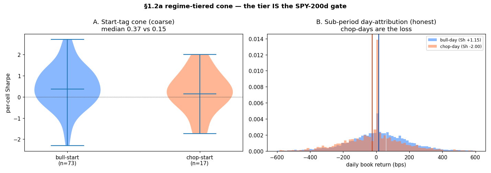

# §1.2a — regime-tiered fan/cone: SEPA-in-bull vs SEPA-in-chop

> **What this answers (Thread M §1.2a, the last open regime item):** we ship ONE all-weather cone,
> but SEPA is a bull-continuation tail strategy, not all-weather. Does splitting the start-date cone
> by regime reveal two distinct strategies (a "bull tier" and a "chop tier"), or is the regime split
> just the SPY-200d gate we already ship?
>
> **Substrate — NO new backtest.** The 90-cell **ungated `champion_trail`** start-date cone
> (`data/selection_sweep/starttime/champion_trail/rolling/r_*/`, 2003–2026, 12m rolling windows).
> *Ungated* is the point: it trades in BOTH regimes, so it can be split by regime. The LIVE champion
> is SPY-gated (never opens chop-start positions), so a re-cut of the ungated cone is the only way to
> see the chop behaviour the gate normally hides. Two cuts, coarse → honest:
> - **Cut A — start-tag cone:** tag each 12m cell by SPY-200d at its START, split the per-cell Sharpe
>   distribution. The "start in bull vs start in chop" fan. Coarse (a bull-started cell rolls into chop).
> - **Cut B — sub-period day-attribution:** assign each equity-curve DAY's book return to that day's
>   SPY-200d state, pool across all 90 cells. Honest regime attribution; loses the cone shape.
>
> **Load-bearing findings:**
> 1. **Cut A — bull-start carries the edge, chop-start is muted (not disastrous).** Per-cell median
>    Sharpe **0.37 (bull-start, n=73)** vs **0.15 (chop-start, n=17)**; total return **+8.4%** vs
>    **+1.9%**. But chop-start's %neg (35%) and floor (−1.74) are barely worse than bull's — because a
>    12-month chop-started window RECOVERS when SPY reclaims 200d mid-cell. The coarse cut washes out
>    the regime because most cells span both regimes.
> 2. **Cut B — this is the sharp read: chop-DAYS are pure drag, a −2.0 Sharpe.** Attributing each
>    book-day to its regime: **bull-days +15.0 bps/day, annualized Sharpe +1.15**; **chop-days
>    −24.7 bps/day, annualized Sharpe −2.00.** Down-day rate is ~identical (44% vs 45%) — it's not
>    that chop days lose *more often*, it's that they lose *bigger* (breakouts fail deeper below 200d).
>    All the loss lives on the chop days.
> 3. **→ THE TIER IS THE SPY-200d GATE.** There is no standalone chop edge to tier INTO — chop-days
>    are a −2.0 Sharpe you want zero exposure to, which is exactly "stand aside below 200d," the live
>    gate. And §1.2b (Q65) already showed the bull regime doesn't want a DIFFERENT config (higher gate).
>    So both tier levers (which-config-in-bull, trade-or-not-in-chop) resolve to the shipped champion.
>    A per-regime split is a WAY TO SEE the gate's value, not a new axis. **No promotion; no cone re-run
>    warranted** (there's no separation for a fresh per-regime cone to confirm — it would be cone-fitting).
>
> This closes the sprint's opening question ("how do we quantify a regime, and what does it mean for
> using the model") on the note the whole thread converged to: **SPY-200d is the whole regime tool,
> and the tiered-usage recommendation is `bull = deploy the champion, chop = stand aside` — already live.**
>
> Runnable: `docs/session_logs/sprint_14/scripts/regime_tiered_cone.py`. Diagnostic only; the hard
> caveat ([[project_vec_engine_optimistic]]: cell/trade-log split ≠ promotion cone) is why this is a
> READ, not a champion change.

Paste each block as one cell.

---

### Cell 1 — load the 90 cells (start date + persisted metrics) + the SPY-200d state

```python
import glob, json
from pathlib import Path
import numpy as np, pandas as pd

def _root():
    p = Path.cwd().resolve()
    for d in (p, *p.parents):
        if (d/"config.py").exists() and (d/"src").is_dir(): return d
    raise RuntimeError("root not found")
ROOT = _root()
import sys; sys.path.insert(0, str(ROOT))
from src.backtest.macro_sizer import spy_above_200d

CONE = ROOT/"data/selection_sweep/starttime/champion_trail/rolling"

rows = []
for cfg_f in sorted(glob.glob(str(CONE/"r_*/config.json"))):
    d = Path(cfg_f).parent
    cfg = json.loads(Path(cfg_f).read_text()); met = json.loads((d/"metrics.json").read_text())
    start = cfg["description"].split()[-1].split("..")[0]     # "champion_trail 2008-07-01..2009-07-01"
    rows.append({"cell": cfg["id"], "start": pd.Timestamp(start), "sharpe": met["sharpe_ratio"],
                 "total_return": met["total_return"], "max_dd": met["max_drawdown"],
                 "trades": met["total_trades"], "dir": str(d)})
cells = pd.DataFrame(rows).sort_values("start").reset_index(drop=True)

spy = pd.Series(spy_above_200d(cells.start.min().strftime("%Y-%m-%d"),
                               (cells.start.max()+pd.DateOffset(years=1, days=10)).strftime("%Y-%m-%d")))
spy.index = pd.to_datetime(spy.index); spy = spy.sort_index()
print(f"{len(cells)} cells | {cells.start.min():%Y-%m}..{cells.start.max():%Y-%m}")
```

---

### Cell 2 — CUT A: start-tag cone (per-cell Sharpe split by SPY-200d at the cell's start)

```python
def q(x):
    return {"n": len(x), "min": round(x.min(),2), "p25": round(x.quantile(.25),2),
            "median": round(x.median(),2), "p75": round(x.quantile(.75),2),
            "max": round(x.max(),2), "%neg": round(100*(x<0).mean(),1)}

cells["bull_start"] = spy.reindex(cells.start, method="ffill").values.astype(bool)
bull, chop = cells[cells.bull_start], cells[~cells.bull_start]
print(f"bull-start {len(bull)} | chop-start {len(chop)}")
for m in ["sharpe","total_return","max_dd"]:
    print(f"\n[{m}]")
    print(pd.DataFrame({"bull-start": q(bull[m]), "chop-start": q(chop[m])}).T.to_string())
```

**Output:**
```
bull-start 73 | chop-start 17

[sharpe]              n   min   p25  median   p75   max  %neg
bull-start        73.0 -2.31 -0.16    0.37  1.09  2.72  32.9
chop-start        17.0 -1.74 -0.15    0.15  0.74  2.01  35.3

[total_return]       n    min   p25  median    p75     max  %neg
bull-start        73.0 -41.17 -8.78    8.37  30.89  211.73  34.2
chop-start        17.0 -35.08 -5.94    1.92  16.65   74.34  41.2

[max_dd]             n    min    p25  median    p75    max  %neg
bull-start        73.0   8.92  14.61   22.63  30.73  50.99   0.0
chop-start        17.0  12.95  17.55   22.62  27.88  38.16   0.0
```
Bull-start median Sharpe 0.37 vs chop-start 0.15; return +8.4% vs +1.9%. Chop-start is *muted*, not
*disastrous* — the 12m window recovers when SPY reclaims 200d. Cut A understates the regime (below).

---

### Cell 3 — CUT B: sub-period day-attribution (each book-day → its regime, pooled)

```python
frames = []
for _, r in cells.iterrows():
    eq = pd.read_parquet(Path(r["dir"])/"equity.parquet")[["date","value"]]
    eq["date"] = pd.to_datetime(eq.date); eq = eq.sort_values("date")
    eq["ret"] = eq.value.pct_change()
    eq["bull"] = spy.reindex(eq.date, method="ffill").values
    frames.append(eq.dropna(subset=["ret","bull"]))
days = pd.concat(frames, ignore_index=True); days["bull"] = days.bull.astype(bool)

out = []
for name, sub in [("bull-day (SPY>200d)", days[days.bull]), ("chop-day (SPY<=200d)", days[~days.bull])]:
    rt = sub.ret
    out.append({"regime": name, "book-days": len(sub), "mean_bps": round(1e4*rt.mean(),2),
                "vol_bps": round(1e4*rt.std(),1),
                "ann_sharpe": round(rt.mean()/rt.std()*np.sqrt(252),2), "%down": round(100*(rt<0).mean(),1)})
print(pd.DataFrame(out).set_index("regime").to_string())

# self-check: the whole finding in two asserts
assert len(cells) == 90 and len(bull) + len(chop) == 90
assert bull.sharpe.median() > chop.sharpe.median()          # bull-start carries the edge
bd, cd = days[days.bull].ret, days[~days.bull].ret
assert bd.mean() > 0 > cd.mean()                            # chop-days are the loss
```

**Output:**
```
                      book-days  mean_bps  vol_bps  ann_sharpe  %down
regime
bull-day (SPY>200d)       13345     14.99    207.3        1.15   44.4
chop-day (SPY<=200d)       3343    -24.71    196.2       -2.00   45.0
```
**The sharp read.** Chop-days: −2.0 annualized Sharpe. Same down-day *rate* (~45%), but losses are
bigger. All the strategy's loss is on the days it's deployed below the 200d line — i.e. the days the
live gate stands aside. There is no chop edge to tier into.

---

### Cell 4 — chart: the two-cone fan (A) + the regime-day story (B)

```python
import matplotlib.pyplot as plt
fig, ax = plt.subplots(1, 2, figsize=(13, 4.6))

# (A) per-cell Sharpe distribution, bull-start vs chop-start
parts = ax[0].violinplot([bull.sharpe.values, chop.sharpe.values], showmedians=True, showextrema=True)
for i, pc in enumerate(parts["bodies"]):
    pc.set_facecolor(["#2a7fff","#ff7a3c"][i]); pc.set_alpha(.55)
ax[0].axhline(0, color="k", lw=.7, ls=":")
ax[0].set_xticks([1,2]); ax[0].set_xticklabels([f"bull-start\n(n={len(bull)})", f"chop-start\n(n={len(chop)})"])
ax[0].set_ylabel("per-cell Sharpe"); ax[0].set_title("A. Start-tag cone (coarse)\nmedian 0.37 vs 0.15")

# (B) pooled daily book-return by regime-day
b, c = days[days.bull].ret*1e4, days[~days.bull].ret*1e4
ax[1].hist(b, bins=80, range=(-600,600), density=True, alpha=.55, color="#2a7fff", label="bull-day (Sh +1.15)")
ax[1].hist(c, bins=80, range=(-600,600), density=True, alpha=.55, color="#ff7a3c", label="chop-day (Sh -2.00)")
ax[1].axvline(b.mean(), color="#1550aa", lw=1.5); ax[1].axvline(c.mean(), color="#c0431a", lw=1.5)
ax[1].set_xlabel("daily book return (bps)"); ax[1].set_title("B. Sub-period day-attribution (honest)\nchop-days are the loss")
ax[1].legend(fontsize=8)
fig.suptitle("§1.2a regime-tiered cone — the tier IS the SPY-200d gate", fontweight="bold")
fig.tight_layout()
fig.savefig(ROOT/"docs/session_logs/sprint_14/verdicts/2026-07-15_regime_tiered_cone.png", dpi=110)
print("saved")
```



---

### Read

The regime split does not reveal two strategies to tier between — it reveals the SPY-200d gate's
value, twice:
- **Cut A** (coarse): bull-start cells win, chop-start lag but recover within the window.
- **Cut B** (honest): chop-*days* carry a **−2.0 Sharpe** — pure drag, zero standalone edge.

Combined with **§1.2b/Q65** (the bull regime doesn't want a higher gate either), both tier levers
collapse onto the shipped champion: **deploy in bull, stand aside in chop.** The tiered-usage
recommendation is the gate we already run. No new alpha axis, no cone re-run — **§1.2a closes on
"the tier is the gate."** [[project_regime_indicator_manual_null]], [[project_capital_deployment]],
[[project_prob_elite_gate_variance_knob]]
```
```
