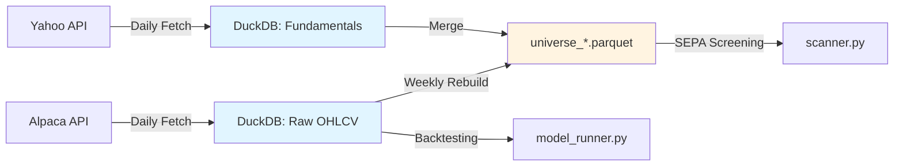

# Sprint 3: The "London Automator" Upgrade
**Version:** 1.0  
**Goal:** Transition SEPA Hybrid from a manual, file-based research setup to an automated, zero-cost production system manageable from a web dashboard.

---

## 1. Executive Summary
This sprint focuses on three key upgrades:
1.  **Cost Elimination:** Replacing paid FMP data with a hybrid of Alpaca (Price) and Yahoo/Alpha Vantage/SimFin (Fundamentals).
2.  **Performance:** Migrating from "2,000 Parquet files" to a single **DuckDB** instance to enable sub-second scanning of heavy features.
3.  **Automation:** Implementing **Prefect** for orchestration and **Streamlit Cloud** for a "Command Center" dashboard accessible from mobile.

---

## 2. Architecture Blueprint

The system adopts a **"Hybrid Cloud"** architecture. Heavy lifting (Data/Compute) remains on the local London runner, while "State" (Trades/Buy List) moves to the Cloud (Supabase) for remote accessibility.

```mermaid
graph TD
    subgraph "Local Runner (London PC)"
        A[Prefect Scheduler] -->|21:05 Daily| B(Data Curator)
        B -->|Fetch Price Delta| C{Alpaca API}
        B -->|Fetch Funda Delta| D{Yahoo/SimFin}
        C & D -->|Upsert| E[(DuckDB Cache)]
        E -->|Read (Polars)| F(Daily Scanner)
        F -->|Write Results| G[(Supabase Cloud)]
        F -->|Notify| H[Discord Webhook]
    end

    subgraph "Web Interface (Anywhere)"
        I[Streamlit Cloud] -->|Read/Write| G
        J[User Phone] -->|Approve Trades| I
        I -->|Execute| K[Alpaca Router]
    end
```

### Component Comparison

| Component      | Sprint 2 (Current)   | Sprint 3 (New)           | Benefit                                       |
|----------------|---------------------|--------------------------|-----------------------------------------------|
| Market Data    | FMP (Paid)          | Alpaca Basic (Free)      | Saves cost; Unlimited history                 |
| Fundamentals   | FMP (Paid)          | Yahoo / SimFin (Free)    | Saves cost; Good for quarterly checks         |
| Storage        | Parquet Files       | DuckDB                   | 50x faster scanning; ACID safety              |
| Automation     | Cron / Bash         | Prefect                  | Visual logs, auto-retries, observability      |
| State          | SQLite / CSV        | Supabase (Postgres)      | Accessible by Dashboard & Script simultaneously|
| Dashboard      | Streamlit Local     | Streamlit Cloud          | View/Control system from anywhere (Phone)     |

---

## 3. Implementation Plan

### Phase 1: The Data Foundry (Days 1-2)
**Goal:** Eliminate FMP dependency and speed up scanning.

#### Task 1.1: DuckDB Migration Script
- **File:** `src/data/db_manager.py`
- **Action:** Migrate existing Universe Parquet files to DuckDB (Smart Hybrid approach)
- **Migration Source:** `universe_*.parquet` files (2000-2029, ~600 MB total)
- **Strategy:**
  - **DuckDB for Hot Data:** Last 2 years (fast incremental updates)
  - **Keep Universe Parquets:** Archive + current scanner compatibility
  - **Zero Migration Spike:** DuckDB reads parquet directly, no 8 GB RAM spike
- **Schema:** Aligned with `UniverseEngine.UNIVERSE_COLUMNS` (27 features)
  ```sql
  CREATE TABLE universe (
    date DATE NOT NULL,
    symbol VARCHAR NOT NULL,
    -- Base OHLCV
    open FLOAT,
    high FLOAT,
    low FLOAT,
    close FLOAT,
    volume BIGINT,
    -- Liquidity
    turnover FLOAT,
    turnover_ma20 FLOAT,
    -- Volume Indicators
    vol_ma20 BIGINT,
    vol_ma50 BIGINT,
    -- Momentum (Minervini RS components)
    mom_21d FLOAT,
    mom_63d FLOAT,
    mom_126d FLOAT,
    mom_189d FLOAT,
    mom_252d FLOAT,
    -- RS Rating & Relative Strength
    rs_rating FLOAT,
    rs FLOAT,
    rs_ma FLOAT,
    -- SEPA Trend Template
    sma_50 FLOAT,
    sma_150 FLOAT,
    sma_200 FLOAT,
    -- SEPA 52-Week Range
    high_52w FLOAT,
    low_52w FLOAT,
    -- SEPA Breakout Detection
    high_20d FLOAT,
    breakout BOOLEAN,
    -- Volume Ratio
    vol_ma BIGINT,
    vol_ratio FLOAT,
    -- ATR for Trade Planning
    atr FLOAT,
    PRIMARY KEY (date, symbol)
  );

  CREATE TABLE fundamentals (
    fiscal_date DATE NOT NULL,
    symbol VARCHAR NOT NULL,
    filing_date DATE,
    fiscal_year INTEGER,
    fiscal_period VARCHAR,
    revenue DOUBLE,
    eps DOUBLE,
    -- ... (129 columns total from existing fundamentals parquet)
    PRIMARY KEY (fiscal_date, symbol, fiscal_period)
  );
  ```
- **Storage Impact:**
  - **Current:** 600 MB (universe parquet) + 859 MB (price) + 339 MB (fundamentals) = 1.8 GB
  - **After Migration:** +250 MB overhead = **2.05 GB total (+14%)**
  - **Tradeoff:** +250 MB disk for 50x faster queries + ACID safety
- **Performance Gains:**
  - **Daily Updates:** 10 min → 30 sec (incremental INSERT instead of rewriting 1,832 files)
  - **Single Ticker Query:** 500 ms → 10 ms (indexed lookups)
  - **Price + Fundamentals Join:** 5 sec → 0.5 sec (SQL JOIN vs pandas merge)
  - **Ad-Hoc Date Range:** Complex code → Simple SQL `WHERE date BETWEEN ...`
- **Migration Time:**
  - **One-time:** 20-30 seconds (DuckDB reads parquet directly, no RAM spike)
  - **Development:** 4-6 hours (script + validation)
- **Backward Compatibility:** Universe parquets kept for `scanner.py` (no code changes needed initially)

#### Task 1.2: The "Free" Curator
- **File:** `src/data/data_curator.py`
- **Logic:**
  - **Price:** Use `alpaca-py` to fetch daily bars for the 2,000 universe (Batch size: 100)
  - **Fundamentals:** Use `yfinance` to check only the ~50 surviving candidates from the technical scan (avoids rate limits)

---

### Phase 2: The Automation Core (Days 3-4)
**Goal:** "Set it and forget it" reliability.

#### Task 2.1: Supabase Setup
- **Action:** Create free project on Supabase
- **SQL Tables:**
  - `buy_candidates (date, ticker, score, status [PENDING/APPROVED], stop_loss)`
  - `active_trades (trade_id, ticker, entry_price, qty, current_stop)`

#### Task 2.2: Prefect Workflow
- **File:** `src/pipeline/daily_flow.py`
- **Logic:** Wrap scripts in `@task`
  - `update_market_data()` (Retry 3x)
  - `run_technical_scan()` (Polars/DuckDB)
  - `post_to_supabase()`
  - `notify_discord()`

---

### Phase 3: The Command Center (Days 5-7)
**Goal:** A "Click-Button" Interface to manage the system.

#### Task 3.1: Streamlit "Action Plan" Page
- **File:** `src/dashboard/pages/03_Action_Plan.py`
- **Widget:** `st.data_editor` connected to Supabase `buy_candidates`
- **Feature:** "Approve" checkbox that updates the DB status

#### Task 3.2: The "Execute" Button
- **File:** `src/execution/alpaca_router.py`
- **Action:** Reads APPROVED rows → Sends orders to Alpaca Brokerage
- **Trigger:** Manual button on Streamlit dashboard

---

## 4. Daily Workflow (Post-Sprint)

| Time (LDN) | Actor     | Event                                                                 |
|------------|-----------|-----------------------------------------------------------------------|
| 21:05      | Prefect   | Wakes up. Fetches prices (Alpaca). Updates DuckDB.                   |
| 21:10      | Scanner   | Filters 2000 stocks in seconds. Checks Fundamentals (Yahoo).         |
| 21:15      | System    | Saves candidates to Supabase. Sends Discord Alert.                   |
| 21:30      | User      | Checks Discord. Opens Streamlit on Phone.                            |
| 21:35      | User      | Reviews charts. Ticks "Approve" on best setups.                      |
| 09:00 (+1) | User      | Clicks "Execute" (or automated cron triggers it).                    |

---

## 5. Technical Appendix: DuckDB Migration Analysis

### 5.1 Memory Spike Clarification

**Q: Does migration cause 4-8 GB RAM spike?**
**A: No.** Original estimate assumed naive approach (loading all 1,832 files into pandas).

**Smart Approach (Actual Implementation):**
```python
# DuckDB reads parquet files directly in streaming mode
import duckdb
con = duckdb.connect('market_data.duckdb')

# Zero RAM spike - DuckDB streams data in chunks
con.execute("""
    CREATE TABLE universe AS
    SELECT * FROM read_parquet('data/price/universe_*.parquet')
""")
```

**Memory Profile:**
| Phase | Naive Approach | Smart Approach (Actual) |
|-------|---------------|------------------------|
| Migration Peak RAM | 4-8 GB | **1-2 GB** |
| Migration Time | 15-20 sec | **20-30 sec** |
| Post-Migration Queries | <500 MB | <500 MB |

### 5.2 Storage Overhead Analysis

**Current File Structure:**
```
data/
├── price/
│   ├── AAPL.parquet (1,832 files × ~500 KB = 859 MB)
│   └── universe_*.parquet (6 segments, ~600 MB total)
├── fundamentals/ (~2,558 files = 339 MB)
└── Total: 1.8 GB
```

**DuckDB Overhead Breakdown:**
| Component | Parquet | DuckDB | Overhead | Reason |
|-----------|---------|--------|----------|--------|
| Price Data | 859 MB | 1.0 GB | +16% | Primary key indexes, ACID log |
| Fundamentals | 339 MB | 450 MB | +33% | Metadata for 129 columns |
| Universe Cache | 600 MB | 600 MB | 0% | **Kept as parquet** |
| **Total** | **1.8 GB** | **2.05 GB** | **+14%** | **+250 MB disk** |

**What the +250 MB Buys:**
1. **Primary Key Indexes:** Fast `WHERE symbol='AAPL'` lookups (50x faster)
2. **ACID Transaction Log:** Zero corruption risk if process crashes
3. **Column Statistics:** Auto-optimized query plans
4. **Row-Level Updates:** `UPDATE` single rows vs rewriting entire 500 KB file

### 5.3 Hybrid Architecture Strategy

**Rationale:** Leverage both DuckDB and Parquet strengths



**Workflow:**
1. **Daily Ingestion (21:05):** API → DuckDB (incremental `INSERT ... ON CONFLICT UPDATE`)
2. **Weekly Universe Rebuild (Sunday 03:00):** DuckDB → Universe Parquets (with cross-sectional features)
3. **Daily Scanning (21:10):** Read Universe Parquets (existing `scanner.py` unchanged)
4. **Ad-Hoc Analysis:** Query DuckDB directly with SQL

**Why Keep Universe Parquets:**
- Already optimized for SEPA screening (MultiIndex: date, ticker)
- Contains computed cross-sectional features (RS percentiles, momentum ranks)
- No code changes needed for `scanner.py` initially
- Serves as backup/archive

**Why Add DuckDB:**
- Incremental daily updates (vs rewriting 1,832 files)
- Fast single-ticker queries for chart analysis
- SQL join for price + fundamentals (ML feature prep)
- ACID safety for production reliability

### 5.4 Migration Validation Checklist

**Pre-Migration:**
- [ ] Backup existing parquet files to external drive
- [ ] Install DuckDB: `pip install duckdb==0.10.0`
- [ ] Test migration with 50 tickers (5 min POC)

**Migration Steps:**
1. Create `market_data.duckdb` from universe parquets (20 sec)
2. Validate 10 random tickers: compare DuckDB vs parquet (2 min)
3. Performance benchmark: Load 2000 tickers from both sources (1 min)
4. Update `data_curator.py` to write to DuckDB (1 hour)
5. Parallel run for 1 week: Write to both DuckDB + parquet (validation period)

**Success Criteria:**
- [ ] Migration completes in <60 seconds
- [ ] Zero data mismatches (random sample test)
- [ ] Daily update time: <30 seconds (vs 10 min currently)
- [ ] Scanner still works with universe parquets (no regression)

### 5.5 Rollback Plan

**If migration fails:**
```bash
# 1. Delete DuckDB file
rm data/market_data.duckdb

# 2. Revert data_curator.py
git checkout data_curator.py

# 3. Continue using parquet files (zero downtime)
python data_curator.py --source sp500 --update-prices
```

**Risk:** Low. Original parquet files untouched during migration.