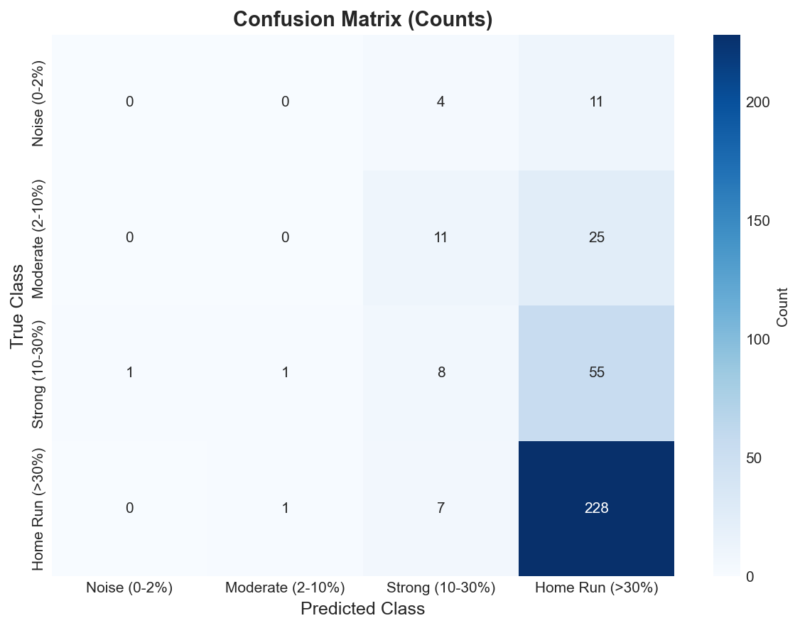
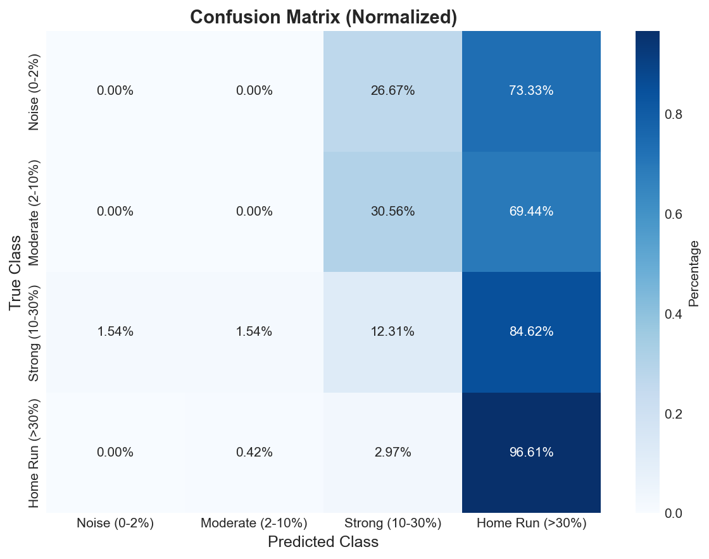
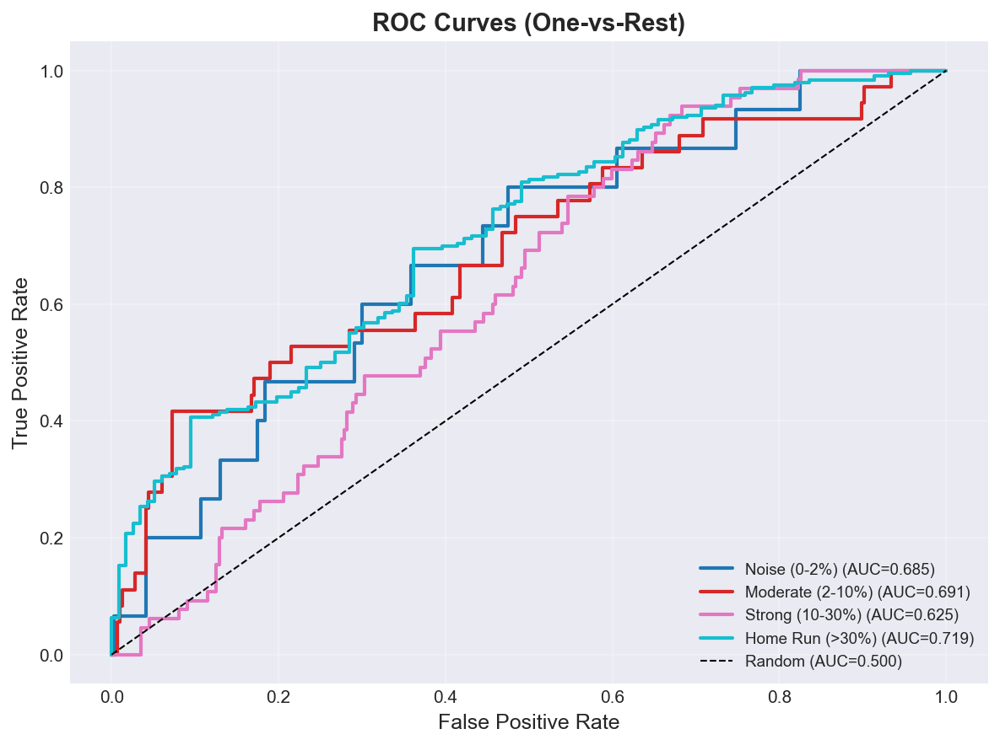
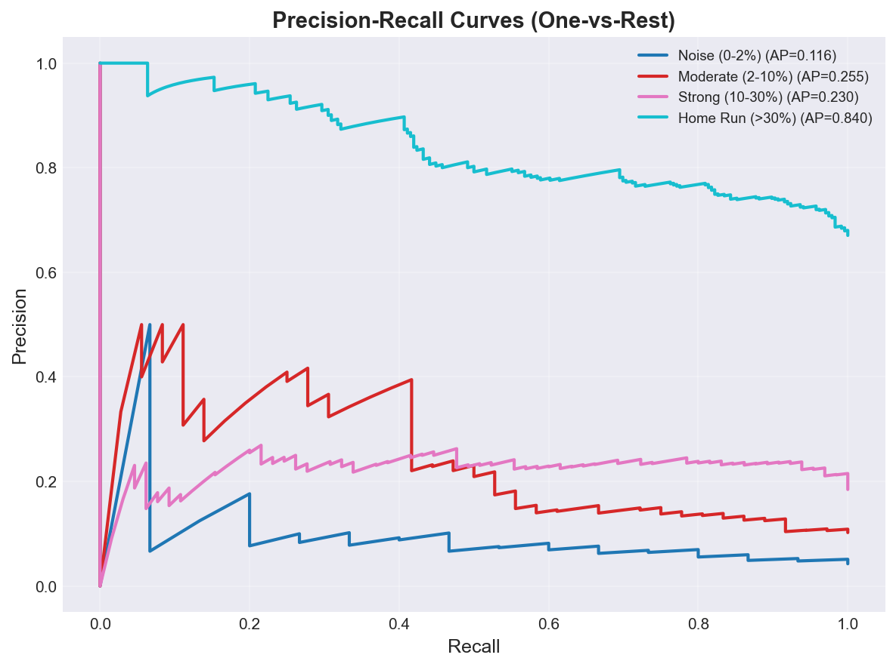
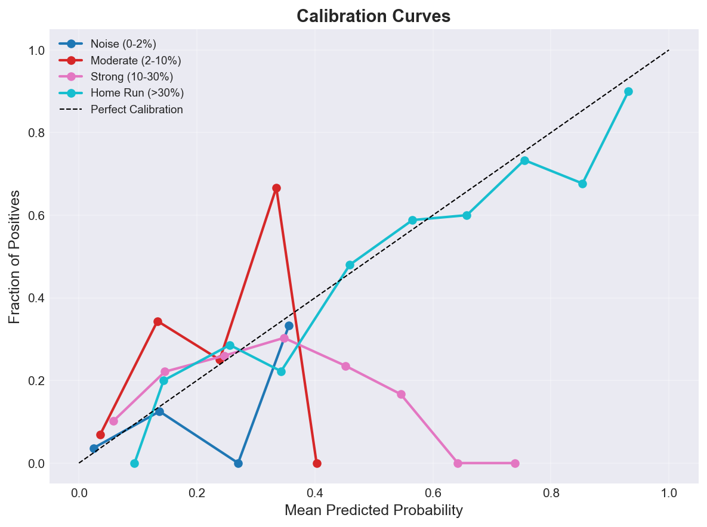
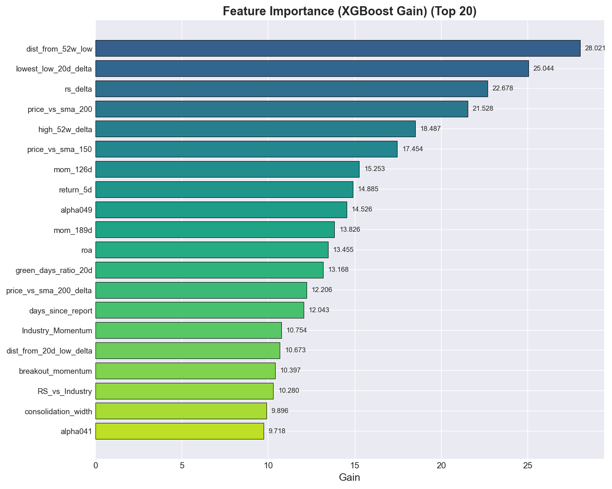

# M01_baseline Classification Report
**Version:** v1
**Generated:** 2026-03-15 13:31:29

---

## 📊 Executive Summary

**Viability:** ✅ ACCEPTABLE

### Key Metrics

- **Accuracy:** 0.670 (67.0%)
- **Weighted F1:** 0.582
- **Macro F1:** 0.248
- **Test Samples:** 352

**Assessment:** Weighted F1 (0.582) is acceptable for initial deployment. Monitor performance closely.

---

## 🔲 Confusion Matrix Analysis

### Confusion Matrix (Counts)

| True \ Predicted | Noise (0-2%) | Moderate (2-10%) | Strong (10-30%) | Home Run (>30%) |
|---|---|---|---|---|
| **Noise (0-2%)** | 0 | 0 | 4 | 11 |
| **Moderate (2-10%)** | 0 | 0 | 11 | 25 |
| **Strong (10-30%)** | 1 | 1 | 8 | 55 |
| **Home Run (>30%)** | 0 | 1 | 7 | 228 |

---

## 📋 Per-Class Performance

*Per-class metrics not available*

---

## 📈 ROC and Precision-Recall Analysis

### ROC AUC Scores

| Class | ROC AUC |
|-------|---------|
| **Noise (0-2%)** | 0.685 |
| **Moderate (2-10%)** | 0.691 |
| **Strong (10-30%)** | 0.625 |
| **Home Run (>30%)** | 0.719 |

### Average Precision Scores

| Class | PR AUC (AP) |
|-------|-------------|
| **Noise (0-2%)** | 0.116 |
| **Moderate (2-10%)** | 0.255 |
| **Strong (10-30%)** | 0.230 |
| **Home Run (>30%)** | 0.840 |

---

## 🎯 Calibration Analysis

### Brier Score (Lower is Better)

| Class | Brier Score |
|-------|-------------|
| **Noise (0-2%)** | 0.0403 |
| **Moderate (2-10%)** | 0.0887 |
| **Strong (10-30%)** | 0.1597 |
| **Home Run (>30%)** | 0.1952 |
| **Mean** | **0.1210** |

🟡 **Moderate calibration** - probabilities are somewhat reliable.

---

## 📊 Feature Importance

### Top 20 Features (XGBoost Gain)

| Rank | Feature | Gain |
|------|---------|------|
| 1 | dist_from_52w_low | 28.0213 |
| 2 | lowest_low_20d_delta | 25.0440 |
| 3 | rs_delta | 22.6781 |
| 4 | price_vs_sma_200 | 21.5285 |
| 5 | high_52w_delta | 18.4871 |
| 6 | price_vs_sma_150 | 17.4544 |
| 7 | mom_126d | 15.2534 |
| 8 | return_5d | 14.8853 |
| 9 | alpha049 | 14.5263 |
| 10 | mom_189d | 13.8261 |
| 11 | roa | 13.4548 |
| 12 | green_days_ratio_20d | 13.1677 |
| 13 | price_vs_sma_200_delta | 12.2056 |
| 14 | days_since_report | 12.0431 |
| 15 | Industry_Momentum | 10.7544 |
| 16 | dist_from_20d_low_delta | 10.6726 |
| 17 | breakout_momentum | 10.3975 |
| 18 | RS_vs_Industry | 10.2796 |
| 19 | consolidation_width | 9.8959 |
| 20 | alpha041 | 9.7183 |

---

## 🔍 SHAP Feature Impact Analysis

### Noise (0-2%)

| Rank | Feature | Mean |SHAP| |
|------|---------|-------------|
| 1 | price_vs_sma_50 | 0.0227 |
| 2 | price_vs_sma_150 | 0.0196 |
| 3 | close_above_sma200 | 0.0194 |
| 4 | price_vs_sma_200 | 0.0185 |

### Moderate (2-10%)

| Rank | Feature | Mean |SHAP| |
|------|---------|-------------|
| 1 | price_vs_sma_50 | 0.0244 |
| 2 | price_vs_sma_200 | 0.0220 |
| 3 | close_above_sma200 | 0.0193 |
| 4 | price_vs_sma_150 | 0.0189 |

### Strong (10-30%)

| Rank | Feature | Mean |SHAP| |
|------|---------|-------------|
| 1 | price_vs_sma_50 | 0.0268 |
| 2 | close_above_sma200 | 0.0248 |
| 3 | price_vs_sma_200 | 0.0216 |
| 4 | price_vs_sma_150 | 0.0197 |

### Home Run (>30%)

| Rank | Feature | Mean |SHAP| |
|------|---------|-------------|
| 1 | close_above_sma200 | 0.0240 |
| 2 | price_vs_sma_200 | 0.0221 |
| 3 | price_vs_sma_50 | 0.0207 |
| 4 | price_vs_sma_150 | 0.0201 |

*Note: SHAP values indicate feature impact magnitude. For directionality, see SHAP beeswarm plots.*

---

## 💡 Recommendations

- ✅ **Model Performance:** Model shows acceptable performance. Monitor in production and iterate as needed.

---

## 📁 Artifacts

### Generated Plots

- `confusion_matrix.png` - Confusion Matrix
- `confusion_matrix_normalized.png` - Confusion Matrix Normalized
- `feature_importance.png` - Feature Importance
- `roc_curves.png` - Roc Curves
- `pr_curves.png` - Pr Curves
- `calibration_curves.png` - Calibration Curves
- `class_distribution.png` - Class Distribution

---

*Report generated by ClassificationEvaluator - 2026-03-15 13:31:29*