# m01_binary Classification Report
**Version:** v1
**Generated:** 2026-05-24 22:20:20

---

## 📊 Executive Summary

**Viability:** ❌ NOT VIABLE

### Key Metrics

- **Accuracy:** 0.634 (63.4%)
- **Weighted F1:** 0.688
- **Macro F1:** 0.554
- **Test Samples:** 5,548

**Assessment:** Accuracy (63.4%) barely exceeds random baseline (85.5%). Model is not production-ready.

---

## ⚖️ Class Distribution Across Splits

| Class | Train Count | Train % | Val Count | Val % | Test Count | Test % |
|-------|-------------|---------|-----------|-------|------------|--------|
| **Not Home Run (<=30%)** | 27,872 | 88.8% | 4,742 | 85.5% | 4,742 | 85.5% |
| **Home Run (>30%)** | 3,510 | 11.2% | 806 | 14.5% | 806 | 14.5% |

✅ Class proportions are stable across splits (<5pp gap).

**Majority-class baseline (test):** 85.5% — any model must beat this.

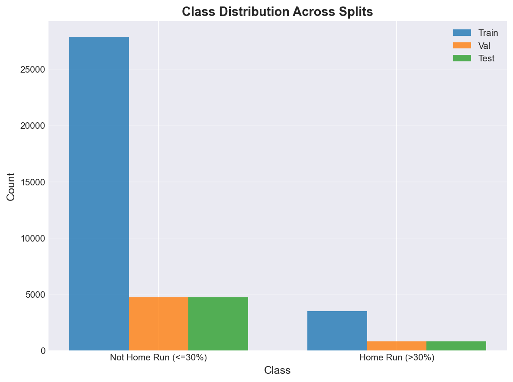

---

## 📅 Temporal Stability

*Per-period metrics. Stable performance across periods = real signal. Wide swings or decay over time = likely overfitting or split artifact.*

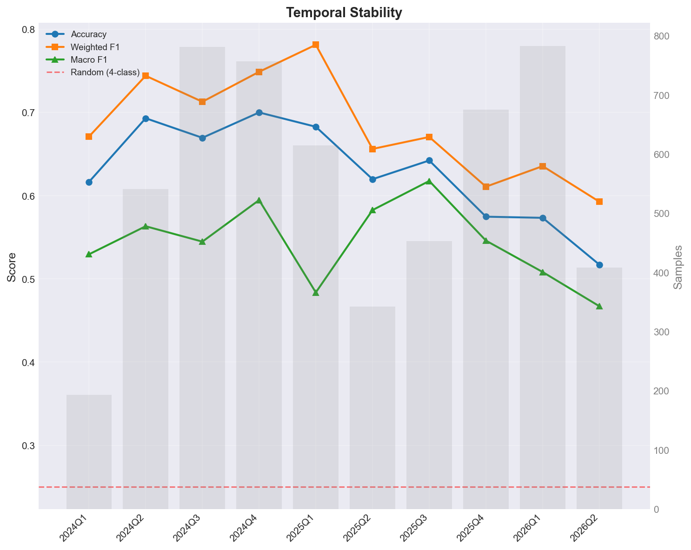

| Period | Samples | Accuracy | Weighted F1 | Macro F1 |
|--------|---------|----------|-------------|----------|
| 2024Q1 | 193 | 0.617 | 0.671 | 0.530 |
| 2024Q2 | 541 | 0.693 | 0.744 | 0.563 |
| 2024Q3 | 781 | 0.670 | 0.713 | 0.545 |
| 2024Q4 | 757 | 0.700 | 0.749 | 0.595 |
| 2025Q1 | 615 | 0.683 | 0.781 | 0.484 |
| 2025Q2 | 342 | 0.620 | 0.656 | 0.583 |
| 2025Q3 | 453 | 0.642 | 0.671 | 0.618 |
| 2025Q4 | 675 | 0.575 | 0.611 | 0.546 |
| 2026Q1 | 783 | 0.573 | 0.636 | 0.508 |
| 2026Q2 | 408 | 0.517 | 0.593 | 0.467 |

### Stability Diagnostics

- **Accuracy std across periods:** 0.060
- **Accuracy range:** 0.183 (min=0.517, max=0.700)
- **Weighted F1 std:** 0.063

⚠️ **Unstable performance** — accuracy varies by >15pp across periods. Investigate whether features behave differently in different regimes, or whether the strong period is overfitted.

---

## 🔲 Confusion Matrix Analysis

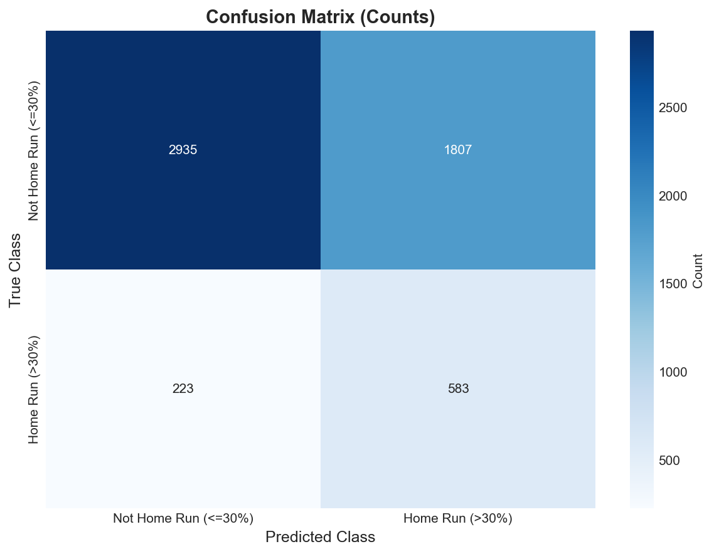

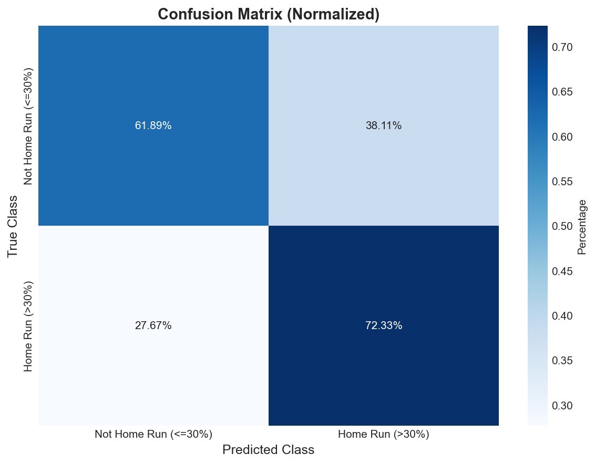

### Confusion Matrix (Counts)

| True \ Predicted | Not Home Run (<=30%) | Home Run (>30%) |
|---|---|---|
| **Not Home Run (<=30%)** | 2,935 | 1,807 |
| **Home Run (>30%)** | 223 | 583 |

---

## 📋 Per-Class Performance

| Class | Precision | Recall | F1-Score | Support |
|-------|-----------|--------|----------|---------|
| **Not Home Run (<=30%)** | 0.929 | 0.619 | 0.743 | 4,742.0 |
| **Home Run (>30%)** | 0.244 | 0.723 | 0.365 | 806.0 |

### Insights

- **Best Performance:** Not Home Run (<=30%) (F1=0.743)
- **Worst Performance:** Home Run (>30%) (F1=0.365)

⚠️  **Warning:** High variance in per-class F1 (std=0.267). Model performance is imbalanced across classes.

---

## 🎯 Top-K Precision & Lift

*Among the top-K predictions ranked by predicted probability, what fraction actually belong to the class? Lift > 1 means the model is doing better than random.*

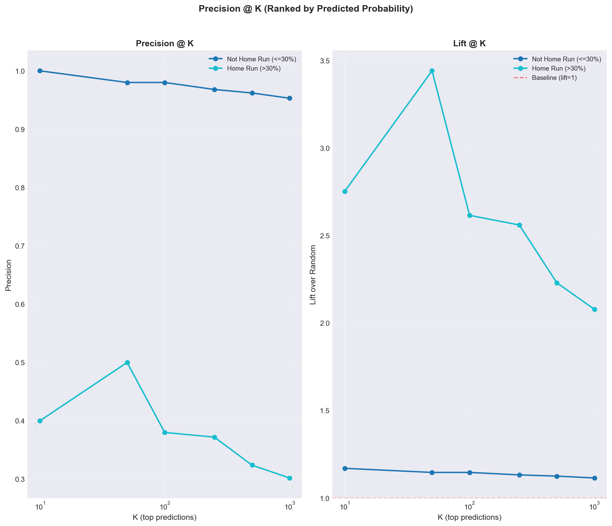

### Precision @ K

| Class | Base Rate | K=10 | K=50 | K=100 | K=250 | K=500 | K=1000 |
|---|---|---|---|---|---|---|---|
| **Not Home Run (<=30%)** | 85.5% | 100.0% | 98.0% | 98.0% | 96.8% | 96.2% | 95.3% |
| **Home Run (>30%)** | 14.5% | 40.0% | 50.0% | 38.0% | 37.2% | 32.4% | 30.2% |

### Lift @ K (precision / base rate)

| Class | Base Rate | K=10 | K=50 | K=100 | K=250 | K=500 | K=1000 |
|---|---|---|---|---|---|---|---|
| **Not Home Run (<=30%)** | 85.5% | 1.17x | 1.15x | 1.15x | 1.13x | 1.13x | 1.11x |
| **Home Run (>30%)** | 14.5% | 2.75x | 3.44x | 2.62x | 2.56x | 2.23x | 2.08x |

**Best top-10 lift:** `Home Run (>30%)` at **2.75x** (precision 40.0% vs base rate 14.5%).

✅ Lift ≥ 2x means top picks are at least 2x more likely to be true positives than random. This is the trading-relevant edge.

---

## 🚦 Actionable Signal Threshold Sweep

*Defines a binary 'go' signal: max P(class) over actionable classes (`Home Run (>30%)`) ≥ threshold. Shows how precision/recall/signal-count trade off as you tighten the cutoff.*

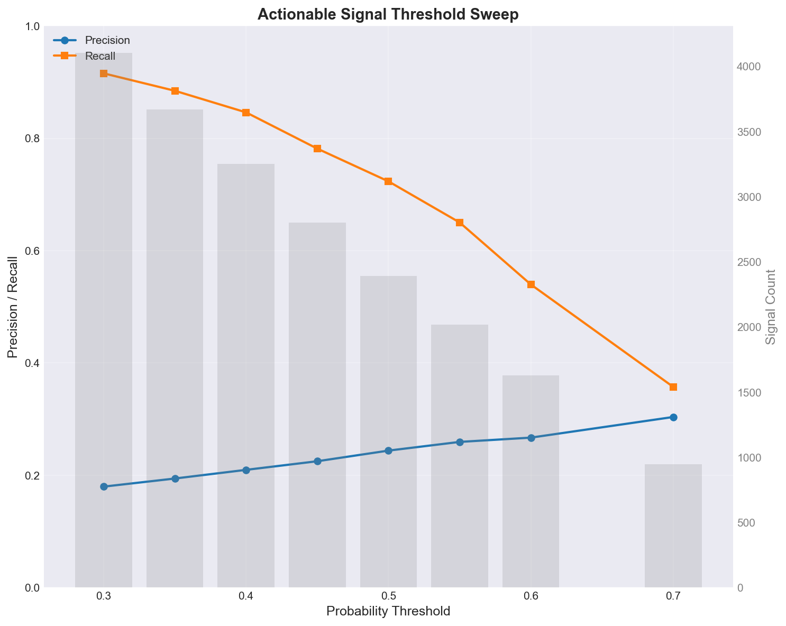

| Threshold | Signals | True Positives | Precision | Recall |
|-----------|---------|----------------|-----------|--------|
| 0.30 | 4,105 | 738 | 18.0% | 91.6% |
| 0.35 | 3,671 | 713 | 19.4% | 88.5% |
| 0.40 | 3,253 | 682 | 21.0% | 84.6% |
| 0.45 | 2,800 | 630 | 22.5% | 78.2% |
| 0.50 | 2,390 | 583 | 24.4% | 72.3% |
| 0.55 | 2,020 | 524 | 25.9% | 65.0% |
| 0.60 | 1,629 | 435 | 26.7% | 54.0% |
| 0.70 | 948 | 288 | 30.4% | 35.7% |

**Suggested operating point:** threshold = **0.70** → precision 30.4%, recall 35.7%, 948.0 signals.

---

## 🎲 Probability Separation

*For each class, mean predicted P(class) for true positives vs true negatives. Larger separation = better ranking power.*

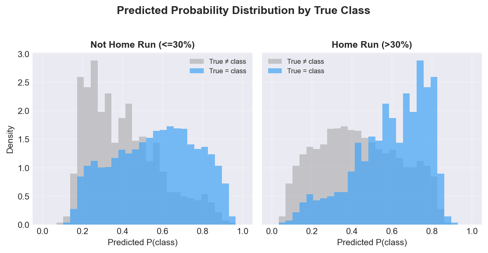

| Class | Mean P (true=class) | Mean P (true≠class) | Separation | Support |
|-------|---------------------|---------------------|------------|---------|
| **Not Home Run (<=30%)** | 0.562 | 0.405 | +0.157 | 4,742 |
| **Home Run (>30%)** | 0.595 | 0.438 | +0.157 | 806 |

---

## 📈 ROC and Precision-Recall Analysis

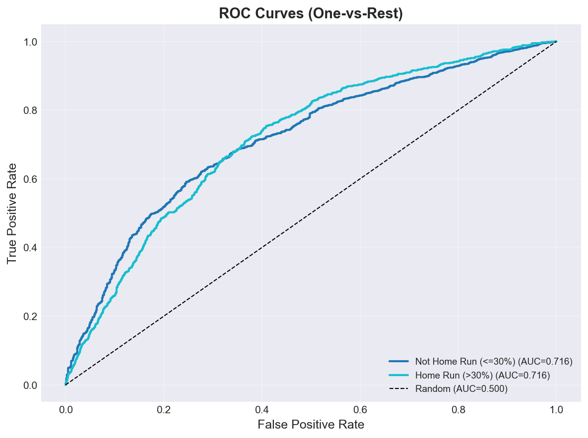

### ROC AUC Scores

| Class | ROC AUC |
|-------|---------|
| **Not Home Run (<=30%)** | 0.716 |
| **Home Run (>30%)** | 0.716 |

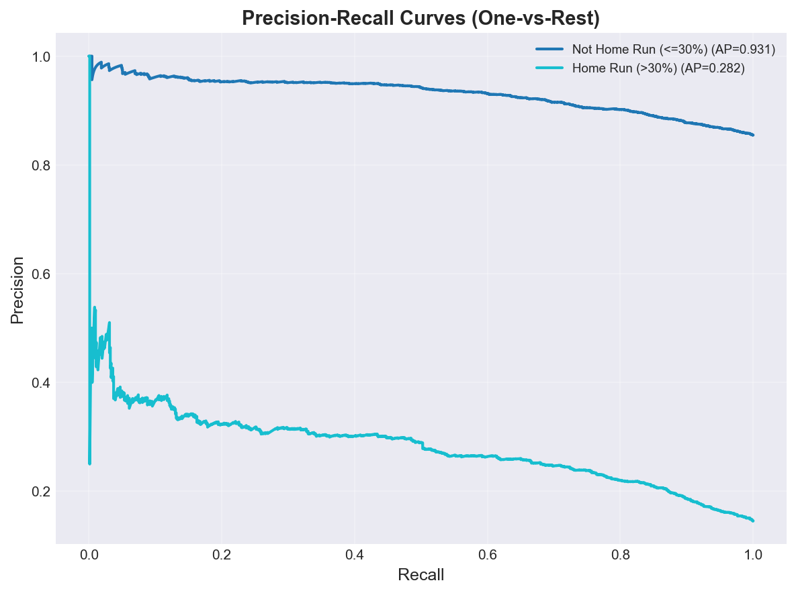

### Average Precision Scores

| Class | PR AUC (AP) |
|-------|-------------|
| **Not Home Run (<=30%)** | 0.931 |
| **Home Run (>30%)** | 0.282 |

---

## 🎯 Calibration Analysis

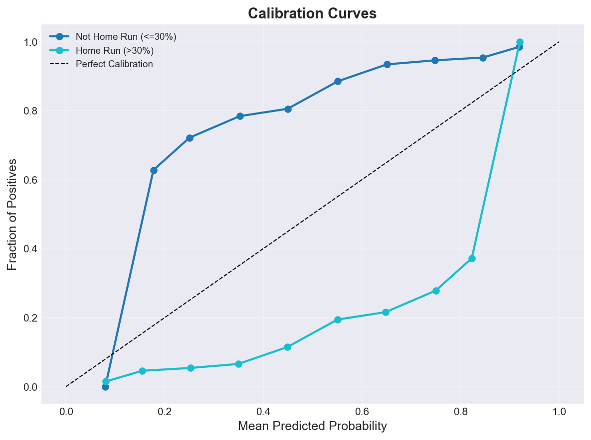

### Brier Score (Lower is Better)

| Class | Brier Score |
|-------|-------------|
| **Not Home Run (<=30%)** | 0.2285 |
| **Home Run (>30%)** | 0.2285 |
| **Mean** | **0.2285** |

⚠️  **Poor calibration** - probabilities may not reflect true likelihood.

---

## 📊 Feature Importance

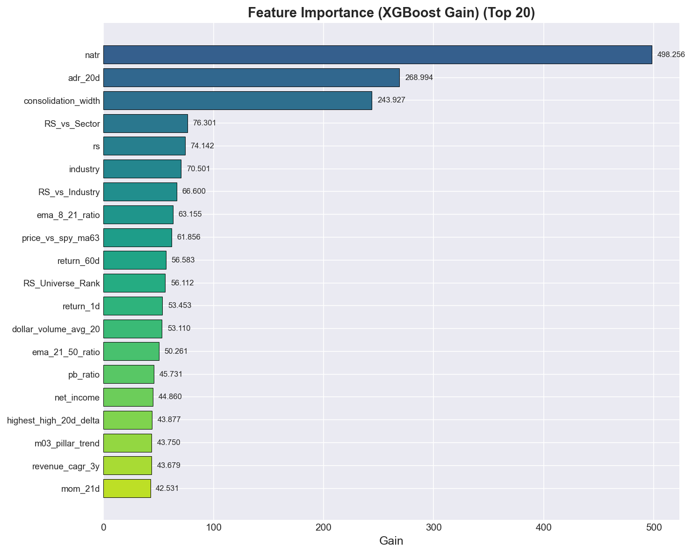

### Top 20 Features (XGBoost Gain)

| Rank | Feature | Gain |
|------|---------|------|
| 1 | natr | 498.2563 |
| 2 | adr_20d | 268.9941 |
| 3 | consolidation_width | 243.9271 |
| 4 | RS_vs_Sector | 76.3014 |
| 5 | rs | 74.1420 |
| 6 | industry | 70.5009 |
| 7 | RS_vs_Industry | 66.5999 |
| 8 | ema_8_21_ratio | 63.1548 |
| 9 | price_vs_spy_ma63 | 61.8559 |
| 10 | return_60d | 56.5834 |
| 11 | RS_Universe_Rank | 56.1115 |
| 12 | return_1d | 53.4533 |
| 13 | dollar_volume_avg_20 | 53.1100 |
| 14 | ema_21_50_ratio | 50.2611 |
| 15 | pb_ratio | 45.7314 |
| 16 | net_income | 44.8597 |
| 17 | highest_high_20d_delta | 43.8767 |
| 18 | m03_pillar_trend | 43.7502 |
| 19 | revenue_cagr_3y | 43.6792 |
| 20 | mom_21d | 42.5307 |

---

## 🔍 SHAP Feature Impact Analysis

### Home Run (>30%)

| Rank | Feature | Mean |SHAP| |
|------|---------|-------------|
| 1 | industry | 0.3173 |
| 2 | natr | 0.1528 |
| 3 | adr_20d | 0.1473 |
| 4 | consolidation_width | 0.1170 |
| 5 | price_vs_spy_ma63 | 0.1025 |
| 6 | m03_pillar_risk | 0.0589 |
| 7 | return_1d | 0.0561 |
| 8 | rs | 0.0500 |
| 9 | m03_pillar_trend | 0.0459 |
| 10 | revenue_cagr_3y | 0.0431 |

*Note: SHAP values indicate feature impact magnitude. For directionality, see SHAP beeswarm plots.*

---

## 💡 Recommendations

- 🟡 **Class Imbalance:** Performance varies significantly across classes. Consider class-specific feature engineering or oversampling.
- 🎯 **Calibration:** Predicted probabilities are poorly calibrated. Consider Platt scaling or isotonic regression.

---

## 📁 Artifacts

### Generated Plots

- `confusion_matrix.png` - Confusion Matrix
- `confusion_matrix_normalized.png` - Confusion Matrix Normalized
- `feature_importance.png` - Feature Importance
- `roc_curves.png` - Roc Curves
- `pr_curves.png` - Pr Curves
- `calibration_curves.png` - Calibration Curves
- `class_distribution.png` - Class Distribution
- `probability_distributions.png` - Probability Distributions
- `temporal_stability.png` - Temporal Stability
- `topk_precision.png` - Topk Precision
- `threshold_sweep.png` - Threshold Sweep

---

*Report generated by ClassificationEvaluator - 2026-05-24 22:20:20*