# m01_binary_no_macro Classification Report
**Version:** v1
**Generated:** 2026-06-30 01:01:31

---

## 📊 Executive Summary

**Viability:** ❌ NOT VIABLE

### Key Metrics

- **Accuracy:** 0.578 (57.8%)
- **Weighted F1:** 0.637
- **Macro F1:** 0.522
- **Test Samples:** 5,551

**Assessment:** Accuracy (57.8%) barely exceeds random baseline (85.0%). Model is not production-ready.

---

## ⚖️ Class Distribution Across Splits

| Class | Train Count | Train % | Val Count | Val % | Test Count | Test % |
|-------|-------------|---------|-----------|-------|------------|--------|
| **Not Home Run (<=30%)** | 27,828 | 88.8% | 4,719 | 85.0% | 4,719 | 85.0% |
| **Home Run (>30%)** | 3,513 | 11.2% | 832 | 15.0% | 832 | 15.0% |

✅ Class proportions are stable across splits (<5pp gap).

**Majority-class baseline (test):** 85.0% — any model must beat this.

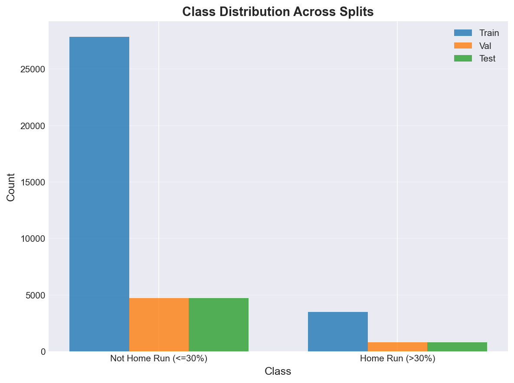

---

## 📅 Temporal Stability

*Per-period metrics. Stable performance across periods = real signal. Wide swings or decay over time = likely overfitting or split artifact.*

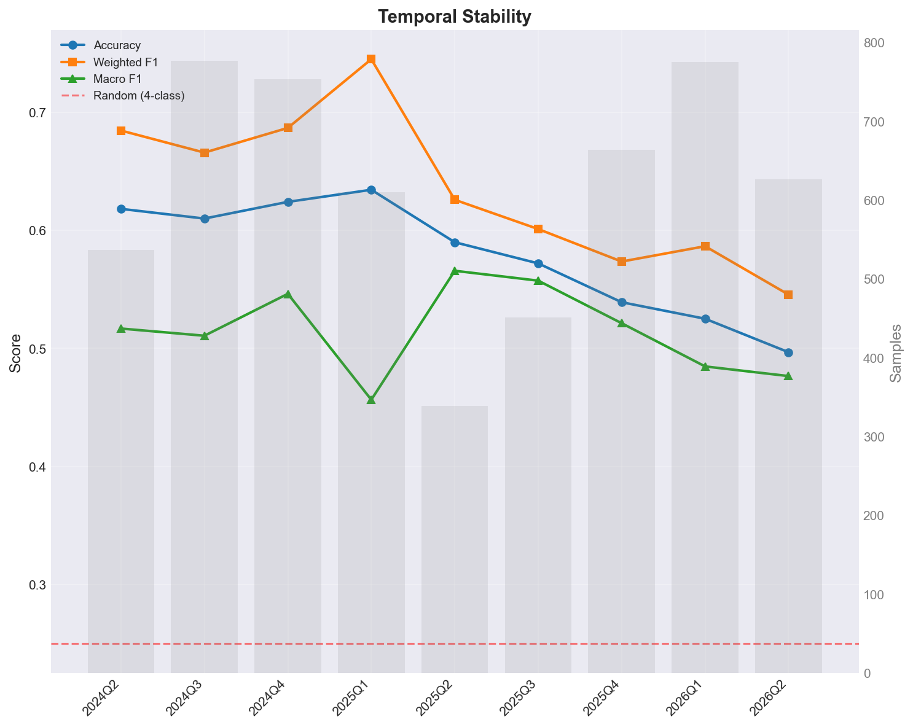

| Period | Samples | Accuracy | Weighted F1 | Macro F1 |
|--------|---------|----------|-------------|----------|
| 2024Q2 | 537 | 0.618 | 0.685 | 0.517 |
| 2024Q3 | 777 | 0.610 | 0.666 | 0.511 |
| 2024Q4 | 753 | 0.624 | 0.687 | 0.546 |
| 2025Q1 | 610 | 0.634 | 0.745 | 0.457 |
| 2025Q2 | 339 | 0.590 | 0.626 | 0.566 |
| 2025Q3 | 451 | 0.572 | 0.601 | 0.557 |
| 2025Q4 | 664 | 0.539 | 0.574 | 0.521 |
| 2026Q1 | 775 | 0.525 | 0.587 | 0.485 |
| 2026Q2 | 626 | 0.497 | 0.546 | 0.477 |

### Stability Diagnostics

- **Accuracy std across periods:** 0.049
- **Accuracy range:** 0.138 (min=0.497, max=0.634)
- **Weighted F1 std:** 0.065

🟡 **Moderately stable** — some period-over-period variation. Monitor.

⚠️ **Performance decay**: accuracy fell from 0.618 (2024Q2) to 0.497 (2026Q2). Suggests features are losing predictive power over time.

---

## 🔲 Confusion Matrix Analysis

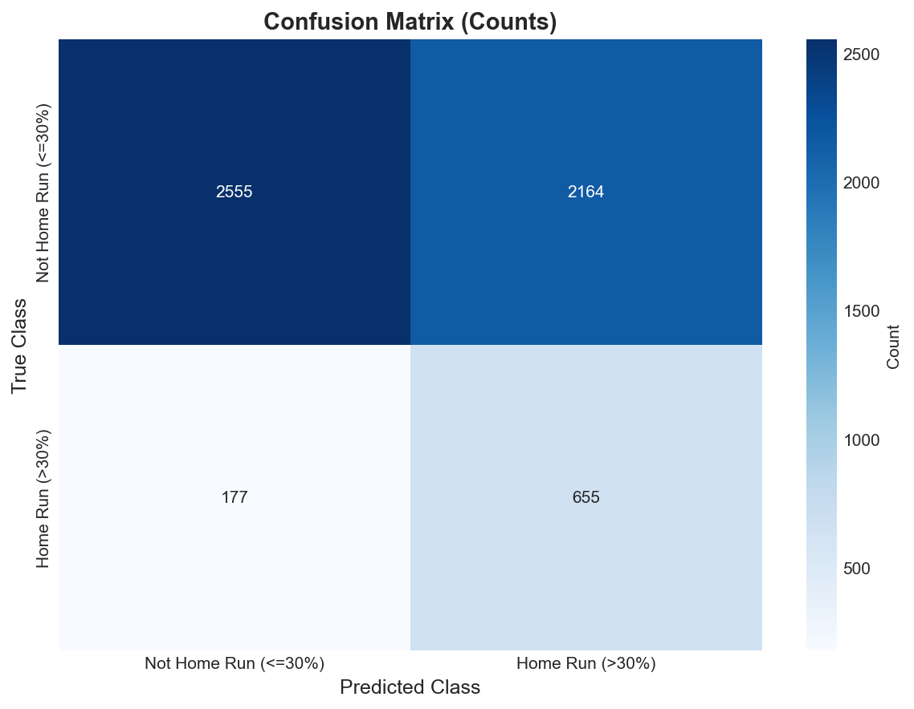

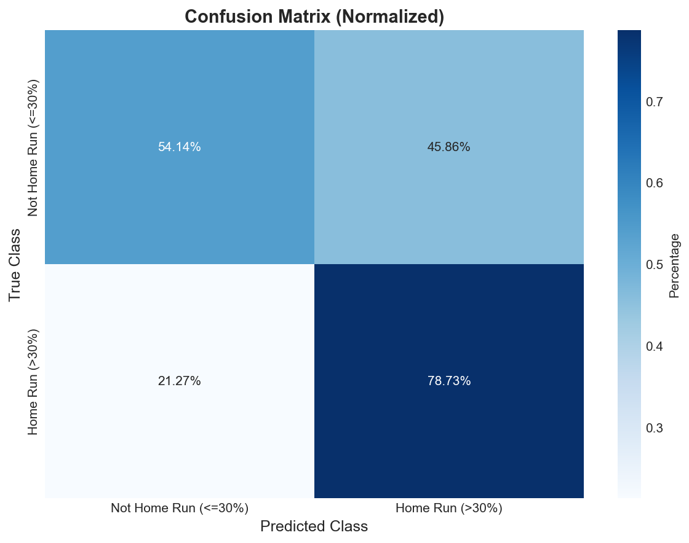

### Confusion Matrix (Counts)

| True \ Predicted | Not Home Run (<=30%) | Home Run (>30%) |
|---|---|---|
| **Not Home Run (<=30%)** | 2,555 | 2,164 |
| **Home Run (>30%)** | 177 | 655 |

---

## 📋 Per-Class Performance

| Class | Precision | Recall | F1-Score | Support |
|-------|-----------|--------|----------|---------|
| **Not Home Run (<=30%)** | 0.935 | 0.541 | 0.686 | 4,719.0 |
| **Home Run (>30%)** | 0.232 | 0.787 | 0.359 | 832.0 |

### Insights

- **Best Performance:** Not Home Run (<=30%) (F1=0.686)
- **Worst Performance:** Home Run (>30%) (F1=0.359)

⚠️  **Warning:** High variance in per-class F1 (std=0.231). Model performance is imbalanced across classes.

---

## 🎯 Top-K Precision & Lift

*Among the top-K predictions ranked by predicted probability, what fraction actually belong to the class? Lift > 1 means the model is doing better than random.*

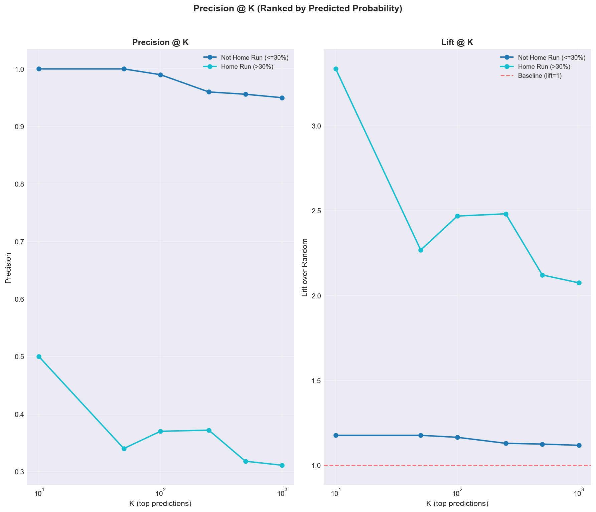

### Precision @ K

| Class | Base Rate | K=10 | K=50 | K=100 | K=250 | K=500 | K=1000 |
|---|---|---|---|---|---|---|---|
| **Not Home Run (<=30%)** | 85.0% | 100.0% | 100.0% | 99.0% | 96.0% | 95.6% | 95.0% |
| **Home Run (>30%)** | 15.0% | 50.0% | 34.0% | 37.0% | 37.2% | 31.8% | 31.1% |

### Lift @ K (precision / base rate)

| Class | Base Rate | K=10 | K=50 | K=100 | K=250 | K=500 | K=1000 |
|---|---|---|---|---|---|---|---|
| **Not Home Run (<=30%)** | 85.0% | 1.18x | 1.18x | 1.16x | 1.13x | 1.12x | 1.12x |
| **Home Run (>30%)** | 15.0% | 3.34x | 2.27x | 2.47x | 2.48x | 2.12x | 2.07x |

**Best top-10 lift:** `Home Run (>30%)` at **3.34x** (precision 50.0% vs base rate 15.0%).

✅ Lift ≥ 2x means top picks are at least 2x more likely to be true positives than random. This is the trading-relevant edge.

---

## 🚦 Actionable Signal Threshold Sweep

*Defines a binary 'go' signal: max P(class) over actionable classes (`Home Run (>30%)`) ≥ threshold. Shows how precision/recall/signal-count trade off as you tighten the cutoff.*

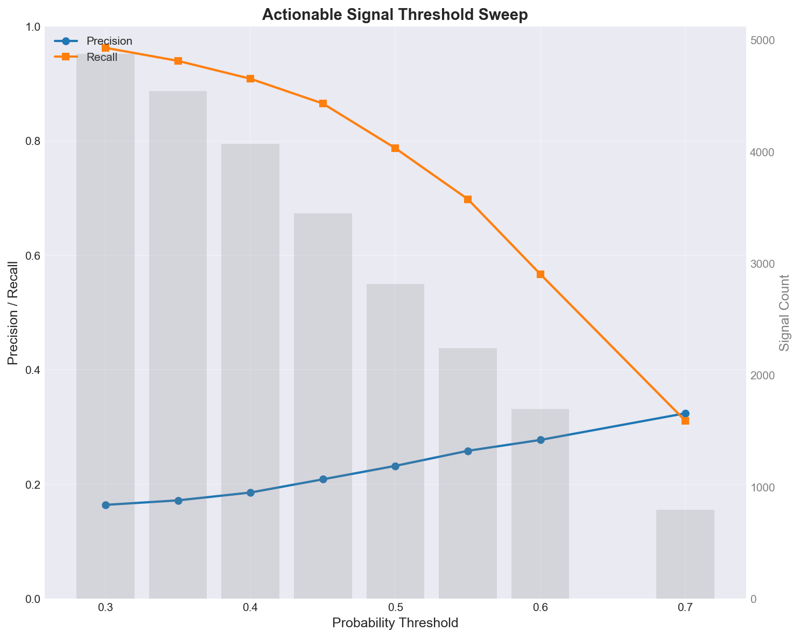

| Threshold | Signals | True Positives | Precision | Recall |
|-----------|---------|----------------|-----------|--------|
| 0.30 | 4,878 | 801 | 16.4% | 96.3% |
| 0.35 | 4,544 | 782 | 17.2% | 94.0% |
| 0.40 | 4,070 | 756 | 18.6% | 90.9% |
| 0.45 | 3,447 | 720 | 20.9% | 86.5% |
| 0.50 | 2,819 | 655 | 23.2% | 78.7% |
| 0.55 | 2,246 | 581 | 25.9% | 69.8% |
| 0.60 | 1,700 | 472 | 27.8% | 56.7% |
| 0.70 | 799 | 259 | 32.4% | 31.1% |

**Suggested operating point:** threshold = **0.70** → precision 32.4%, recall 31.1%, 799.0 signals.

---

## 🎲 Probability Separation

*For each class, mean predicted P(class) for true positives vs true negatives. Larger separation = better ranking power.*

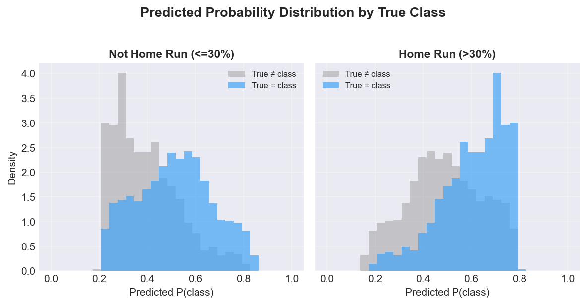

| Class | Mean P (true=class) | Mean P (true≠class) | Separation | Support |
|-------|---------------------|---------------------|------------|---------|
| **Not Home Run (<=30%)** | 0.513 | 0.395 | +0.117 | 4,719 |
| **Home Run (>30%)** | 0.605 | 0.487 | +0.117 | 832 |

---

## 📈 ROC and Precision-Recall Analysis

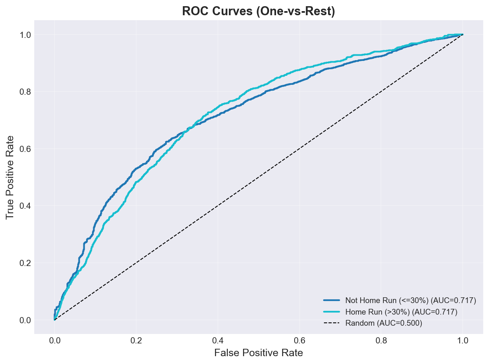

### ROC AUC Scores

| Class | ROC AUC |
|-------|---------|
| **Not Home Run (<=30%)** | 0.717 |
| **Home Run (>30%)** | 0.717 |

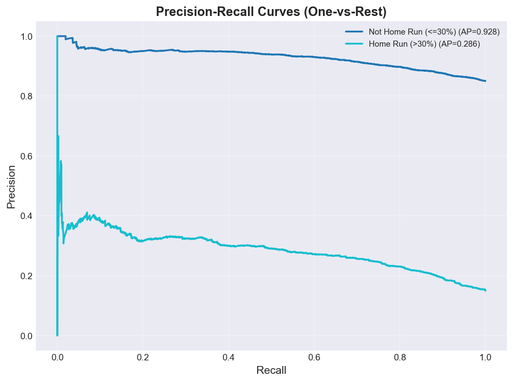

### Average Precision Scores

| Class | PR AUC (AP) |
|-------|-------------|
| **Not Home Run (<=30%)** | 0.928 |
| **Home Run (>30%)** | 0.286 |

---

## 🎯 Calibration Analysis

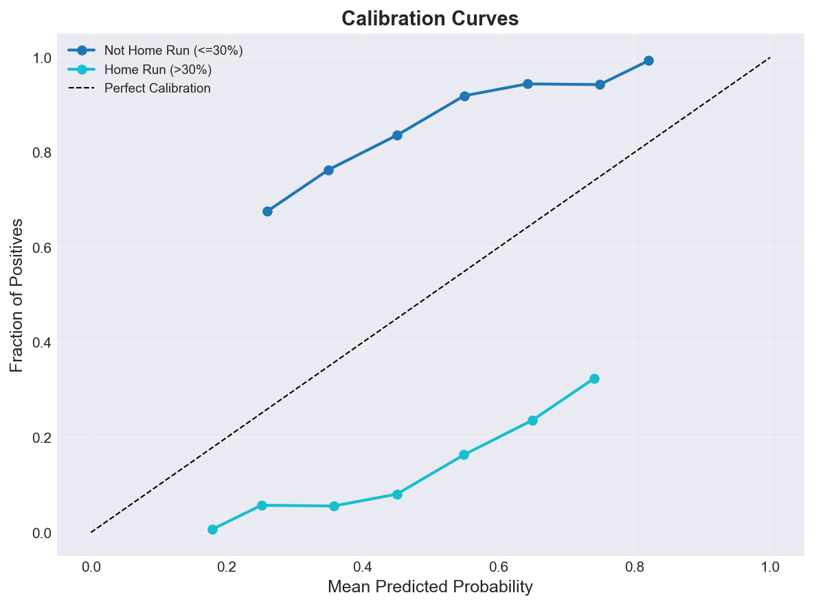

### Brier Score (Lower is Better)

| Class | Brier Score |
|-------|-------------|
| **Not Home Run (<=30%)** | 0.2489 |
| **Home Run (>30%)** | 0.2489 |
| **Mean** | **0.2489** |

⚠️  **Poor calibration** - probabilities may not reflect true likelihood.

---

## 📊 Feature Importance

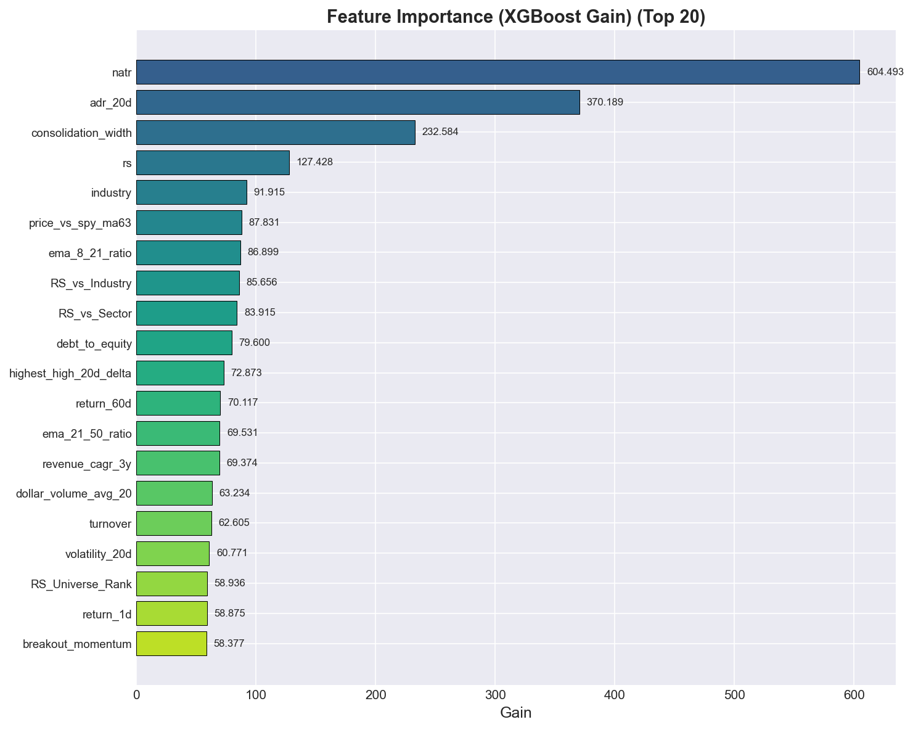

### Top 20 Features (XGBoost Gain)

| Rank | Feature | Gain |
|------|---------|------|
| 1 | natr | 604.4928 |
| 2 | adr_20d | 370.1887 |
| 3 | consolidation_width | 232.5843 |
| 4 | rs | 127.4280 |
| 5 | industry | 91.9152 |
| 6 | price_vs_spy_ma63 | 87.8306 |
| 7 | ema_8_21_ratio | 86.8995 |
| 8 | RS_vs_Industry | 85.6563 |
| 9 | RS_vs_Sector | 83.9148 |
| 10 | debt_to_equity | 79.5998 |
| 11 | highest_high_20d_delta | 72.8733 |
| 12 | return_60d | 70.1173 |
| 13 | ema_21_50_ratio | 69.5308 |
| 14 | revenue_cagr_3y | 69.3744 |
| 15 | dollar_volume_avg_20 | 63.2341 |
| 16 | turnover | 62.6049 |
| 17 | volatility_20d | 60.7714 |
| 18 | RS_Universe_Rank | 58.9359 |
| 19 | return_1d | 58.8749 |
| 20 | breakout_momentum | 58.3768 |

---

## 🔍 SHAP Feature Impact Analysis

### Home Run (>30%)

| Rank | Feature | Mean |SHAP| |
|------|---------|-------------|
| 1 | adr_20d | 0.1136 |
| 2 | natr | 0.1067 |
| 3 | industry | 0.1035 |
| 4 | consolidation_width | 0.0406 |
| 5 | ema_8_21_ratio | 0.0211 |
| 6 | rs | 0.0141 |
| 7 | return_60d | 0.0071 |
| 8 | price_vs_spy_ma63 | 0.0059 |
| 9 | dollar_volume_avg_20 | 0.0058 |
| 10 | RS_vs_Sector | 0.0058 |

*Note: SHAP values indicate feature impact magnitude. For directionality, see SHAP beeswarm plots.*

---

## 💡 Recommendations

- 🟡 **Class Imbalance:** Performance varies significantly across classes. Consider class-specific feature engineering or oversampling.
- 🎯 **Calibration:** Predicted probabilities are poorly calibrated. Consider Platt scaling or isotonic regression.

---

## 📁 Artifacts

### Generated Plots

- `confusion_matrix.png` - Confusion Matrix
- `confusion_matrix_normalized.png` - Confusion Matrix Normalized
- `feature_importance.png` - Feature Importance
- `roc_curves.png` - Roc Curves
- `pr_curves.png` - Pr Curves
- `calibration_curves.png` - Calibration Curves
- `class_distribution.png` - Class Distribution
- `probability_distributions.png` - Probability Distributions
- `temporal_stability.png` - Temporal Stability
- `topk_precision.png` - Topk Precision
- `threshold_sweep.png` - Threshold Sweep

---

*Report generated by ClassificationEvaluator - 2026-06-30 01:01:31*