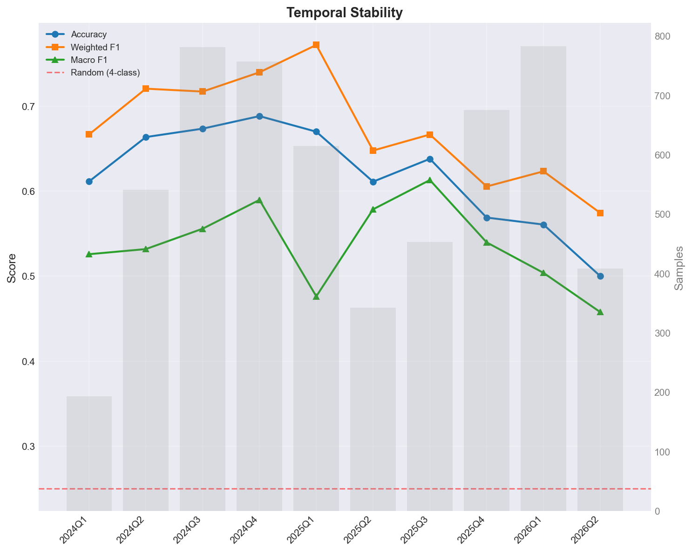
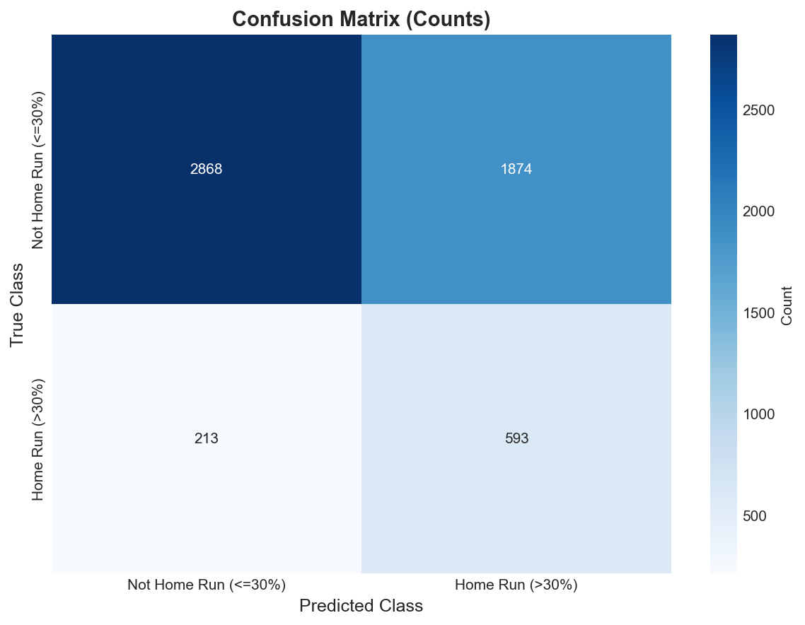
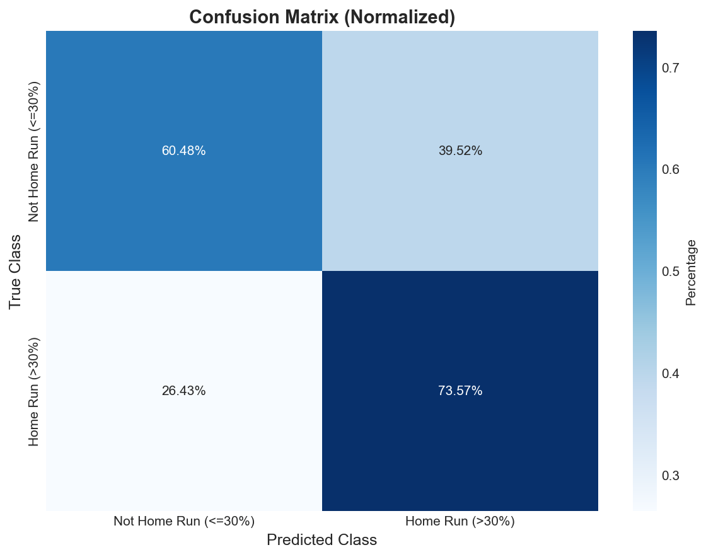
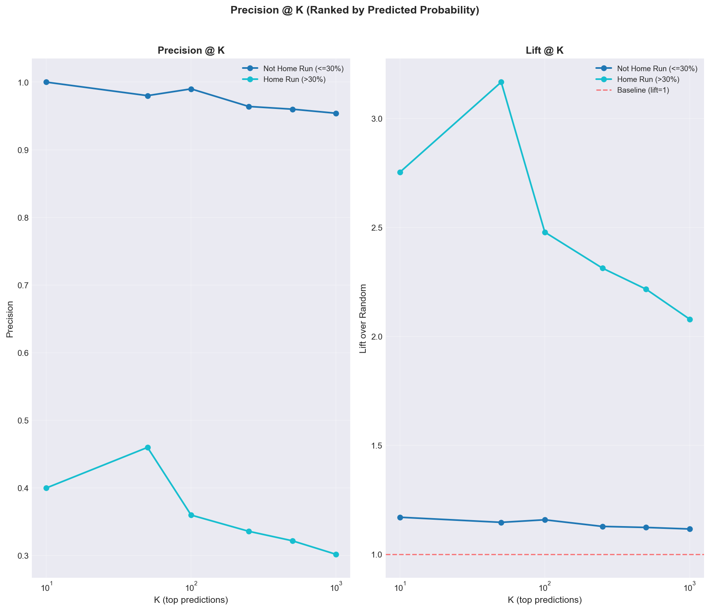
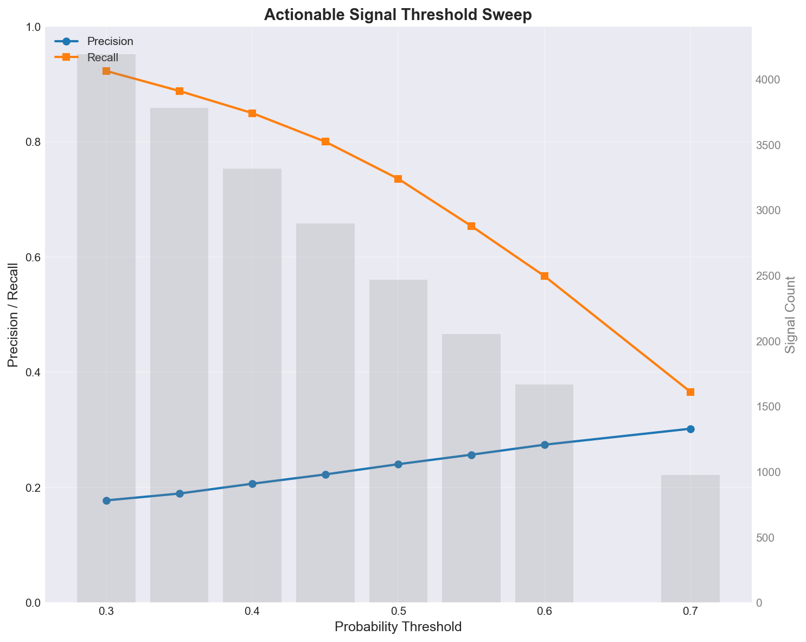
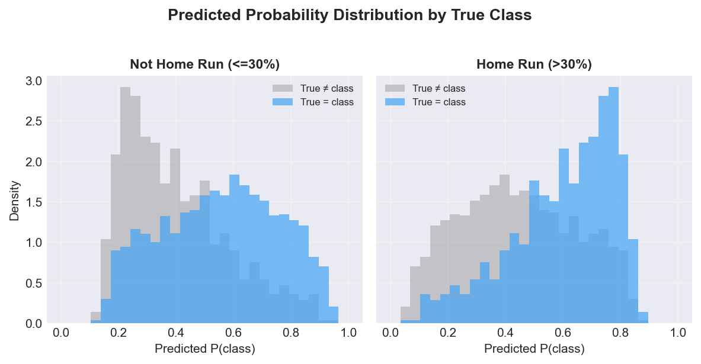
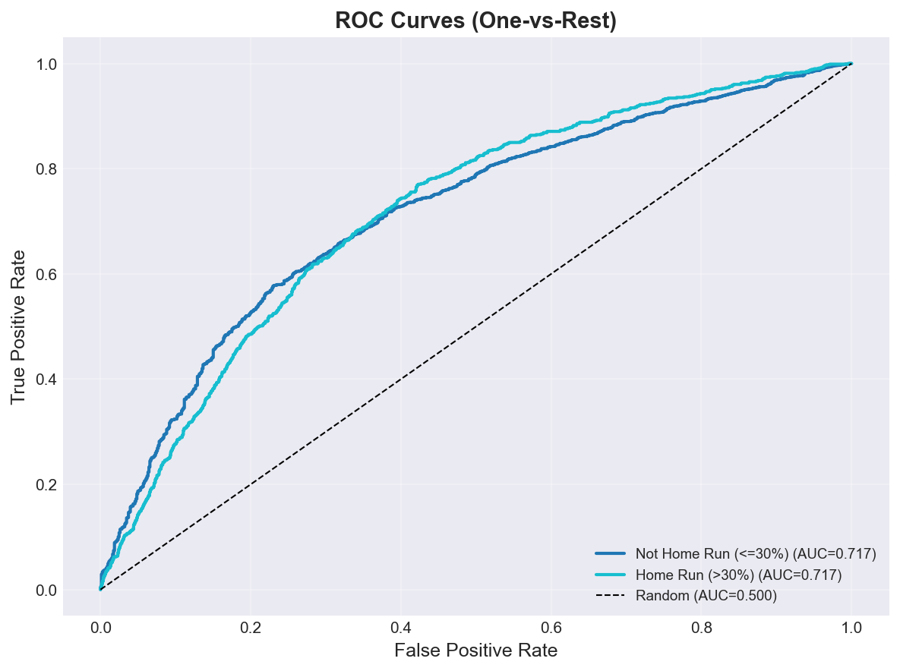
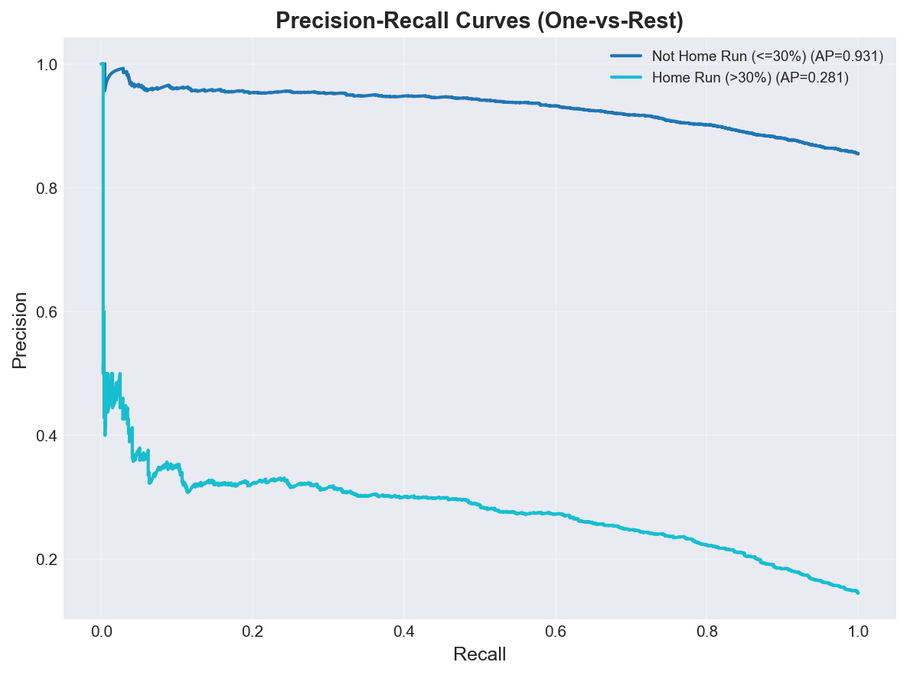
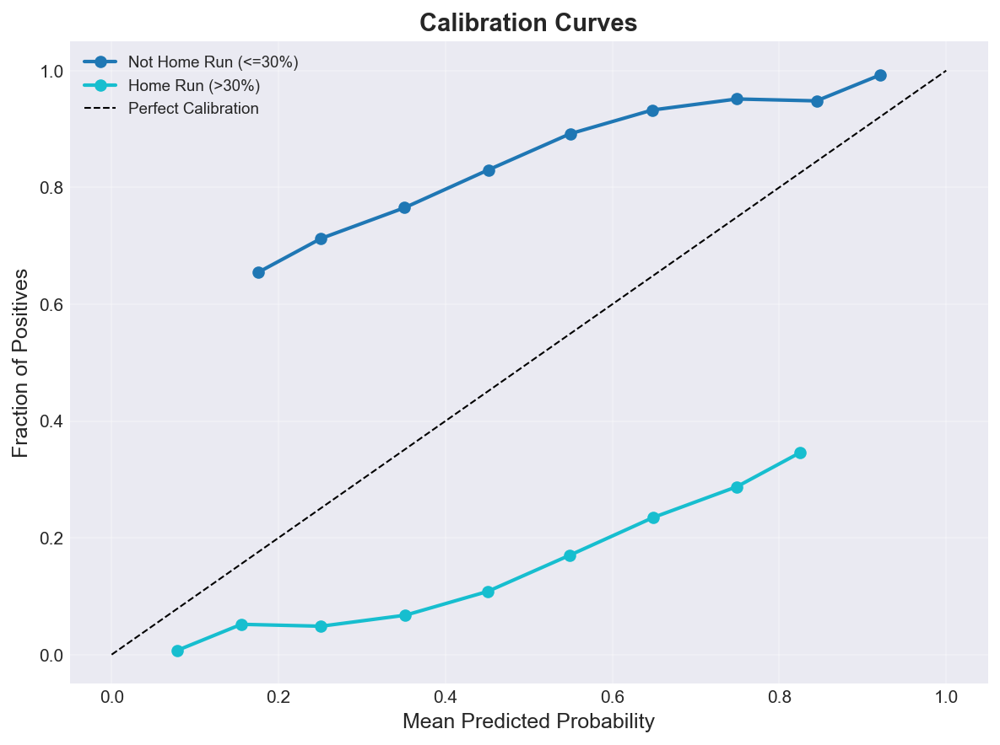
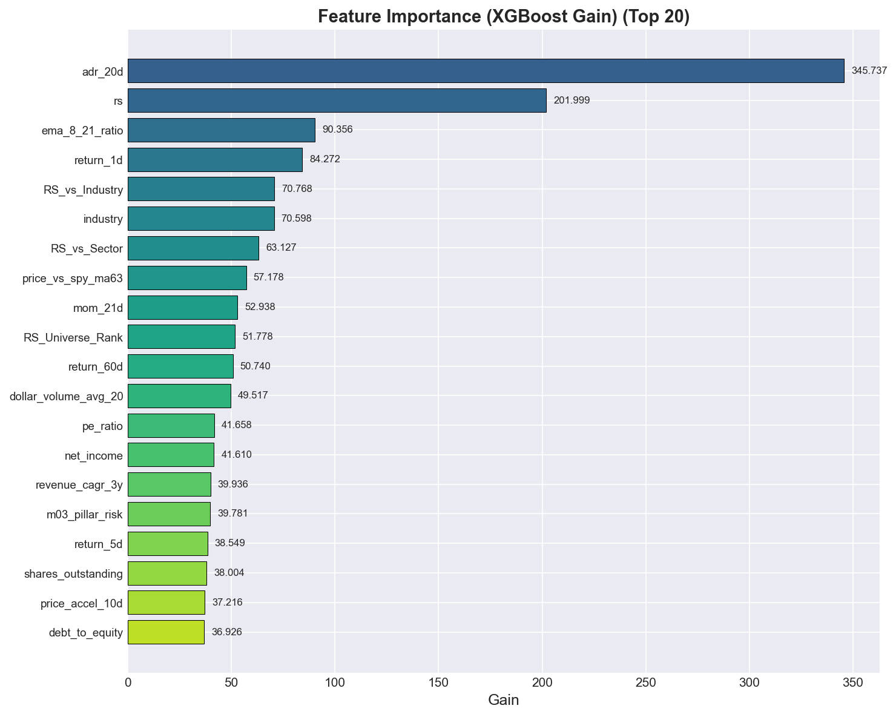

# m01_binary_pruned Classification Report
**Version:** v1
**Generated:** 2026-05-25 11:09:45

---

## 📊 Executive Summary

**Viability:** ❌ NOT VIABLE

### Key Metrics

- **Accuracy:** 0.624 (62.4%)
- **Weighted F1:** 0.679
- **Macro F1:** 0.548
- **Test Samples:** 5,548

**Assessment:** Accuracy (62.4%) barely exceeds random baseline (85.5%). Model is not production-ready.

---

## ⚖️ Class Distribution Across Splits

| Class | Train Count | Train % | Val Count | Val % | Test Count | Test % |
|-------|-------------|---------|-----------|-------|------------|--------|
| **Not Home Run (<=30%)** | 27,872 | 88.8% | 4,742 | 85.5% | 4,742 | 85.5% |
| **Home Run (>30%)** | 3,510 | 11.2% | 806 | 14.5% | 806 | 14.5% |

✅ Class proportions are stable across splits (<5pp gap).

**Majority-class baseline (test):** 85.5% — any model must beat this.

---

## 📅 Temporal Stability

*Per-period metrics. Stable performance across periods = real signal. Wide swings or decay over time = likely overfitting or split artifact.*

| Period | Samples | Accuracy | Weighted F1 | Macro F1 |
|--------|---------|----------|-------------|----------|
| 2024Q1 | 193 | 0.611 | 0.667 | 0.526 |
| 2024Q2 | 541 | 0.664 | 0.721 | 0.532 |
| 2024Q3 | 781 | 0.673 | 0.717 | 0.556 |
| 2024Q4 | 757 | 0.688 | 0.740 | 0.590 |
| 2025Q1 | 615 | 0.670 | 0.772 | 0.476 |
| 2025Q2 | 342 | 0.611 | 0.648 | 0.579 |
| 2025Q3 | 453 | 0.638 | 0.667 | 0.613 |
| 2025Q4 | 675 | 0.569 | 0.605 | 0.540 |
| 2026Q1 | 783 | 0.561 | 0.623 | 0.504 |
| 2026Q2 | 408 | 0.500 | 0.574 | 0.458 |

### Stability Diagnostics

- **Accuracy std across periods:** 0.060
- **Accuracy range:** 0.188 (min=0.500, max=0.688)
- **Weighted F1 std:** 0.063

⚠️ **Unstable performance** — accuracy varies by >15pp across periods. Investigate whether features behave differently in different regimes, or whether the strong period is overfitted.

⚠️ **Performance decay**: accuracy fell from 0.611 (2024Q1) to 0.500 (2026Q2). Suggests features are losing predictive power over time.

---

## 🔲 Confusion Matrix Analysis

### Confusion Matrix (Counts)

| True \ Predicted | Not Home Run (<=30%) | Home Run (>30%) |
|---|---|---|
| **Not Home Run (<=30%)** | 2,868 | 1,874 |
| **Home Run (>30%)** | 213 | 593 |

---

## 📋 Per-Class Performance

| Class | Precision | Recall | F1-Score | Support |
|-------|-----------|--------|----------|---------|
| **Not Home Run (<=30%)** | 0.931 | 0.605 | 0.733 | 4,742.0 |
| **Home Run (>30%)** | 0.240 | 0.736 | 0.362 | 806.0 |

### Insights

- **Best Performance:** Not Home Run (<=30%) (F1=0.733)
- **Worst Performance:** Home Run (>30%) (F1=0.362)

⚠️  **Warning:** High variance in per-class F1 (std=0.262). Model performance is imbalanced across classes.

---

## 🎯 Top-K Precision & Lift

*Among the top-K predictions ranked by predicted probability, what fraction actually belong to the class? Lift > 1 means the model is doing better than random.*

### Precision @ K

| Class | Base Rate | K=10 | K=50 | K=100 | K=250 | K=500 | K=1000 |
|---|---|---|---|---|---|---|---|
| **Not Home Run (<=30%)** | 85.5% | 100.0% | 98.0% | 99.0% | 96.4% | 96.0% | 95.4% |
| **Home Run (>30%)** | 14.5% | 40.0% | 46.0% | 36.0% | 33.6% | 32.2% | 30.2% |

### Lift @ K (precision / base rate)

| Class | Base Rate | K=10 | K=50 | K=100 | K=250 | K=500 | K=1000 |
|---|---|---|---|---|---|---|---|
| **Not Home Run (<=30%)** | 85.5% | 1.17x | 1.15x | 1.16x | 1.13x | 1.12x | 1.12x |
| **Home Run (>30%)** | 14.5% | 2.75x | 3.17x | 2.48x | 2.31x | 2.22x | 2.08x |

**Best top-10 lift:** `Home Run (>30%)` at **2.75x** (precision 40.0% vs base rate 14.5%).

✅ Lift ≥ 2x means top picks are at least 2x more likely to be true positives than random. This is the trading-relevant edge.

---

## 🚦 Actionable Signal Threshold Sweep

*Defines a binary 'go' signal: max P(class) over actionable classes (`Home Run (>30%)`) ≥ threshold. Shows how precision/recall/signal-count trade off as you tighten the cutoff.*

| Threshold | Signals | True Positives | Precision | Recall |
|-----------|---------|----------------|-----------|--------|
| 0.30 | 4,192 | 744 | 17.7% | 92.3% |
| 0.35 | 3,781 | 716 | 18.9% | 88.8% |
| 0.40 | 3,318 | 685 | 20.6% | 85.0% |
| 0.45 | 2,898 | 645 | 22.3% | 80.0% |
| 0.50 | 2,467 | 593 | 24.0% | 73.6% |
| 0.55 | 2,052 | 527 | 25.7% | 65.4% |
| 0.60 | 1,667 | 457 | 27.4% | 56.7% |
| 0.70 | 977 | 295 | 30.2% | 36.6% |

**Suggested operating point:** threshold = **0.70** → precision 30.2%, recall 36.6%, 977.0 signals.

---

## 🎲 Probability Separation

*For each class, mean predicted P(class) for true positives vs true negatives. Larger separation = better ranking power.*

| Class | Mean P (true=class) | Mean P (true≠class) | Separation | Support |
|-------|---------------------|---------------------|------------|---------|
| **Not Home Run (<=30%)** | 0.555 | 0.399 | +0.156 | 4,742 |
| **Home Run (>30%)** | 0.601 | 0.445 | +0.156 | 806 |

---

## 📈 ROC and Precision-Recall Analysis

### ROC AUC Scores

| Class | ROC AUC |
|-------|---------|
| **Not Home Run (<=30%)** | 0.717 |
| **Home Run (>30%)** | 0.717 |

### Average Precision Scores

| Class | PR AUC (AP) |
|-------|-------------|
| **Not Home Run (<=30%)** | 0.931 |
| **Home Run (>30%)** | 0.281 |

---

## 🎯 Calibration Analysis

### Brier Score (Lower is Better)

| Class | Brier Score |
|-------|-------------|
| **Not Home Run (<=30%)** | 0.2323 |
| **Home Run (>30%)** | 0.2323 |
| **Mean** | **0.2323** |

⚠️  **Poor calibration** - probabilities may not reflect true likelihood.

---

## 📊 Feature Importance

### Top 20 Features (XGBoost Gain)

| Rank | Feature | Gain |
|------|---------|------|
| 1 | adr_20d | 345.7370 |
| 2 | rs | 201.9992 |
| 3 | ema_8_21_ratio | 90.3563 |
| 4 | return_1d | 84.2721 |
| 5 | RS_vs_Industry | 70.7685 |
| 6 | industry | 70.5982 |
| 7 | RS_vs_Sector | 63.1270 |
| 8 | price_vs_spy_ma63 | 57.1777 |
| 9 | mom_21d | 52.9382 |
| 10 | RS_Universe_Rank | 51.7778 |
| 11 | return_60d | 50.7395 |
| 12 | dollar_volume_avg_20 | 49.5173 |
| 13 | pe_ratio | 41.6582 |
| 14 | net_income | 41.6103 |
| 15 | revenue_cagr_3y | 39.9363 |
| 16 | m03_pillar_risk | 39.7812 |
| 17 | return_5d | 38.5485 |
| 18 | shares_outstanding | 38.0043 |
| 19 | price_accel_10d | 37.2160 |
| 20 | debt_to_equity | 36.9265 |

---

## 🔍 SHAP Feature Impact Analysis

### Home Run (>30%)

| Rank | Feature | Mean |SHAP| |
|------|---------|-------------|
| 1 | industry | 0.3123 |
| 2 | adr_20d | 0.3002 |
| 3 | price_vs_spy_ma63 | 0.1297 |
| 4 | return_1d | 0.0825 |
| 5 | ema_8_21_ratio | 0.0719 |
| 6 | rs | 0.0577 |
| 7 | m03_pillar_risk | 0.0523 |
| 8 | revenue_cagr_3y | 0.0508 |
| 9 | m03_pillar_trend | 0.0453 |
| 10 | RS_vs_Industry | 0.0355 |

*Note: SHAP values indicate feature impact magnitude. For directionality, see SHAP beeswarm plots.*

---

## 💡 Recommendations

- 🟡 **Class Imbalance:** Performance varies significantly across classes. Consider class-specific feature engineering or oversampling.
- 🎯 **Calibration:** Predicted probabilities are poorly calibrated. Consider Platt scaling or isotonic regression.

---

## 📁 Artifacts

### Generated Plots

- `confusion_matrix.png` - Confusion Matrix
- `confusion_matrix_normalized.png` - Confusion Matrix Normalized
- `feature_importance.png` - Feature Importance
- `roc_curves.png` - Roc Curves
- `pr_curves.png` - Pr Curves
- `calibration_curves.png` - Calibration Curves
- `class_distribution.png` - Class Distribution
- `probability_distributions.png` - Probability Distributions
- `temporal_stability.png` - Temporal Stability
- `topk_precision.png` - Topk Precision
- `threshold_sweep.png` - Threshold Sweep

---

*Report generated by ClassificationEvaluator - 2026-05-25 11:09:45*