# m01_no_macro Classification Report
**Version:** v1
**Generated:** 2026-06-30 00:54:34

---

## 📊 Executive Summary

**Viability:** ❌ NOT VIABLE

### Key Metrics

- **Accuracy:** 0.296 (29.6%)
- **Weighted F1:** 0.288
- **Macro F1:** 0.296
- **Test Samples:** 7,389

**Assessment:** Accuracy (29.6%) barely exceeds random baseline (40.6%). Model is not production-ready.

---

## ⚖️ Class Distribution Across Splits

| Class | Train Count | Train % | Val Count | Val % | Test Count | Test % |
|-------|-------------|---------|-----------|-------|------------|--------|
| **Noise (0-2%)** | 4,436 | 20.0% | 1,140 | 15.5% | 1,077 | 14.6% |
| **Moderate (2-10%)** | 9,124 | 41.2% | 3,040 | 41.2% | 3,003 | 40.6% |
| **Strong (10-30%)** | 6,425 | 29.0% | 2,095 | 28.4% | 2,207 | 29.9% |
| **Home Run (>30%)** | 2,143 | 9.7% | 1,100 | 14.9% | 1,102 | 14.9% |

⚠️ **Distribution shift detected** (>5pp gap between train and test):
- `Noise (0-2%)`: train=20.0% vs test=14.6%
- `Home Run (>30%)`: train=9.7% vs test=14.9%

This means train and test see different label mixes — metrics like accuracy aren't directly comparable across periods.

**Majority-class baseline (test):** 40.6% — any model must beat this.

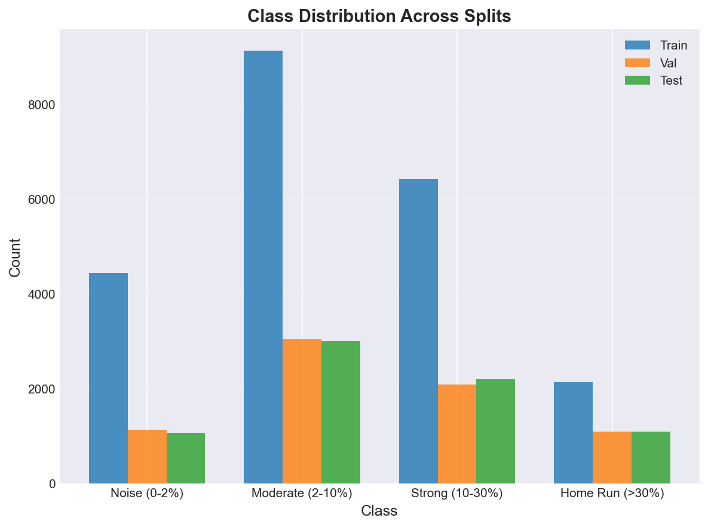

---

## 📅 Temporal Stability

*Per-period metrics. Stable performance across periods = real signal. Wide swings or decay over time = likely overfitting or split artifact.*

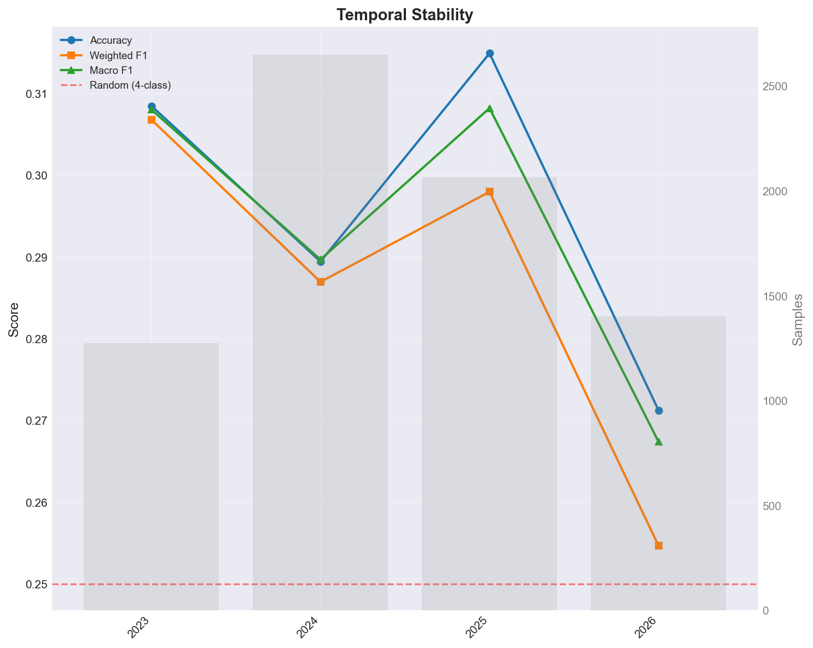

| Period | Samples | Accuracy | Weighted F1 | Macro F1 |
|--------|---------|----------|-------------|----------|
| 2023 | 1,274 | 0.308 | 0.307 | 0.308 |
| 2024 | 2,650 | 0.289 | 0.287 | 0.290 |
| 2025 | 2,064 | 0.315 | 0.298 | 0.308 |
| 2026 | 1,401 | 0.271 | 0.255 | 0.267 |

### Stability Diagnostics

- **Accuracy std across periods:** 0.020
- **Accuracy range:** 0.044 (min=0.271, max=0.315)
- **Weighted F1 std:** 0.023

✅ **Highly stable** — performance is consistent across periods. Less likely to be a leakage artifact.

---

## 🔲 Confusion Matrix Analysis

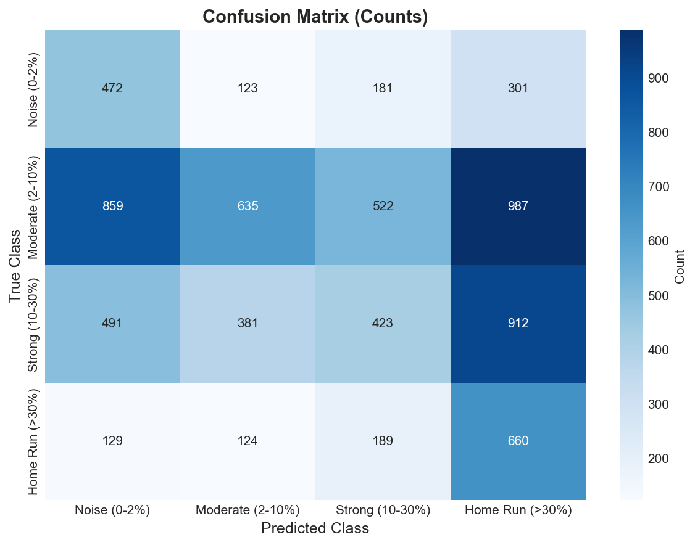

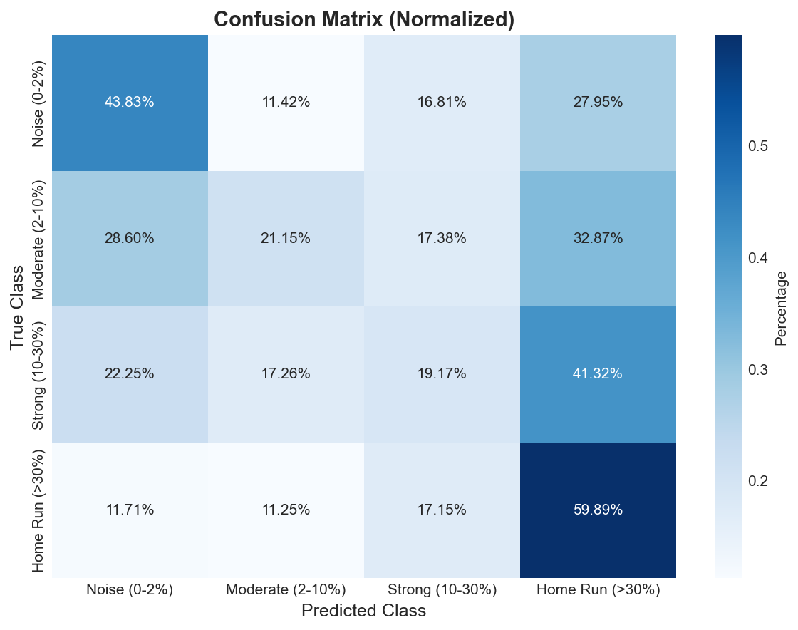

### Confusion Matrix (Counts)

| True \ Predicted | Noise (0-2%) | Moderate (2-10%) | Strong (10-30%) | Home Run (>30%) |
|---|---|---|---|---|
| **Noise (0-2%)** | 472 | 123 | 181 | 301 |
| **Moderate (2-10%)** | 859 | 635 | 522 | 987 |
| **Strong (10-30%)** | 491 | 381 | 423 | 912 |
| **Home Run (>30%)** | 129 | 124 | 189 | 660 |

---

## 📋 Per-Class Performance

| Class | Precision | Recall | F1-Score | Support |
|-------|-----------|--------|----------|---------|
| **Noise (0-2%)** | 0.242 | 0.438 | 0.312 | 1,077.0 |
| **Moderate (2-10%)** | 0.503 | 0.211 | 0.298 | 3,003.0 |
| **Strong (10-30%)** | 0.322 | 0.192 | 0.240 | 2,207.0 |
| **Home Run (>30%)** | 0.231 | 0.599 | 0.333 | 1,102.0 |

### Insights

- **Best Performance:** Home Run (>30%) (F1=0.333)
- **Worst Performance:** Strong (10-30%) (F1=0.240)

---

## 🎯 Top-K Precision & Lift

*Among the top-K predictions ranked by predicted probability, what fraction actually belong to the class? Lift > 1 means the model is doing better than random.*

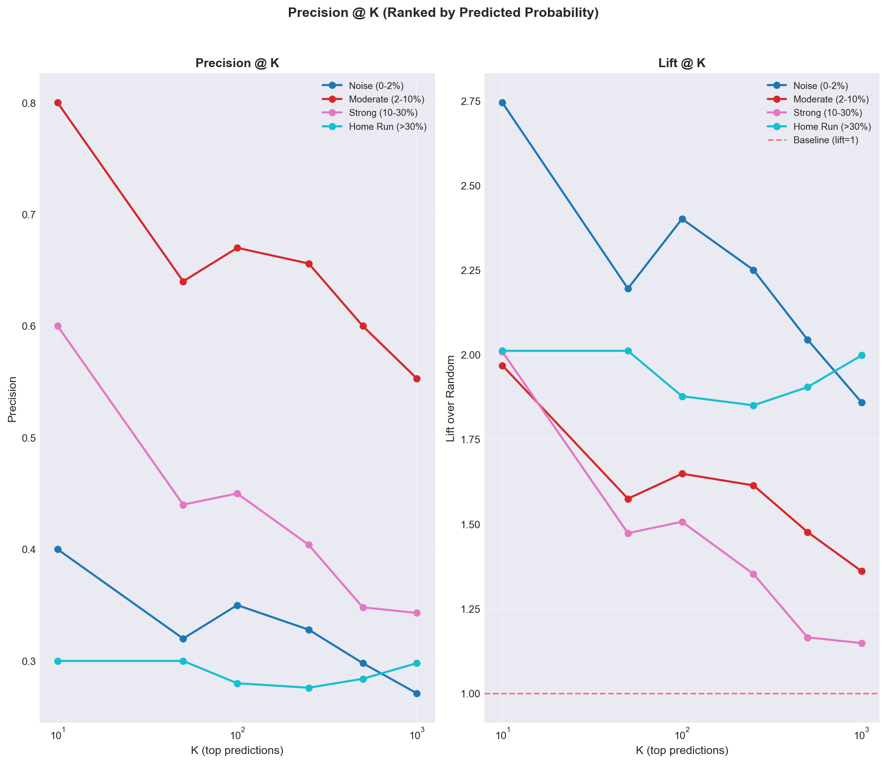

### Precision @ K

| Class | Base Rate | K=10 | K=50 | K=100 | K=250 | K=500 | K=1000 |
|---|---|---|---|---|---|---|---|
| **Noise (0-2%)** | 14.6% | 40.0% | 32.0% | 35.0% | 32.8% | 29.8% | 27.1% |
| **Moderate (2-10%)** | 40.6% | 80.0% | 64.0% | 67.0% | 65.6% | 60.0% | 55.3% |
| **Strong (10-30%)** | 29.9% | 60.0% | 44.0% | 45.0% | 40.4% | 34.8% | 34.3% |
| **Home Run (>30%)** | 14.9% | 30.0% | 30.0% | 28.0% | 27.6% | 28.4% | 29.8% |

### Lift @ K (precision / base rate)

| Class | Base Rate | K=10 | K=50 | K=100 | K=250 | K=500 | K=1000 |
|---|---|---|---|---|---|---|---|
| **Noise (0-2%)** | 14.6% | 2.74x | 2.20x | 2.40x | 2.25x | 2.04x | 1.86x |
| **Moderate (2-10%)** | 40.6% | 1.97x | 1.57x | 1.65x | 1.61x | 1.48x | 1.36x |
| **Strong (10-30%)** | 29.9% | 2.01x | 1.47x | 1.51x | 1.35x | 1.17x | 1.15x |
| **Home Run (>30%)** | 14.9% | 2.01x | 2.01x | 1.88x | 1.85x | 1.90x | 2.00x |

**Best top-10 lift:** `Noise (0-2%)` at **2.74x** (precision 40.0% vs base rate 14.6%).

✅ Lift ≥ 2x means top picks are at least 2x more likely to be true positives than random. This is the trading-relevant edge.

---

## 🚦 Actionable Signal Threshold Sweep

*Defines a binary 'go' signal: max P(class) over actionable classes (`Strong (10-30%)`, `Home Run (>30%)`) ≥ threshold. Shows how precision/recall/signal-count trade off as you tighten the cutoff.*

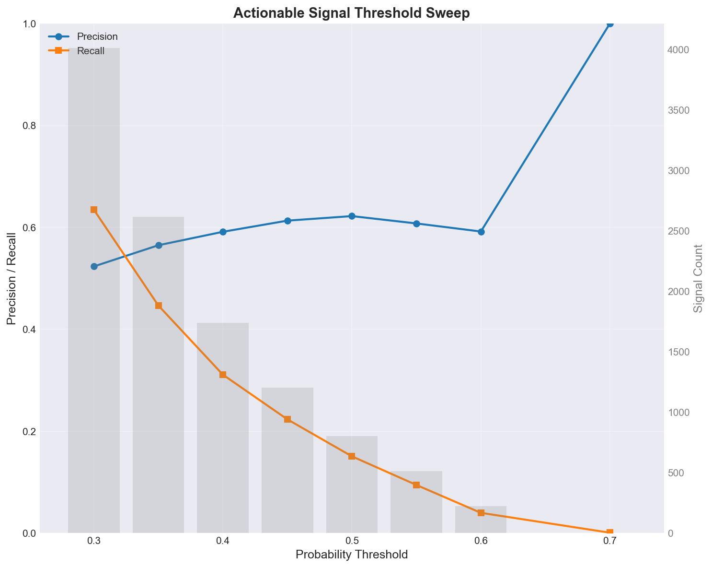

| Threshold | Signals | True Positives | Precision | Recall |
|-----------|---------|----------------|-----------|--------|
| 0.30 | 4,012 | 2,100 | 52.3% | 63.5% |
| 0.35 | 2,616 | 1,478 | 56.5% | 44.7% |
| 0.40 | 1,740 | 1,029 | 59.1% | 31.1% |
| 0.45 | 1,205 | 739 | 61.3% | 22.3% |
| 0.50 | 802 | 499 | 62.2% | 15.1% |
| 0.55 | 515 | 313 | 60.8% | 9.5% |
| 0.60 | 223 | 132 | 59.2% | 4.0% |
| 0.70 | 3 | 3 | 100.0% | 0.1% |

**Suggested operating point:** threshold = **0.50** → precision 62.2%, recall 15.1%, 802.0 signals.

---

## 🎲 Probability Separation

*For each class, mean predicted P(class) for true positives vs true negatives. Larger separation = better ranking power.*

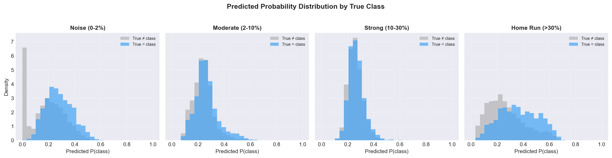

| Class | Mean P (true=class) | Mean P (true≠class) | Separation | Support |
|-------|---------------------|---------------------|------------|---------|
| **Noise (0-2%)** | 0.282 | 0.191 | +0.091 | 1,077 |
| **Moderate (2-10%)** | 0.266 | 0.239 | +0.027 | 3,003 |
| **Strong (10-30%)** | 0.268 | 0.261 | +0.007 | 2,207 |
| **Home Run (>30%)** | 0.366 | 0.268 | +0.097 | 1,102 |

---

## 📈 ROC and Precision-Recall Analysis

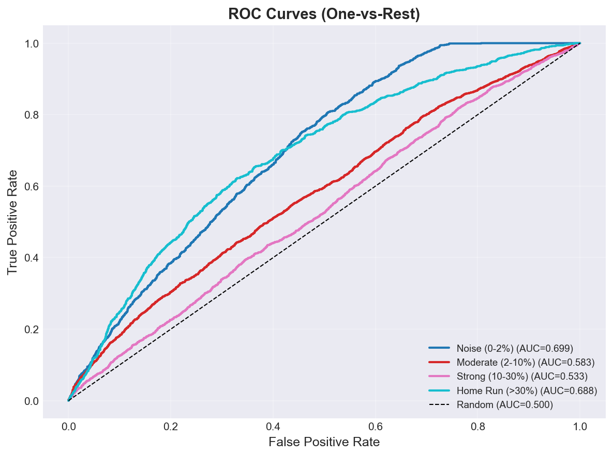

### ROC AUC Scores

| Class | ROC AUC |
|-------|---------|
| **Noise (0-2%)** | 0.699 |
| **Moderate (2-10%)** | 0.583 |
| **Strong (10-30%)** | 0.533 |
| **Home Run (>30%)** | 0.688 |

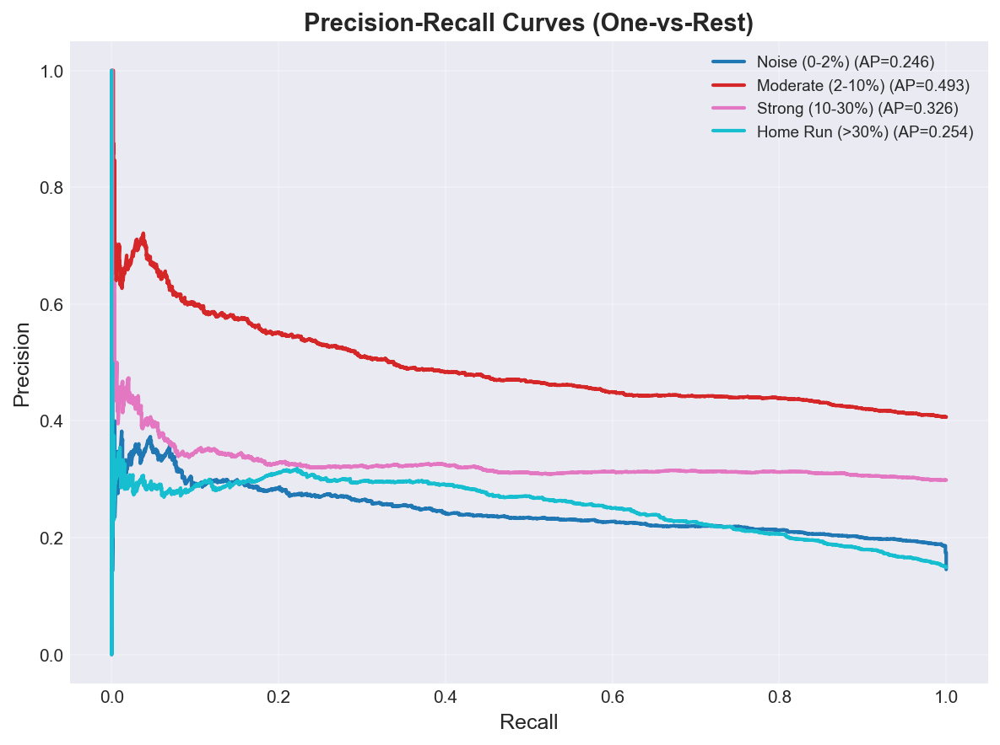

### Average Precision Scores

| Class | PR AUC (AP) |
|-------|-------------|
| **Noise (0-2%)** | 0.246 |
| **Moderate (2-10%)** | 0.493 |
| **Strong (10-30%)** | 0.326 |
| **Home Run (>30%)** | 0.254 |

---

## 🎯 Calibration Analysis

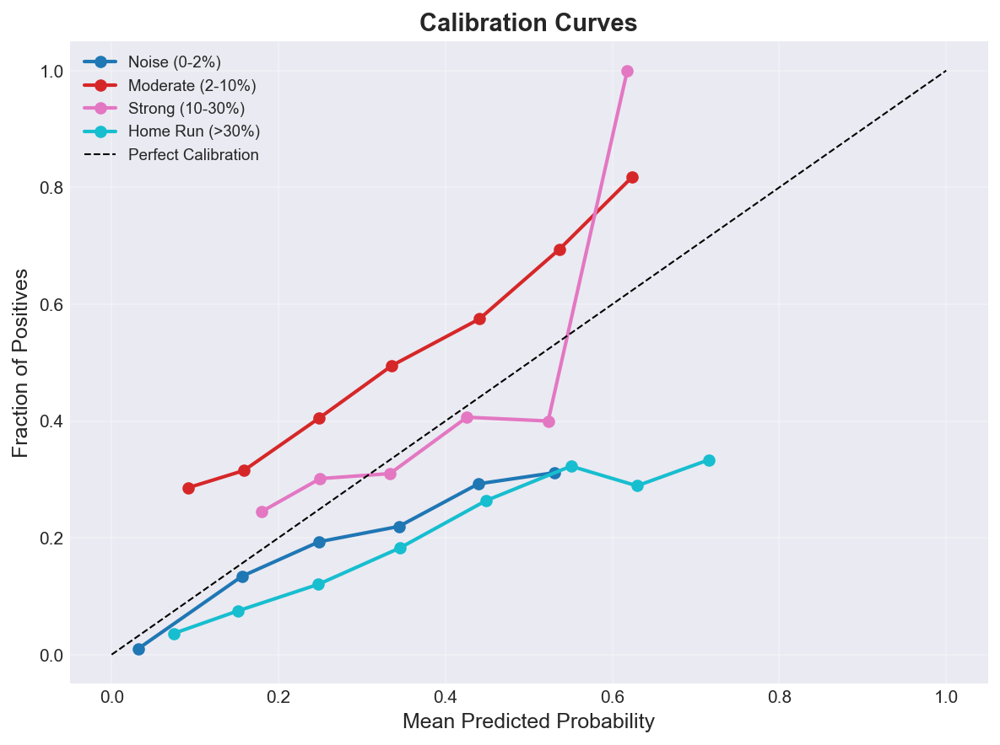

### Brier Score (Lower is Better)

| Class | Brier Score |
|-------|-------------|
| **Noise (0-2%)** | 0.1220 |
| **Moderate (2-10%)** | 0.2600 |
| **Strong (10-30%)** | 0.2110 |
| **Home Run (>30%)** | 0.1419 |
| **Mean** | **0.1837** |

🟡 **Moderate calibration** - probabilities are somewhat reliable.

---

## 📊 Feature Importance

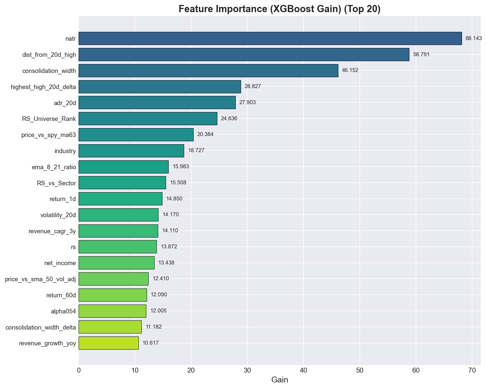

### Top 20 Features (XGBoost Gain)

| Rank | Feature | Gain |
|------|---------|------|
| 1 | natr | 68.1433 |
| 2 | dist_from_20d_high | 58.7912 |
| 3 | consolidation_width | 46.1520 |
| 4 | highest_high_20d_delta | 28.8270 |
| 5 | adr_20d | 27.9035 |
| 6 | RS_Universe_Rank | 24.6357 |
| 7 | price_vs_spy_ma63 | 20.3837 |
| 8 | industry | 18.7266 |
| 9 | ema_8_21_ratio | 15.9829 |
| 10 | RS_vs_Sector | 15.5078 |
| 11 | return_1d | 14.8499 |
| 12 | volatility_20d | 14.1699 |
| 13 | revenue_cagr_3y | 14.1096 |
| 14 | rs | 13.8720 |
| 15 | net_income | 13.4381 |
| 16 | price_vs_sma_50_vol_adj | 12.4104 |
| 17 | return_60d | 12.0901 |
| 18 | alpha054 | 12.0047 |
| 19 | consolidation_width_delta | 11.1815 |
| 20 | revenue_growth_yoy | 10.6169 |

---

## 🔍 SHAP Feature Impact Analysis

### Noise (0-2%)

| Rank | Feature | Mean |SHAP| |
|------|---------|-------------|
| 1 | dist_from_20d_high | 0.5042 |
| 2 | highest_high_20d_delta | 0.1563 |
| 3 | industry | 0.1278 |
| 4 | consolidation_width | 0.0863 |
| 5 | ema_8_21_ratio | 0.0616 |
| 6 | price_vs_sma_50_vol_adj | 0.0409 |
| 7 | alpha054 | 0.0263 |
| 8 | volatility_20d | 0.0222 |
| 9 | return_1d | 0.0211 |
| 10 | natr | 0.0198 |

### Moderate (2-10%)

| Rank | Feature | Mean |SHAP| |
|------|---------|-------------|
| 1 | industry | 0.0976 |
| 2 | dist_from_20d_high | 0.0704 |
| 3 | RS_vs_Sector | 0.0361 |
| 4 | price_vs_spy_ma63 | 0.0290 |
| 5 | adr_20d | 0.0252 |
| 6 | mom_252d | 0.0248 |
| 7 | rs | 0.0247 |
| 8 | high_52w_delta | 0.0182 |
| 9 | pe_ratio | 0.0153 |
| 10 | mom_21d | 0.0140 |

### Strong (10-30%)

| Rank | Feature | Mean |SHAP| |
|------|---------|-------------|
| 1 | industry | 0.1039 |
| 2 | consolidation_width | 0.0240 |
| 3 | price_vs_sma_50_vol_adj | 0.0222 |
| 4 | rs_ma | 0.0191 |
| 5 | natr_delta | 0.0141 |
| 6 | atr_pct_chg | 0.0138 |
| 7 | vcp_ratio_delta | 0.0132 |
| 8 | RS_vs_Industry | 0.0124 |
| 9 | ema_8_21_ratio | 0.0121 |
| 10 | vcp_ratio | 0.0117 |

### Home Run (>30%)

| Rank | Feature | Mean |SHAP| |
|------|---------|-------------|
| 1 | industry | 0.2252 |
| 2 | natr | 0.1354 |
| 3 | price_vs_spy_ma63 | 0.0894 |
| 4 | consolidation_width | 0.0705 |
| 5 | RS_Universe_Rank | 0.0646 |
| 6 | volatility_20d | 0.0583 |
| 7 | adr_20d | 0.0439 |
| 8 | revenue_cagr_3y | 0.0367 |
| 9 | dollar_volume_avg_20 | 0.0316 |
| 10 | return_1d | 0.0235 |

*Note: SHAP values indicate feature impact magnitude. For directionality, see SHAP beeswarm plots.*

---

## 💡 Recommendations

- 🔴 **Critical:** Accuracy is very low. Consider feature engineering or collecting more data.
- 📊 **Model Improvement:** Try hyperparameter tuning, ensemble methods, or alternative algorithms.

---

## 📁 Artifacts

### Generated Plots

- `confusion_matrix.png` - Confusion Matrix
- `confusion_matrix_normalized.png` - Confusion Matrix Normalized
- `feature_importance.png` - Feature Importance
- `roc_curves.png` - Roc Curves
- `pr_curves.png` - Pr Curves
- `calibration_curves.png` - Calibration Curves
- `class_distribution.png` - Class Distribution
- `probability_distributions.png` - Probability Distributions
- `temporal_stability.png` - Temporal Stability
- `topk_precision.png` - Topk Precision
- `threshold_sweep.png` - Threshold Sweep

---

*Report generated by ClassificationEvaluator - 2026-06-30 00:54:34*