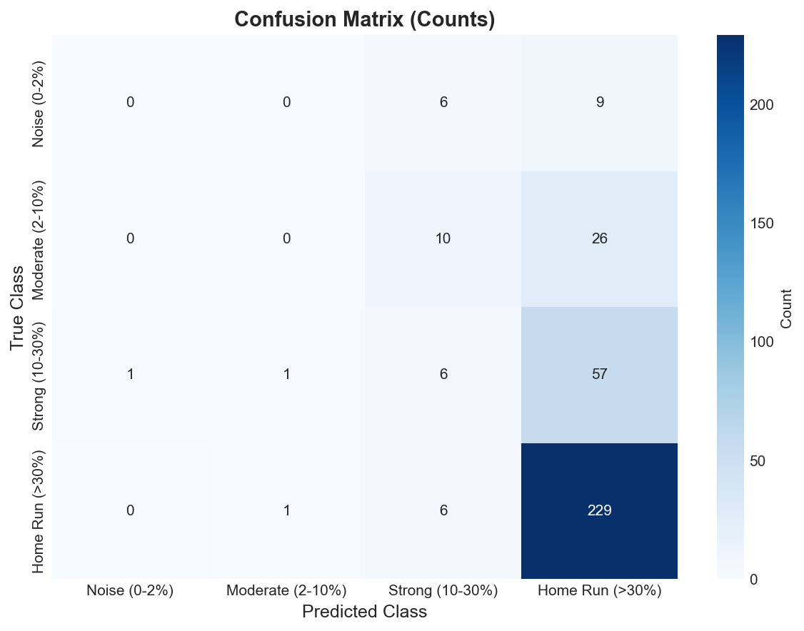
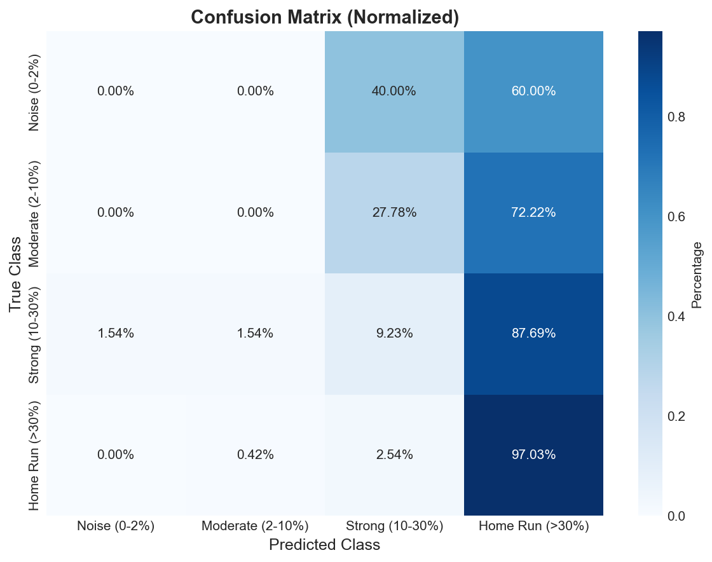
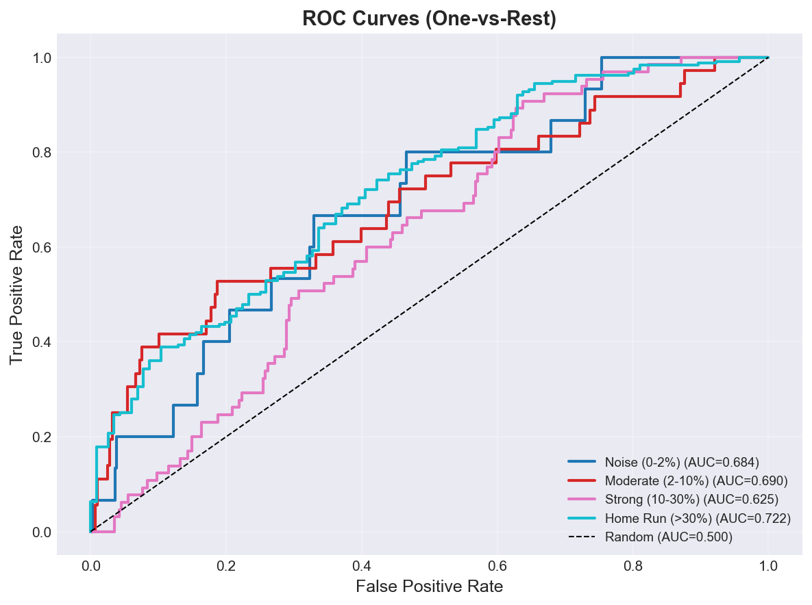
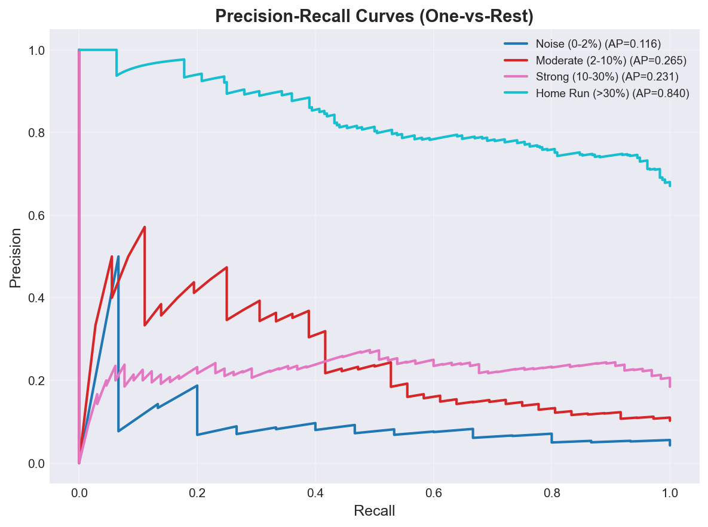
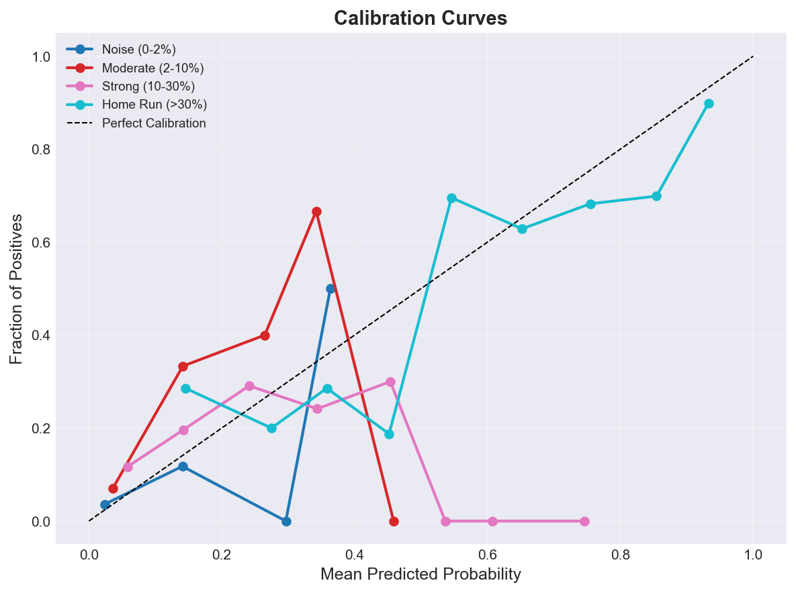
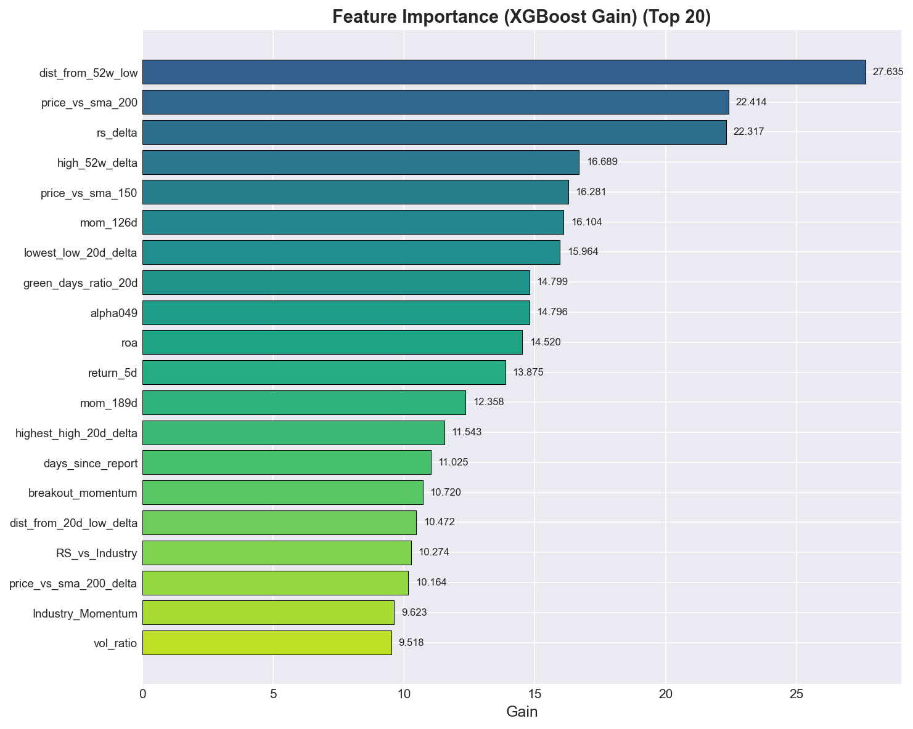

# m04_baseline Classification Report
**Version:** v1
**Generated:** 2026-03-15 13:27:17

---

## 📊 Executive Summary

**Viability:** ✅ ACCEPTABLE

### Key Metrics

- **Accuracy:** 0.668 (66.8%)
- **Weighted F1:** 0.575
- **Macro F1:** 0.238
- **Test Samples:** 352

**Assessment:** Weighted F1 (0.575) is acceptable for initial deployment. Monitor performance closely.

---

## 🔲 Confusion Matrix Analysis

### Confusion Matrix (Counts)

| True \ Predicted | Noise (0-2%) | Moderate (2-10%) | Strong (10-30%) | Home Run (>30%) |
|---|---|---|---|---|
| **Noise (0-2%)** | 0 | 0 | 6 | 9 |
| **Moderate (2-10%)** | 0 | 0 | 10 | 26 |
| **Strong (10-30%)** | 1 | 1 | 6 | 57 |
| **Home Run (>30%)** | 0 | 1 | 6 | 229 |

---

## 📋 Per-Class Performance

*Per-class metrics not available*

---

## 📈 ROC and Precision-Recall Analysis

### ROC AUC Scores

| Class | ROC AUC |
|-------|---------|
| **Noise (0-2%)** | 0.684 |
| **Moderate (2-10%)** | 0.690 |
| **Strong (10-30%)** | 0.625 |
| **Home Run (>30%)** | 0.722 |

### Average Precision Scores

| Class | PR AUC (AP) |
|-------|-------------|
| **Noise (0-2%)** | 0.116 |
| **Moderate (2-10%)** | 0.265 |
| **Strong (10-30%)** | 0.231 |
| **Home Run (>30%)** | 0.840 |

---

## 🎯 Calibration Analysis

### Brier Score (Lower is Better)

| Class | Brier Score |
|-------|-------------|
| **Noise (0-2%)** | 0.0404 |
| **Moderate (2-10%)** | 0.0883 |
| **Strong (10-30%)** | 0.1593 |
| **Home Run (>30%)** | 0.1940 |
| **Mean** | **0.1205** |

🟡 **Moderate calibration** - probabilities are somewhat reliable.

---

## 📊 Feature Importance

### Top 20 Features (XGBoost Gain)

| Rank | Feature | Gain |
|------|---------|------|
| 1 | dist_from_52w_low | 27.6353 |
| 2 | price_vs_sma_200 | 22.4136 |
| 3 | rs_delta | 22.3167 |
| 4 | high_52w_delta | 16.6891 |
| 5 | price_vs_sma_150 | 16.2808 |
| 6 | mom_126d | 16.1038 |
| 7 | lowest_low_20d_delta | 15.9640 |
| 8 | green_days_ratio_20d | 14.7986 |
| 9 | alpha049 | 14.7964 |
| 10 | roa | 14.5200 |
| 11 | return_5d | 13.8746 |
| 12 | mom_189d | 12.3580 |
| 13 | highest_high_20d_delta | 11.5429 |
| 14 | days_since_report | 11.0253 |
| 15 | breakout_momentum | 10.7199 |
| 16 | dist_from_20d_low_delta | 10.4716 |
| 17 | RS_vs_Industry | 10.2740 |
| 18 | price_vs_sma_200_delta | 10.1636 |
| 19 | Industry_Momentum | 9.6228 |
| 20 | vol_ratio | 9.5175 |

---

## 🔍 SHAP Feature Impact Analysis

### Noise (0-2%)

| Rank | Feature | Mean |SHAP| |
|------|---------|-------------|
| 1 | price_vs_sma_50 | 0.0226 |
| 2 | close_above_sma200 | 0.0196 |
| 3 | price_vs_sma_150 | 0.0195 |
| 4 | price_vs_sma_200 | 0.0189 |

### Moderate (2-10%)

| Rank | Feature | Mean |SHAP| |
|------|---------|-------------|
| 1 | price_vs_sma_50 | 0.0244 |
| 2 | price_vs_sma_200 | 0.0225 |
| 3 | close_above_sma200 | 0.0199 |
| 4 | price_vs_sma_150 | 0.0195 |

### Strong (10-30%)

| Rank | Feature | Mean |SHAP| |
|------|---------|-------------|
| 1 | price_vs_sma_50 | 0.0272 |
| 2 | close_above_sma200 | 0.0250 |
| 3 | price_vs_sma_200 | 0.0213 |
| 4 | price_vs_sma_150 | 0.0201 |

### Home Run (>30%)

| Rank | Feature | Mean |SHAP| |
|------|---------|-------------|
| 1 | close_above_sma200 | 0.0238 |
| 2 | price_vs_sma_200 | 0.0221 |
| 3 | price_vs_sma_50 | 0.0220 |
| 4 | price_vs_sma_150 | 0.0200 |

*Note: SHAP values indicate feature impact magnitude. For directionality, see SHAP beeswarm plots.*

---

## 💡 Recommendations

- ✅ **Model Performance:** Model shows acceptable performance. Monitor in production and iterate as needed.

---

## 📁 Artifacts

### Generated Plots

- `confusion_matrix.png` - Confusion Matrix
- `confusion_matrix_normalized.png` - Confusion Matrix Normalized
- `feature_importance.png` - Feature Importance
- `roc_curves.png` - Roc Curves
- `pr_curves.png` - Pr Curves
- `calibration_curves.png` - Calibration Curves
- `class_distribution.png` - Class Distribution

---

*Report generated by ClassificationEvaluator - 2026-03-15 13:27:17*