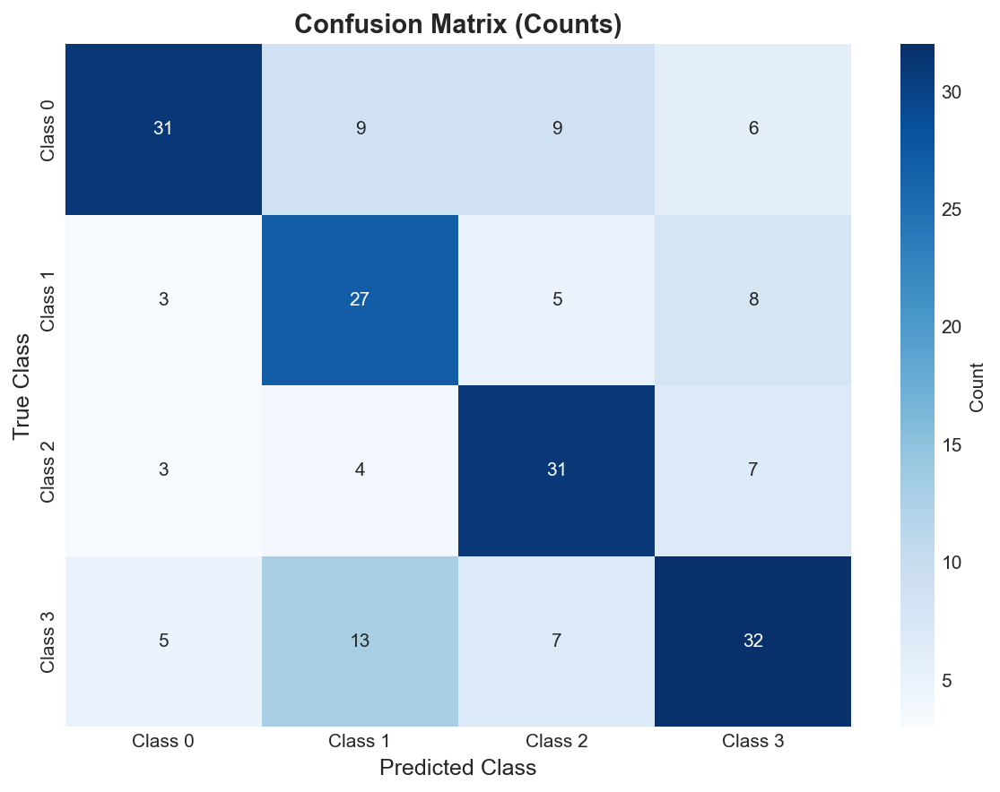
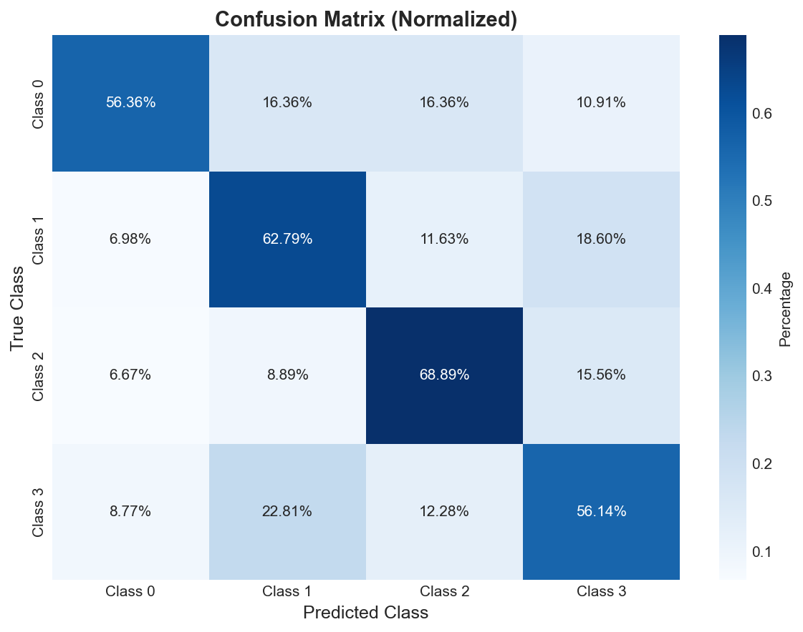
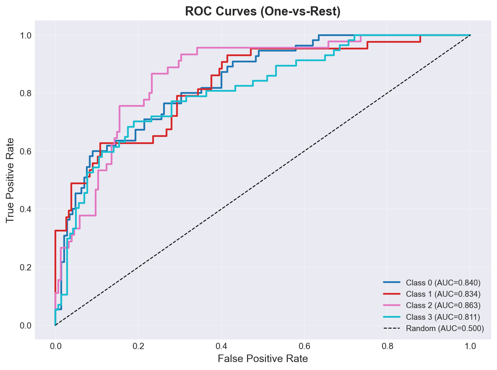
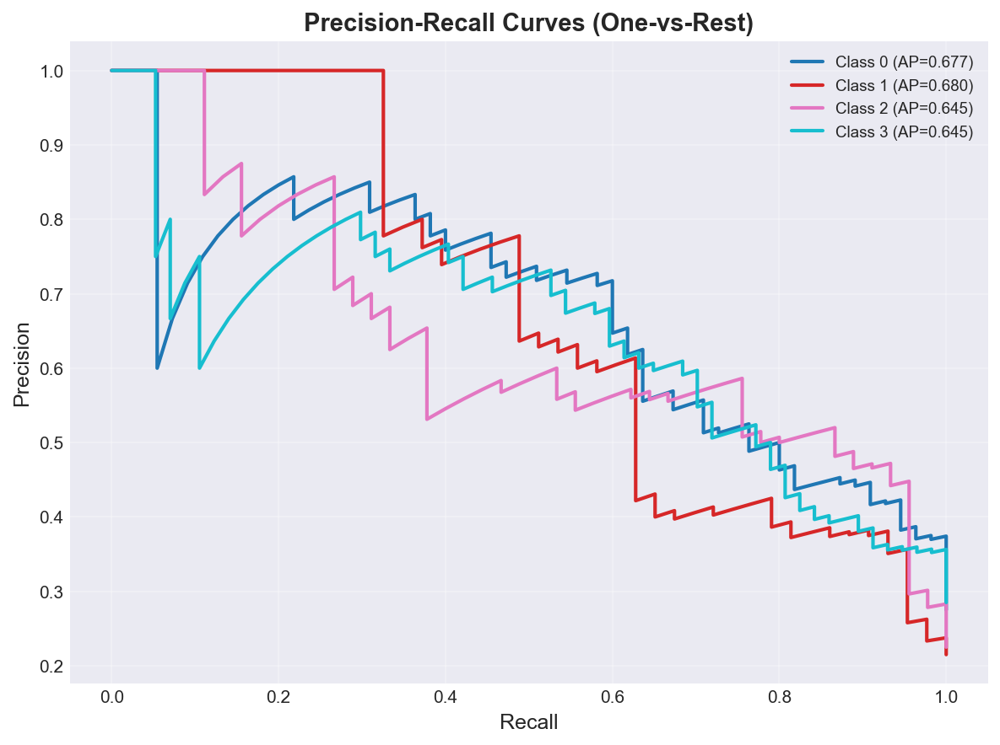
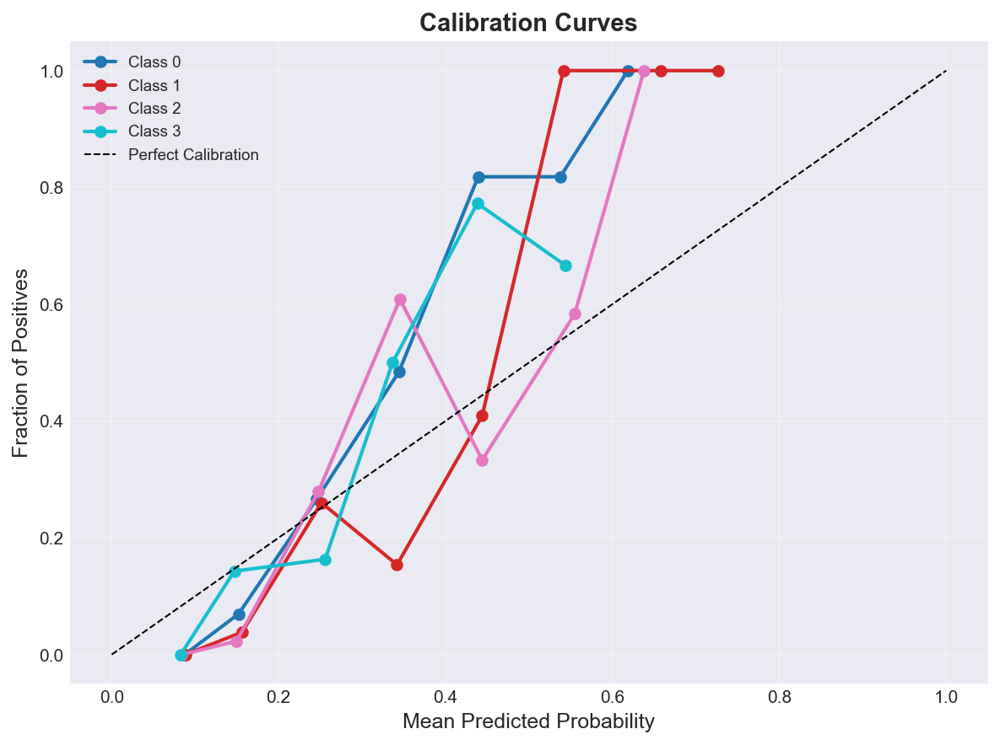
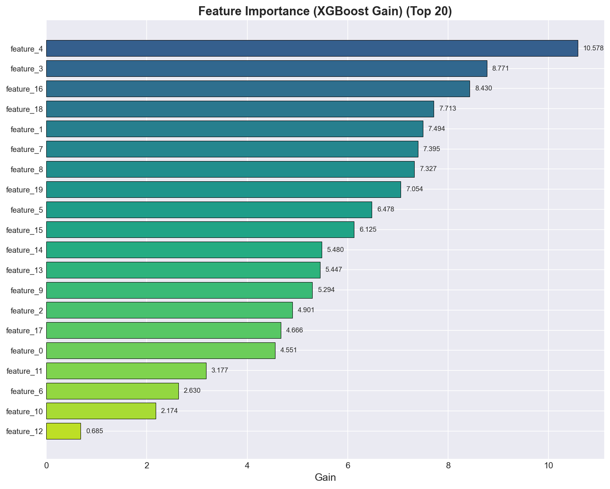

# test_model Classification Report
**Version:** v1
**Generated:** 2026-03-15 12:03:12

---

## 📊 Executive Summary

**Viability:** ✅ ACCEPTABLE

### Key Metrics

- **Accuracy:** 0.605 (60.5%)
- **Weighted F1:** 0.606
- **Macro F1:** 0.606
- **Test Samples:** 200

**Assessment:** Weighted F1 (0.606) is acceptable for initial deployment. Monitor performance closely.

---

## 🔲 Confusion Matrix Analysis

### Confusion Matrix (Counts)

| True \ Predicted | Class 0 | Class 1 | Class 2 | Class 3 |
|---|---|---|---|---|
| **Class 0** | 31 | 9 | 9 | 6 |
| **Class 1** | 3 | 27 | 5 | 8 |
| **Class 2** | 3 | 4 | 31 | 7 |
| **Class 3** | 5 | 13 | 7 | 32 |

---

## 📋 Per-Class Performance

*Per-class metrics not available*

---

## 📈 ROC and Precision-Recall Analysis

### ROC AUC Scores

| Class | ROC AUC |
|-------|---------|
| **Class 0** | 0.840 |
| **Class 1** | 0.834 |
| **Class 2** | 0.863 |
| **Class 3** | 0.811 |

### Average Precision Scores

| Class | PR AUC (AP) |
|-------|-------------|
| **Class 0** | 0.677 |
| **Class 1** | 0.680 |
| **Class 2** | 0.645 |
| **Class 3** | 0.645 |

---

## 🎯 Calibration Analysis

### Brier Score (Lower is Better)

| Class | Brier Score |
|-------|-------------|
| **Class 0** | 0.1550 |
| **Class 1** | 0.1286 |
| **Class 2** | 0.1295 |
| **Class 3** | 0.1652 |
| **Mean** | **0.1446** |

🟡 **Moderate calibration** - probabilities are somewhat reliable.

---

## 📊 Feature Importance

### Top 20 Features (XGBoost Gain)

| Rank | Feature | Gain |
|------|---------|------|
| 1 | feature_4 | 10.5778 |
| 2 | feature_3 | 8.7711 |
| 3 | feature_16 | 8.4300 |
| 4 | feature_18 | 7.7128 |
| 5 | feature_1 | 7.4939 |
| 6 | feature_7 | 7.3948 |
| 7 | feature_8 | 7.3271 |
| 8 | feature_19 | 7.0537 |
| 9 | feature_5 | 6.4780 |
| 10 | feature_15 | 6.1251 |
| 11 | feature_14 | 5.4803 |
| 12 | feature_13 | 5.4472 |
| 13 | feature_9 | 5.2936 |
| 14 | feature_2 | 4.9009 |
| 15 | feature_17 | 4.6659 |
| 16 | feature_0 | 4.5508 |
| 17 | feature_11 | 3.1773 |
| 18 | feature_6 | 2.6299 |
| 19 | feature_10 | 2.1740 |
| 20 | feature_12 | 0.6851 |

---

## 🔍 SHAP Feature Impact Analysis

### Class 0

| Rank | Feature | Mean |SHAP| |
|------|---------|-------------|
| 1 | feature_0 | 0.0600 |
| 2 | feature_3 | 0.0538 |
| 3 | feature_2 | 0.0487 |
| 4 | feature_1 | 0.0435 |

### Class 1

| Rank | Feature | Mean |SHAP| |
|------|---------|-------------|
| 1 | feature_1 | 0.0706 |
| 2 | feature_2 | 0.0689 |
| 3 | feature_3 | 0.0533 |
| 4 | feature_0 | 0.0463 |

### Class 2

| Rank | Feature | Mean |SHAP| |
|------|---------|-------------|
| 1 | feature_1 | 0.0596 |
| 2 | feature_3 | 0.0478 |
| 3 | feature_2 | 0.0450 |
| 4 | feature_0 | 0.0387 |

### Class 3

| Rank | Feature | Mean |SHAP| |
|------|---------|-------------|
| 1 | feature_1 | 0.0620 |
| 2 | feature_3 | 0.0441 |
| 3 | feature_0 | 0.0435 |
| 4 | feature_2 | 0.0401 |

*Note: SHAP values indicate feature impact magnitude. For directionality, see SHAP beeswarm plots.*

---

## 💡 Recommendations

- ✅ **Model Performance:** Model shows acceptable performance. Monitor in production and iterate as needed.

---

## 📁 Artifacts

### Generated Plots

- `confusion_matrix.png` - Confusion Matrix
- `confusion_matrix_normalized.png` - Confusion Matrix Normalized
- `feature_importance.png` - Feature Importance
- `roc_curves.png` - Roc Curves
- `pr_curves.png` - Pr Curves
- `calibration_curves.png` - Calibration Curves
- `class_distribution.png` - Class Distribution

---

*Report generated by ClassificationEvaluator - 2026-03-15 12:03:12*